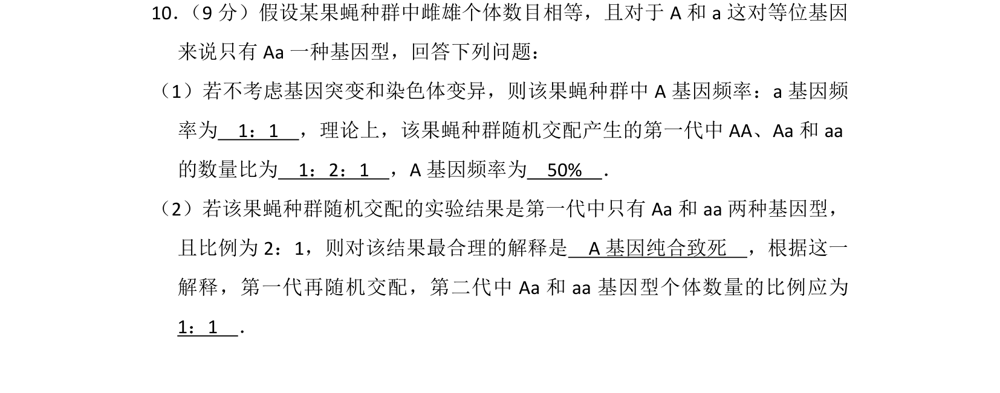
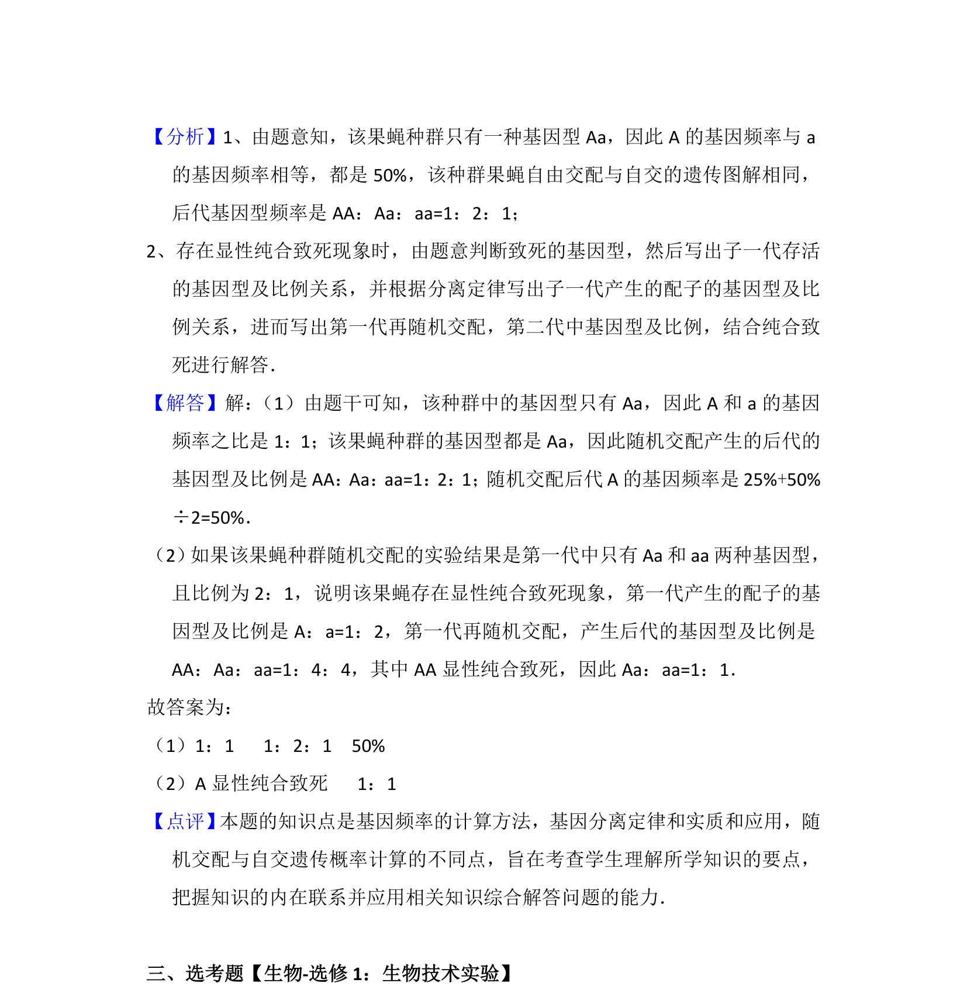

## 题面

## 摘要

该题考查基因频率与基因型频率的计算，涉及随机交配和A基因纯合致死条件下的比例推导。

## 关联考点

- [[803-基因频率|基因频率]]
- [[基因型频率]]
- [[随机交配]]
- [[纯合致死]]

## 答案与解析

> 📄 原 PDF 第 10 页：`素材/真题/湖南/2008-2024·（湖南）生物高考真题/2015年高考生物试卷（新课标Ⅰ）（解析卷）.pdf`
