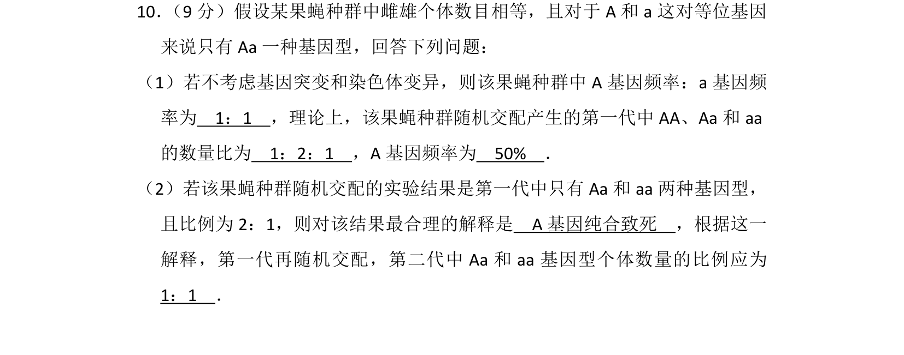
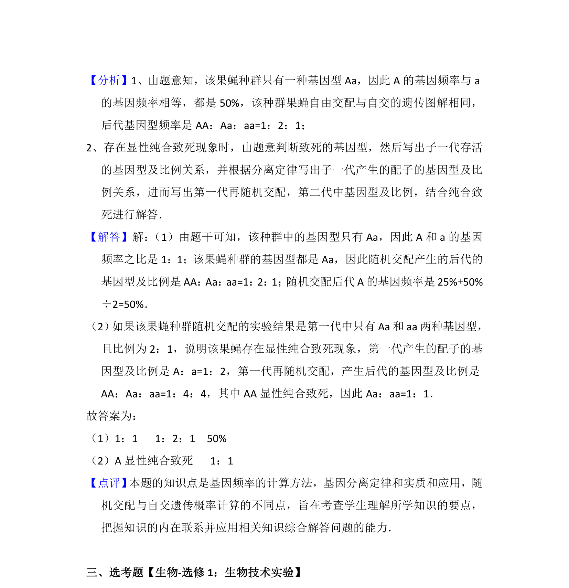

## 题面

## 摘要

该题考查基因频率与基因型频率的计算，涉及随机交配和A基因纯合致死条件下的比例推导。

## 关联考点

- [[803-基因频率|基因频率]]
- [[基因型频率]]
- [[随机交配]]
- [[纯合致死]]

## 答案与解析

> 📄 原 PDF 第 10 页：`素材/真题/湖南/2008-2024·（湖南）生物高考真题/2015年高考生物试卷（新课标Ⅰ）（解析卷）.pdf`

<!-- 题干文本-start -->
## 题干文本
10． （9分）假设某果蝇种群中雌雄个体数目相等，且对于A和a这对等位基因
来说只有Aa一种基因型，回答下列问题：
（1）若不考虑基因突变和染色体变异，则该果蝇种群中A基因频率：a基因频
率为　1：1　，理论上，该果蝇种群随机交配产生的第一代中AA、Aa和aa
的数量比为　1：2：1　，A基因频率为　50%　．
（2）若该果蝇种群随机交配的实验结果是第一代中只有Aa和aa两种基因型，
且比例为2：1，则对该结果最合理的解释是　A基因纯合致死　，根据这一
解释，第一代再随机交配，第二代中Aa和aa基因型个体数量的比例应为　
1：1　．
<!-- 题干文本-end -->

<!-- 解析文本-start -->
## 解析文本
【考点】B5：基因频率的变化．菁优网版权所有
<!-- 解析文本-end -->
