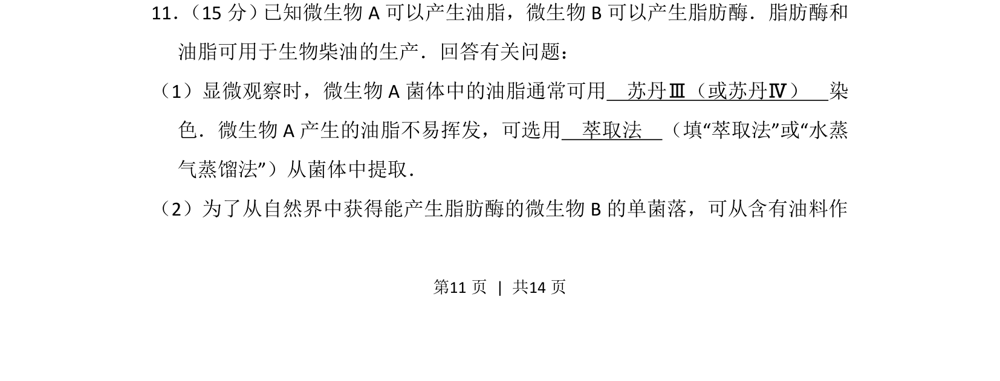
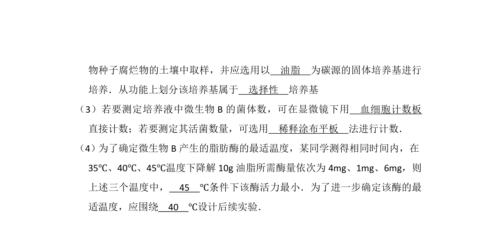
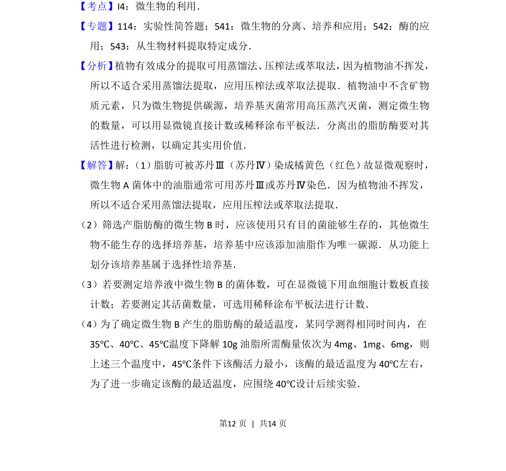
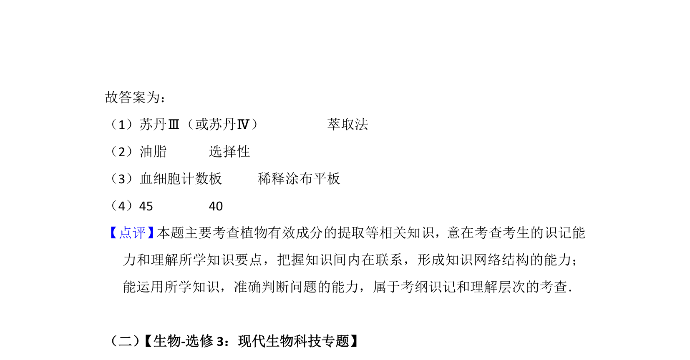

## 题面

## 摘要

本题涉及微生物油脂染色与提取方法，以及产脂肪酶菌株的分离。

## 关联考点

- [[922-脂肪鉴定|脂肪鉴定]]
- [[776-萃取法|萃取法]]
- [[487-微生物分离|微生物分离]]
- [[脂肪酶]]

## 答案与解析

> 📄 原 PDF 第 11 页：`素材/真题/湖南/2008-2024·（湖南）生物高考真题/2015年高考生物试卷（新课标Ⅰ）（解析卷）.pdf`
