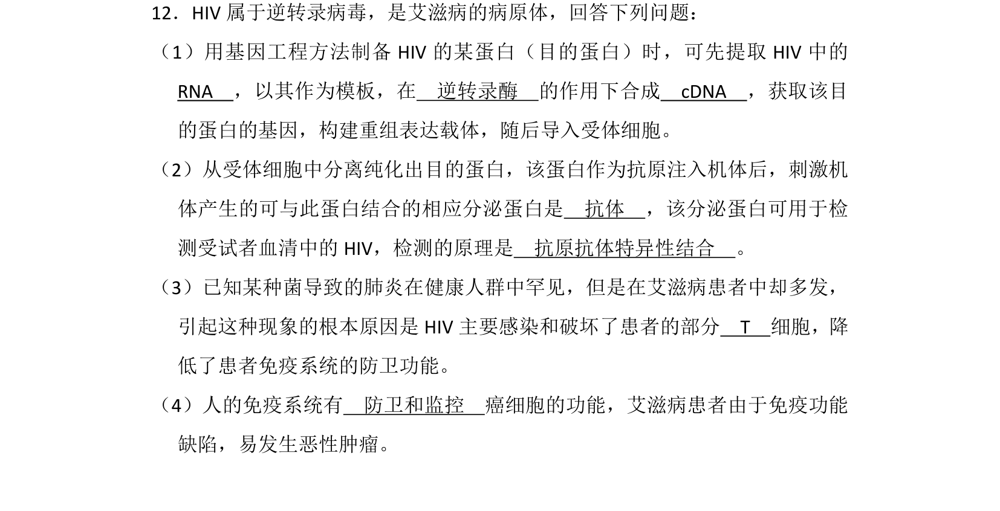
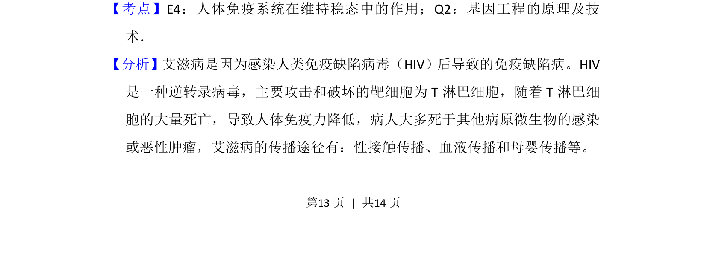
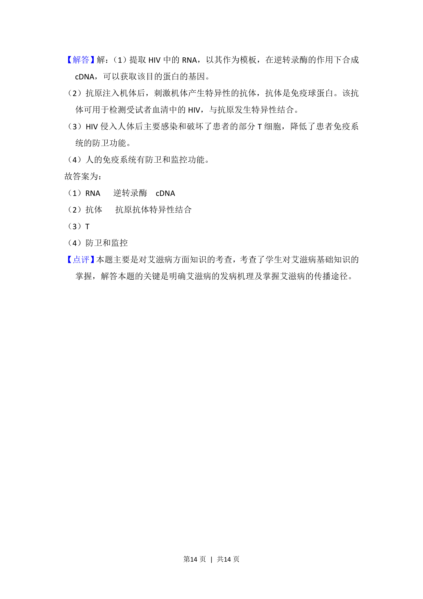

## 题面

## 摘要

该题考查HIV的逆转录特性、基因工程获取目的蛋白、抗原抗体结合检测及免疫系统防卫与监控功能。

## 关联考点

- [[513-逆转录|逆转录]]
- [[411-基因工程|基因工程]]
- [[抗原抗体特异性结合]]
- [[免疫防卫与监控]]

## 答案与解析

> 📄 原 PDF 第 13 页：`素材/真题/湖南/2008-2024·（湖南）生物高考真题/2015年高考生物试卷（新课标Ⅰ）（解析卷）.pdf`
