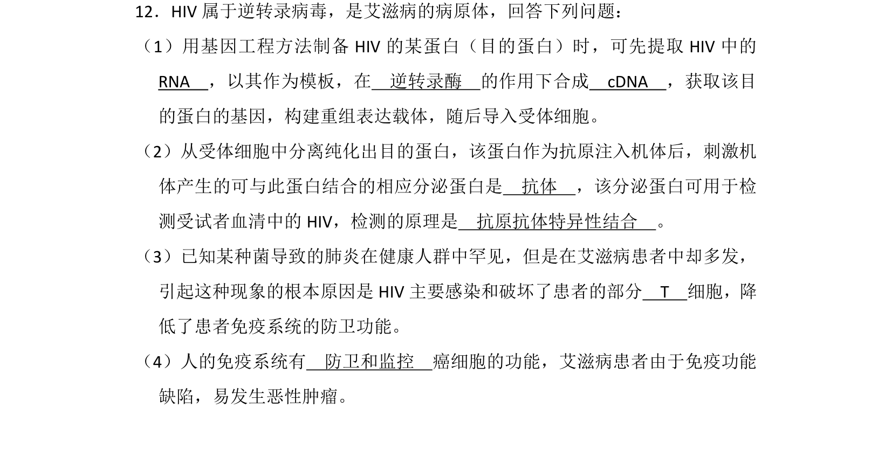
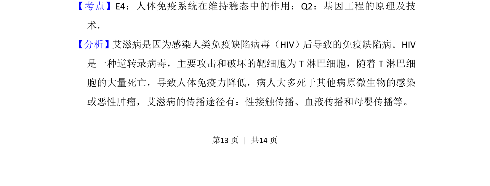
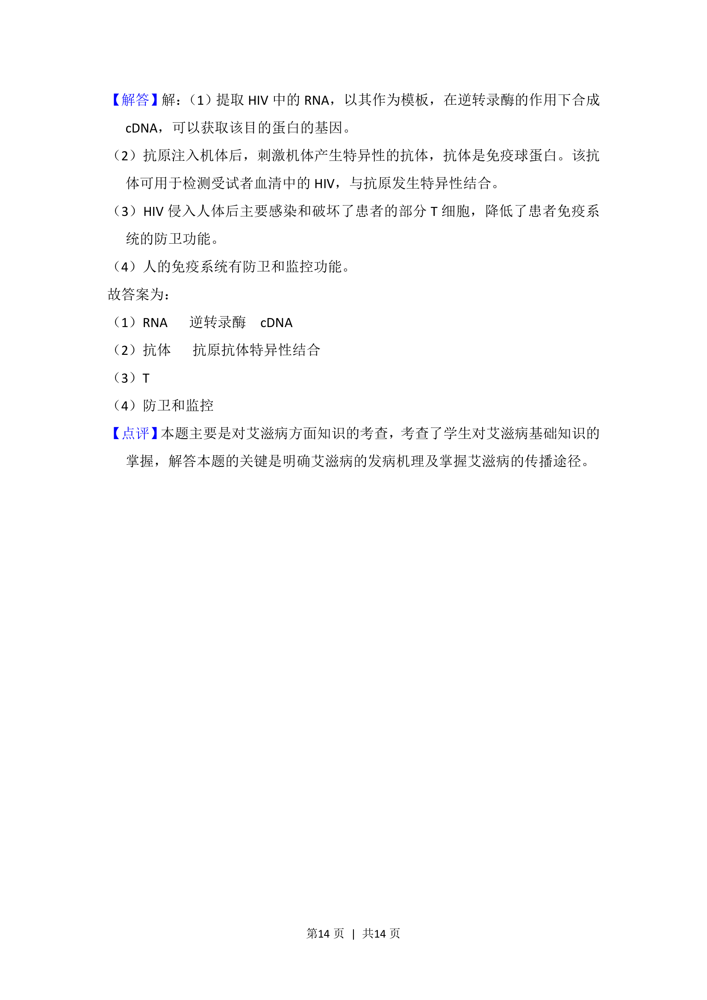

## 题面

## 摘要

该题考查HIV的逆转录特性、基因工程获取目的蛋白、抗原抗体结合检测及免疫系统防卫与监控功能。

## 关联考点

- [[513-逆转录|逆转录]]
- [[411-基因工程|基因工程]]
- [[抗原抗体特异性结合]]
- [[免疫防卫与监控]]

## 答案与解析

> 📄 原 PDF 第 13 页：`素材/真题/湖南/2008-2024·（湖南）生物高考真题/2015年高考生物试卷（新课标Ⅰ）（解析卷）.pdf`

<!-- 题干文本-start -->
## 题干文本
12．HIV属于逆转录病毒，是艾滋病的病原体，回答下列问题：
（1）用基因工程方法制备HIV的某蛋白（目的蛋白）时，可先提取HIV中的　
RNA　，以其作为模板，在　逆转录酶　的作用下合成　cDNA　，获取该目
的蛋白的基因，构建重组表达载体，随后导入受体细胞。
（2）从受体细胞中分离纯化出目的蛋白，该蛋白作为抗原注入机体后，刺激机
体产生的可与此蛋白结合的相应分泌蛋白是　抗体　，该分泌蛋白可用于检
测受试者血清中的HIV，检测的原理是　抗原抗体特异性结合　。
（3）已知某种菌导致的肺炎在健康人群中罕见，但是在艾滋病患者中却多发，
引起这种现象的根本原因是HIV主要感染和破坏了患者的部分　T　细胞，降
低了患者免疫系统的防卫功能。
（4）人的免疫系统有　防卫和监控　癌细胞的功能，艾滋病患者由于免疫功能
缺陷，易发生恶性肿瘤。
<!-- 题干文本-end -->

<!-- 解析文本-start -->
## 解析文本
【考点】E4：人体免疫系统在维持稳态中的作用；Q2：基因工程的原理及技
术．菁优网版权所有
【分析】艾滋病是因为感染人类免疫缺陷病毒（HIV）后导致的免疫缺陷病。HIV
是一种逆转录病毒，主要攻击和破坏的靶细胞为T淋巴细胞，随着T淋巴细
胞的大量死亡，导致人体免疫力降低，病人大多死于其他病原微生物的感染
或恶性肿瘤，艾滋病的传播途径有：性接触传播、血液传播和母婴传播等。
<!-- 解析文本-end -->
