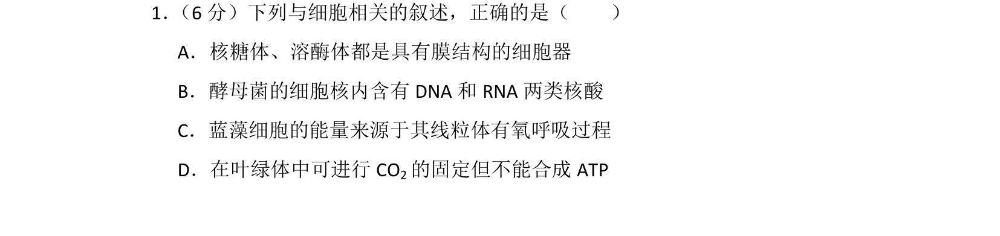
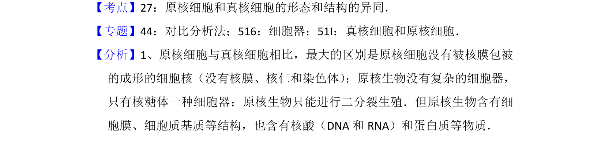

## 题面

## 摘要

该题考查原核细胞与真核细胞的形态结构异同，涉及细胞器结构与功能辨析。

## 关联考点

- [[205-原核细胞|原核细胞]]
- [[208-真核细胞|真核细胞]]
- [[229-细胞器|细胞器]]
- [[光合作用与呼吸作用]]

## 答案与解析

> 📄 原 PDF 第 1 页：`素材/真题/湖南/2008-2024·（湖南）生物高考真题/2016年高考生物试卷（新课标Ⅰ）（解析卷）.pdf`

<!-- 题干文本-start -->
## 题干文本
1． （6分）下列与细胞相关的叙述，正确的是（　　）
A．核糖体、溶酶体都是具有膜结构的细胞器
B．酵母菌的细胞核内含有DNA和RNA两类核酸
C．蓝藻细胞的能量来源于其线粒体有氧呼吸过程
D．在叶绿体中可进行CO 2的固定但不能合成ATP
<!-- 题干文本-end -->

<!-- 解析文本-start -->
## 解析文本
【考点】27：原核细胞和真核细胞的形态和结构的异同．菁优网版权所有
【专题】44：对比分析法；516：细胞器；51I：真核细胞和原核细胞．
【分析】1、原核细胞与真核细胞相比，最大的区别是原核细胞没有被核膜包被
的成形的细胞核（没有核膜、核仁和染色体） ；原核生物没有复杂的细胞器，
只有核糖体一种细胞器；原核生物只能进行二分裂生殖．但原核生物含有细
胞膜、细胞质基质等结构，也含有核酸（DNA和RNA）和蛋白质等物质．
<!-- 解析文本-end -->
