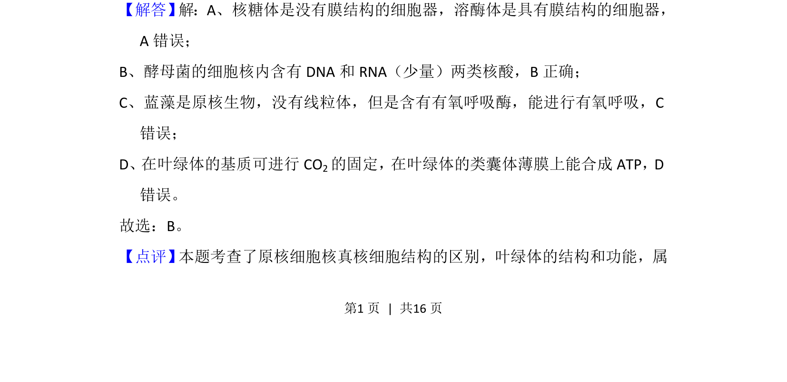
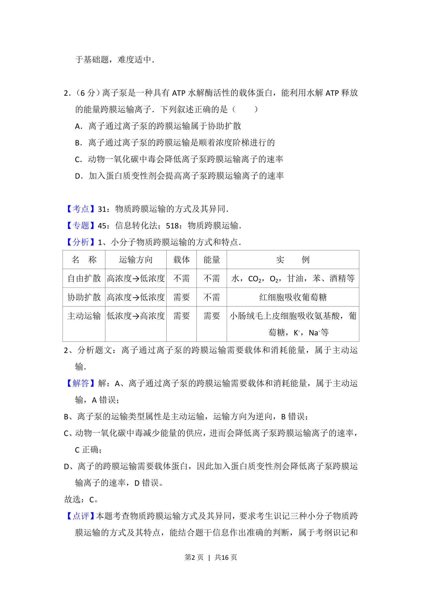
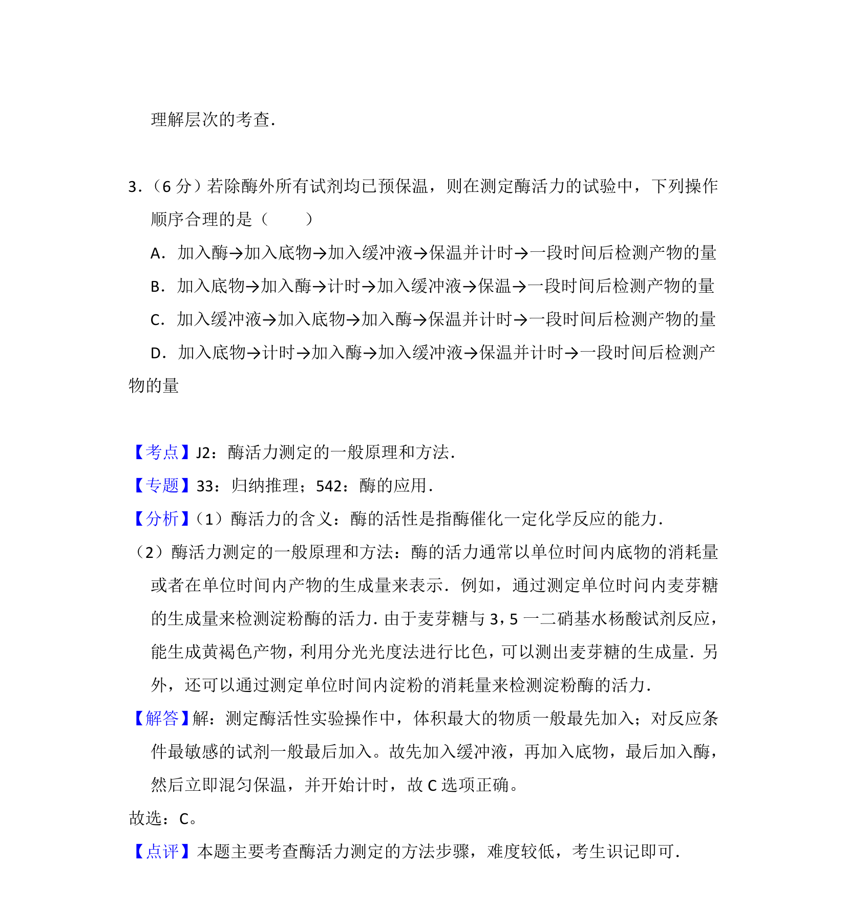

## 题面

## 摘要

该题考查细胞结构与功能，辨析核糖体膜结构、酵母菌核酸、蓝藻有氧呼吸及叶绿体中光反应与暗反应的场所。

## 关联考点

- [[229-细胞器|细胞器]]
- [[205-原核细胞|原核细胞]]
- [[208-真核细胞|真核细胞]]
- [[叶绿体功能]]

## 答案与解析

> 📄 原 PDF 第 1 页：`素材/真题/湖南/2008-2024·（湖南）生物高考真题/2016年高考生物试卷（新课标Ⅰ）（解析卷）.pdf`
