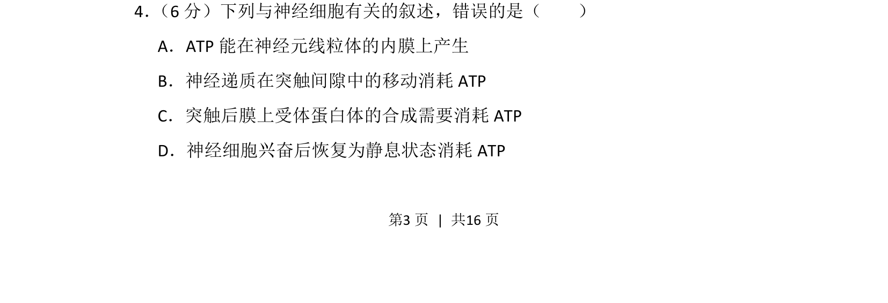
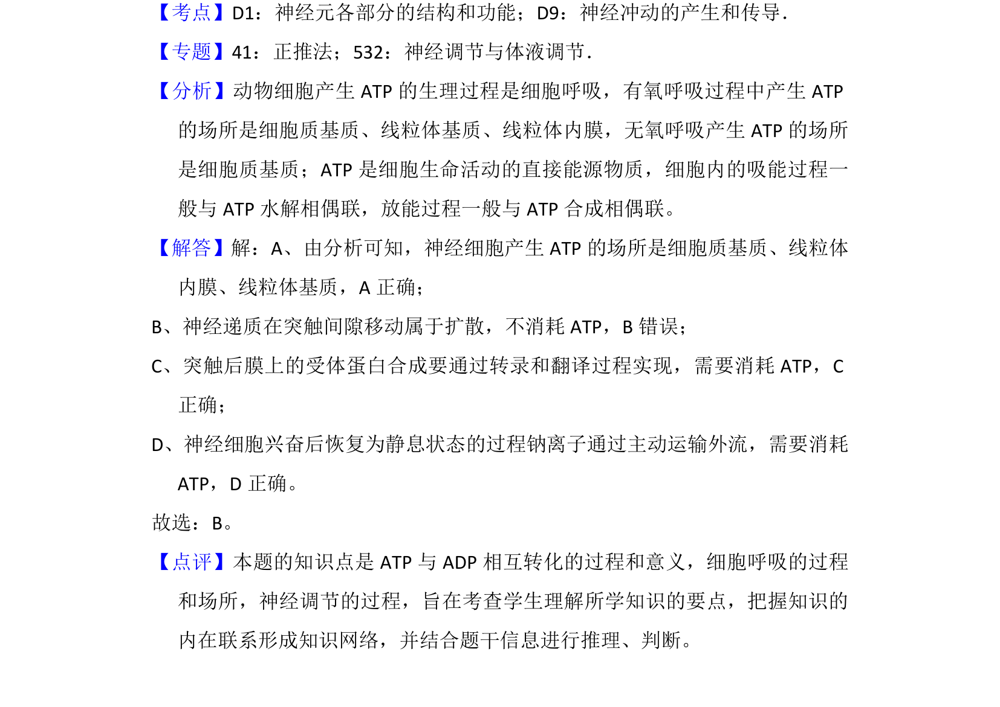

## 题面

## 摘要

本题通过辨析神经细胞相关生理过程，考查ATP的合成和消耗机制

## 关联考点

- [[ATP合成部位]]
- [[925-突触传递|突触传递]]
- [[256-主动运输|主动运输]]
- [[静息电位恢复]]

## 答案与解析

> 📄 原 PDF 第 3 页：`素材/真题/湖南/2008-2024·（湖南）生物高考真题/2016年高考生物试卷（新课标Ⅰ）（解析卷）.pdf`
