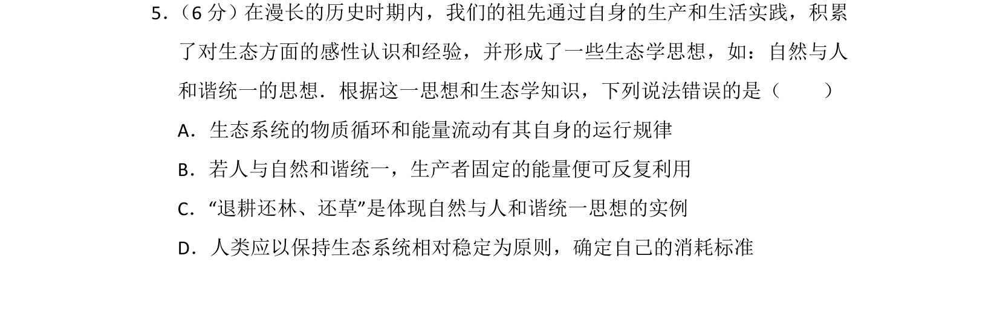
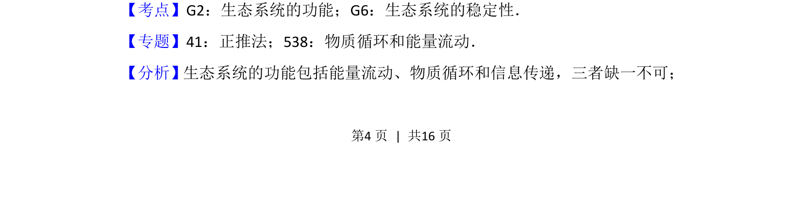
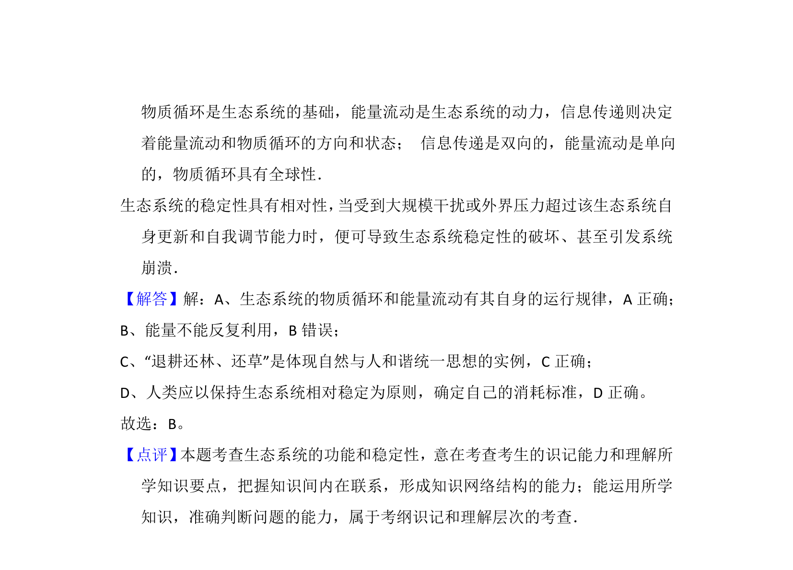

## 题面

## 摘要

结合生态学思想考查生态系统的功能及稳定性

## 关联考点

- [[生态系统的功能]]
- [[855-生态系统的稳定性|生态系统的稳定性]]
- [[385-生态系统能量流动|能量流动]]
- [[383-生态系统物质循环|物质循环]]

## 答案与解析

> 📄 原 PDF 第 4 页：`素材/真题/湖南/2008-2024·（湖南）生物高考真题/2016年高考生物试卷（新课标Ⅰ）（解析卷）.pdf`
