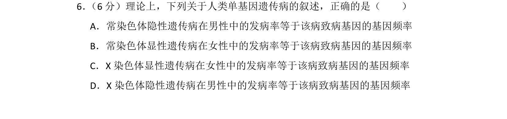
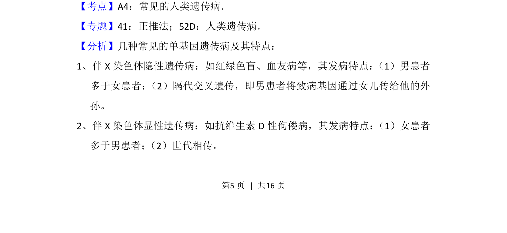
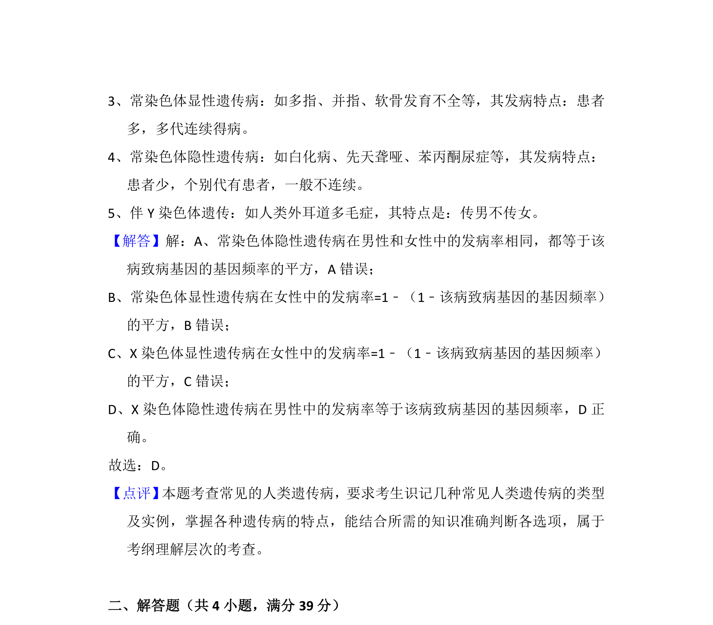

## 题面

## 摘要

该题考查人类单基因遗传病发病率与基因频率的关系，需辨析常染色体和伴性遗传中两者是否相等。

## 关联考点

- [[299-人类遗传病|人类遗传病]]
- [[803-基因频率|基因频率]]
- [[发病率]]
- [[276-伴性遗传|伴性遗传]]

## 答案与解析

> 📄 原 PDF 第 5 页：`素材/真题/湖南/2008-2024·（湖南）生物高考真题/2016年高考生物试卷（新课标Ⅰ）（解析卷）.pdf`
