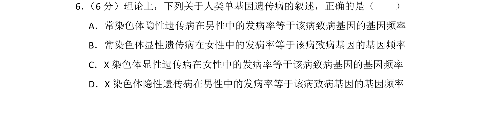
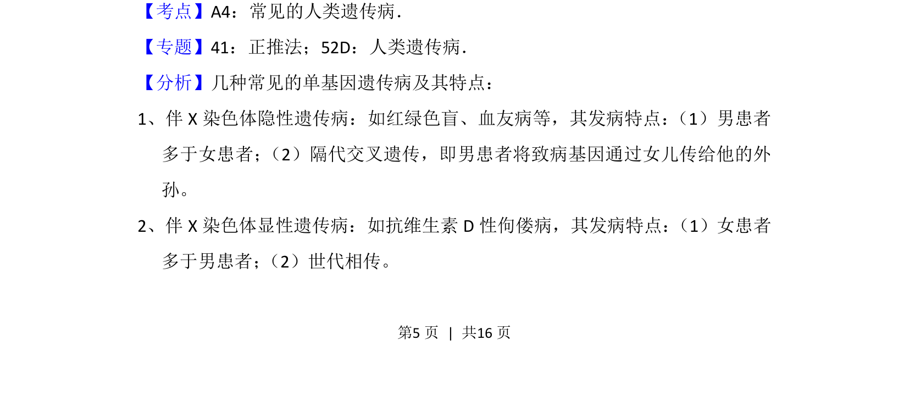
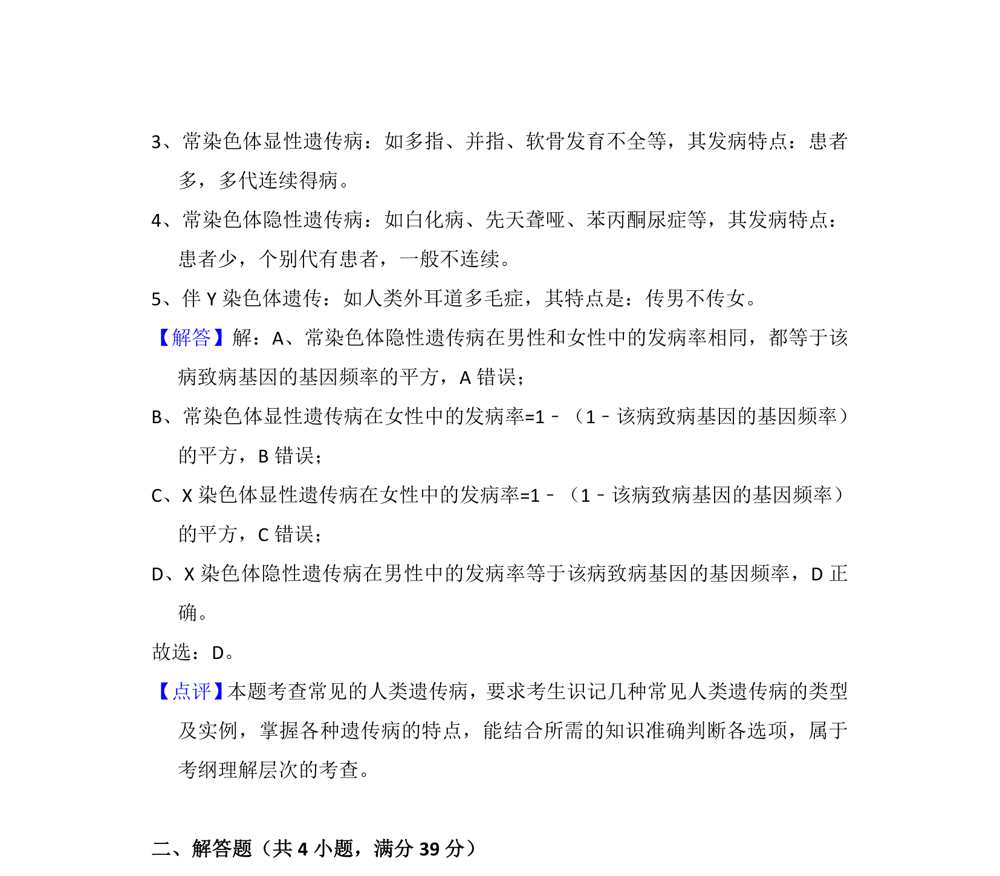

## 题面

## 摘要

该题考查人类单基因遗传病发病率与基因频率的关系，需辨析常染色体和伴性遗传中两者是否相等。

## 关联考点

- [[299-人类遗传病|人类遗传病]]
- [[803-基因频率|基因频率]]
- [[发病率]]
- [[276-伴性遗传|伴性遗传]]

## 答案与解析

> 📄 原 PDF 第 5 页：`素材/真题/湖南/2008-2024·（湖南）生物高考真题/2016年高考生物试卷（新课标Ⅰ）（解析卷）.pdf`

<!-- 题干文本-start -->
## 题干文本
6． （6分）理论上，下列关于人类单基因遗传病的叙述，正确的是（　　）
A．常染色体隐性遗传病在男性中的发病率等于该病致病基因的基因频率
B．常染色体显性遗传病在女性中的发病率等于该病致病基因的基因频率
C．X染色体显性遗传病在女性中的发病率等于该病致病基因的基因频率
D．X染色体隐性遗传病在男性中的发病率等于该病致病基因的基因频率
<!-- 题干文本-end -->

<!-- 解析文本-start -->
## 解析文本
【考点】A4：常见的人类遗传病．菁优网版权所有
【专题】41：正推法；52D：人类遗传病．
【分析】几种常见的单基因遗传病及其特点：
1、伴X染色体隐性遗传病：如红绿色盲、血友病等，其发病特点： （1）男患者
多于女患者； （2）隔代交叉遗传，即男患者将致病基因通过女儿传给他的外
孙。
2、伴X染色体显性遗传病：如抗维生素D性佝偻病，其发病特点： （1）女患者
多于男患者； （2）世代相传。
<!-- 解析文本-end -->
