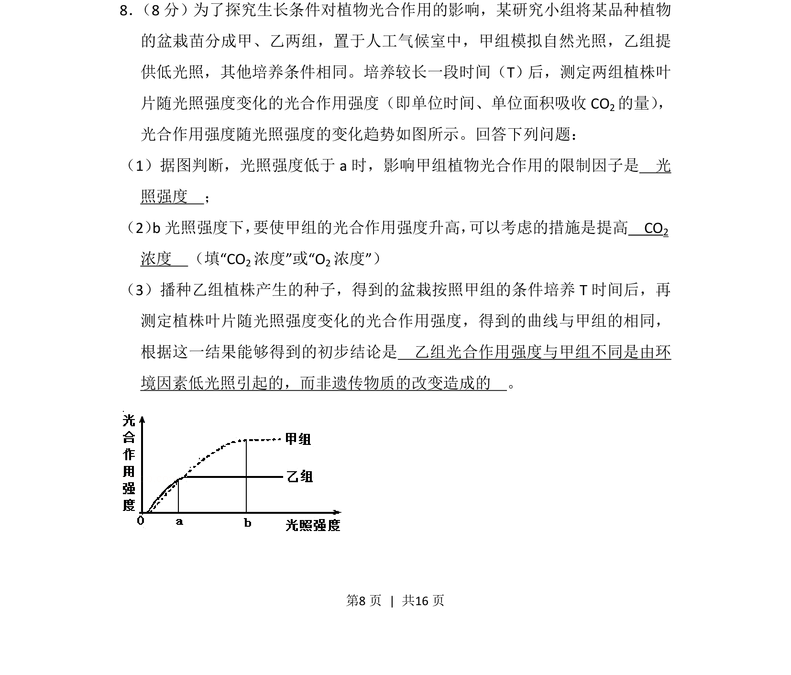
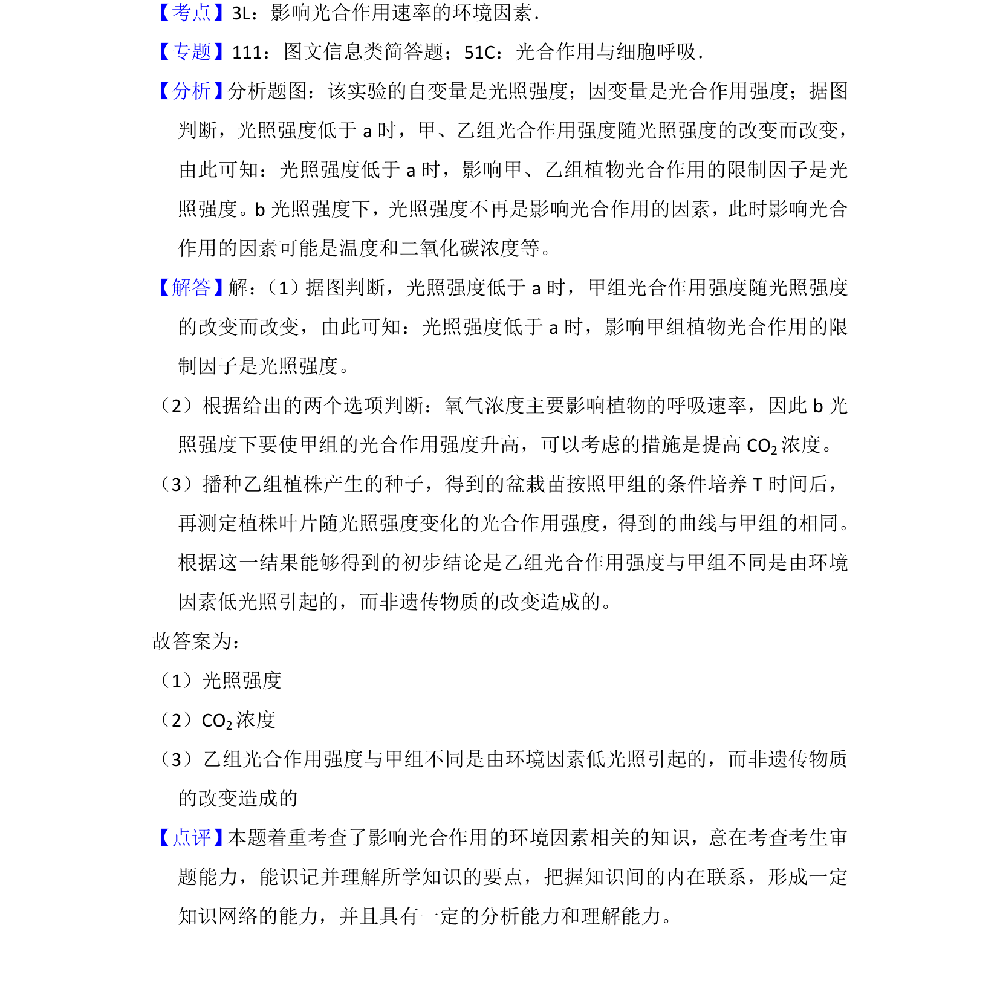

## 题面

## 摘要

探究光照条件对植物光合作用的影响，分析环境因素与遗传因素的作用。

## 关联考点

- [[033-光合作用|光合作用]]
- [[736-光照强度|光照强度]]
- [[限制因子]]
- [[环境与遗传]]

## 答案与解析

> 📄 原 PDF 第 8 页：`素材/真题/湖南/2008-2024·（湖南）生物高考真题/2016年高考生物试卷（新课标Ⅰ）（解析卷）.pdf`
