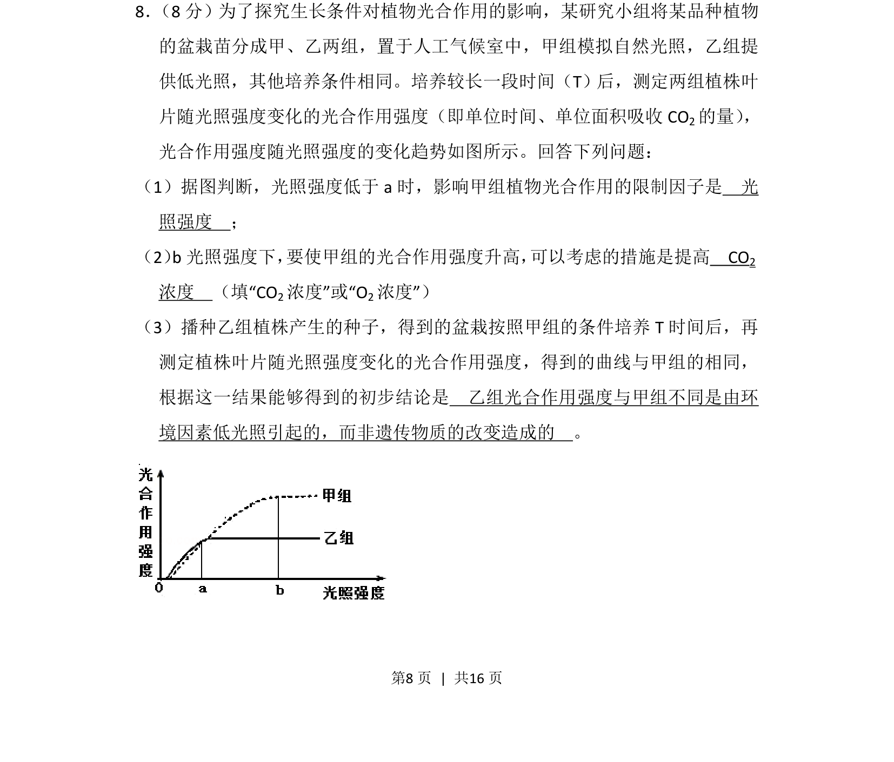
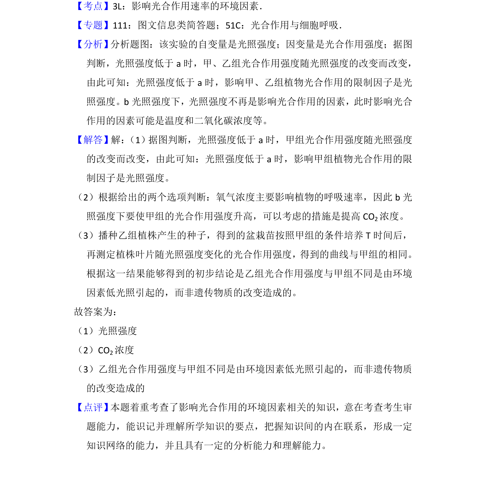

## 题面

## 摘要

探究光照条件对植物光合作用的影响，分析环境因素与遗传因素的作用。

## 关联考点

- [[033-光合作用|光合作用]]
- [[736-光照强度|光照强度]]
- [[限制因子]]
- [[环境与遗传]]

## 答案与解析

> 📄 原 PDF 第 8 页：`素材/真题/湖南/2008-2024·（湖南）生物高考真题/2016年高考生物试卷（新课标Ⅰ）（解析卷）.pdf`

<!-- 题干文本-start -->
## 题干文本
8． （8分）为了探究生长条件对植物光合作用的影响，某研究小组将某品种植物
的盆栽苗分成甲、乙两组，置于人工气候室中，甲组模拟自然光照，乙组提
供低光照，其他培养条件相同。培养较长一段时间（T）后，测定两组植株叶
片随光照强度变化的光合作用强度（即单位时间、单位面积吸收CO 2的量） ，
光合作用强度随光照强度的变化趋势如图所示。回答下列问题：
（1）据图判断，光照强度低于a时，影响甲组植物光合作用的限制因子是　光
照强度　；
（2）b光照强度下， 要使甲组的光合作用强度升高， 可以考虑的措施是提高　CO2
浓度　（填“CO2浓度”或“O2浓度”）
（3）播种乙组植株产生的种子，得到的盆栽按照甲组的条件培养T时间后，再
测定植株叶片随光照强度变化的光合作用强度，得到的曲线与甲组的相同，
根据这一结果能够得到的初步结论是　乙组光合作用强度与甲组不同是由环
境因素低光照引起的，而非遗传物质的改变造成的　。
<!-- 题干文本-end -->

<!-- 解析文本-start -->
## 解析文本

<!-- 解析文本-end -->
