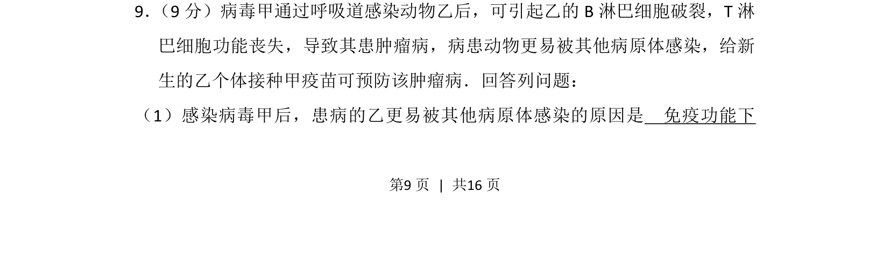
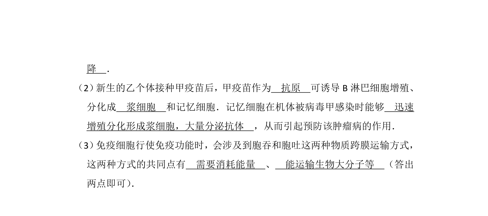
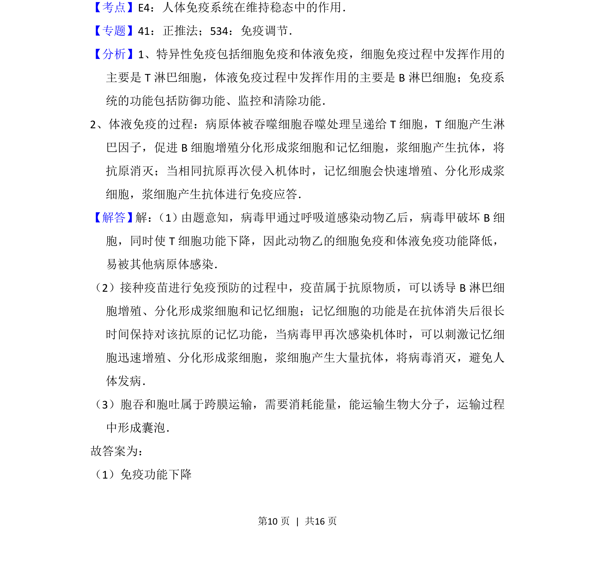
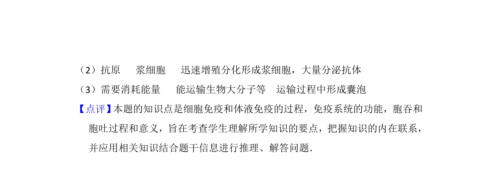

## 题面

## 摘要

免疫功能受损导致更易被其他病原体感染，以及疫苗预防肿瘤病的免疫学原理

## 关联考点

- [[免疫缺陷]]
- [[637-特异性免疫|特异性免疫]]
- [[898-疫苗|疫苗]]
- [[免疫记忆]]

## 答案与解析

> 📄 原 PDF 第 9 页：`素材/真题/湖南/2008-2024·（湖南）生物高考真题/2016年高考生物试卷（新课标Ⅰ）（解析卷）.pdf`
