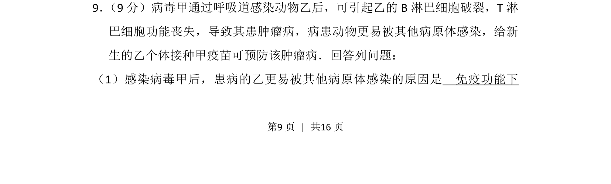
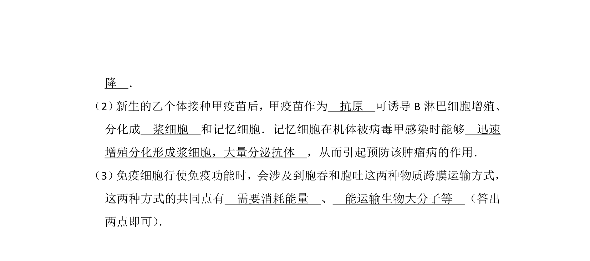
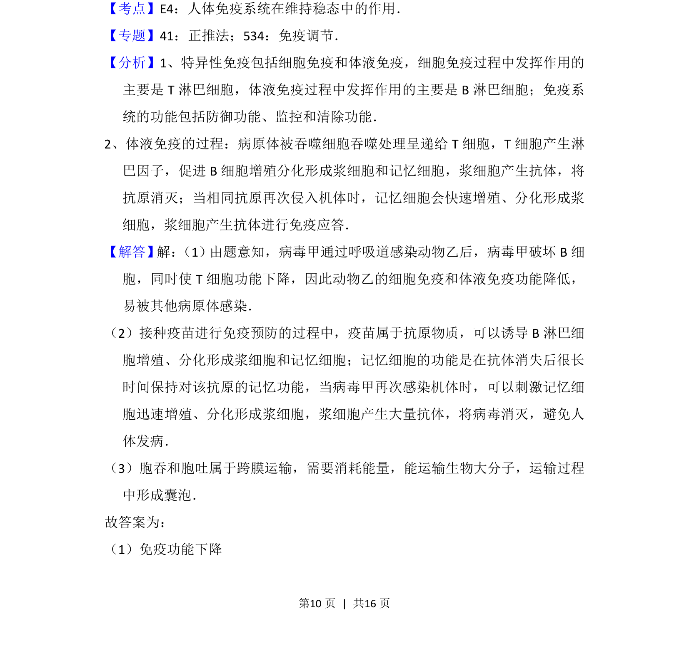
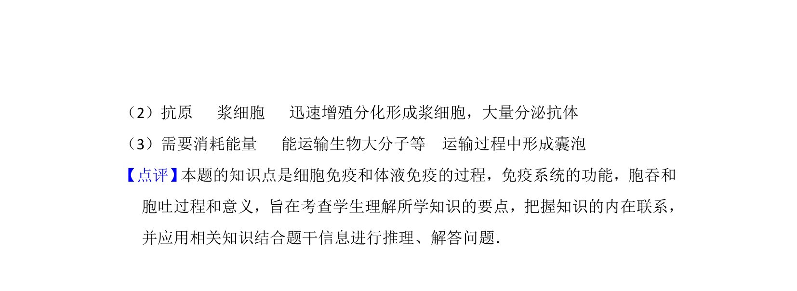

## 题面

## 摘要

免疫功能受损导致更易被其他病原体感染，以及疫苗预防肿瘤病的免疫学原理

## 关联考点

- [[免疫缺陷]]
- [[637-特异性免疫|特异性免疫]]
- [[898-疫苗|疫苗]]
- [[免疫记忆]]

## 答案与解析

> 📄 原 PDF 第 9 页：`素材/真题/湖南/2008-2024·（湖南）生物高考真题/2016年高考生物试卷（新课标Ⅰ）（解析卷）.pdf`

<!-- 题干文本-start -->
## 题干文本
9． （9分）病毒甲通过呼吸道感染动物乙后，可引起乙的B淋巴细胞破裂，T淋
巴细胞功能丧失，导致其患肿瘤病，病患动物更易被其他病原体感染，给新
生的乙个体接种甲疫苗可预防该肿瘤病．回答列问题：
（1）感染病毒甲后，患病的乙更易被其他病原体感染的原因是　免疫功能下
<!-- 题干文本-end -->

<!-- 解析文本-start -->
## 解析文本

<!-- 解析文本-end -->
