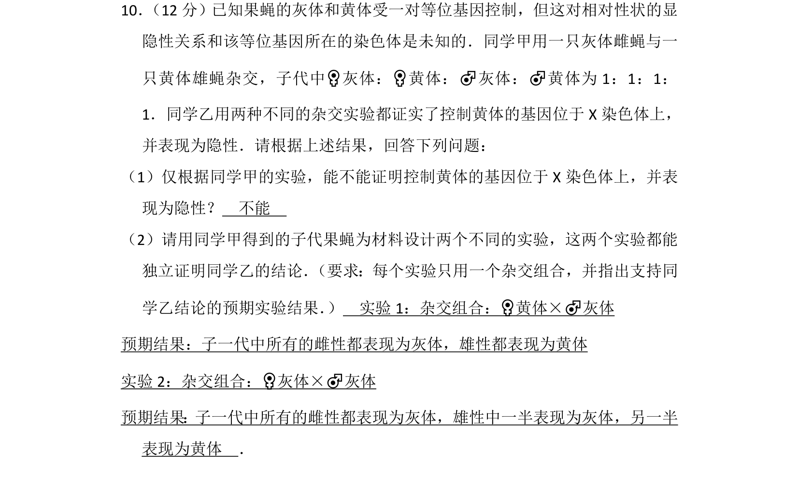
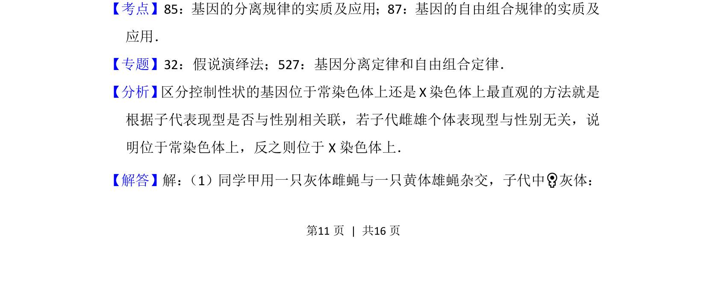
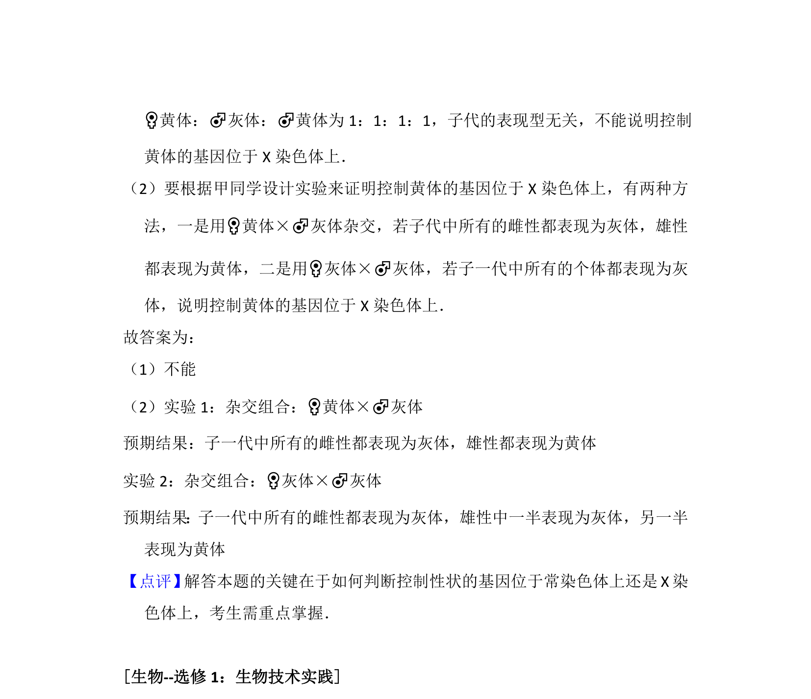

## 题面

## 摘要

考查果蝇灰体与黄体性状的遗传方式判断及伴性遗传实验设计。

## 关联考点

- [[266-分离定律|基因的分离定律]]
- [[276-伴性遗传|伴性遗传]]
- [[遗传实验设计]]

## 答案与解析

> 📄 原 PDF 第 11 页：`素材/真题/湖南/2008-2024·（湖南）生物高考真题/2016年高考生物试卷（新课标Ⅰ）（解析卷）.pdf`
