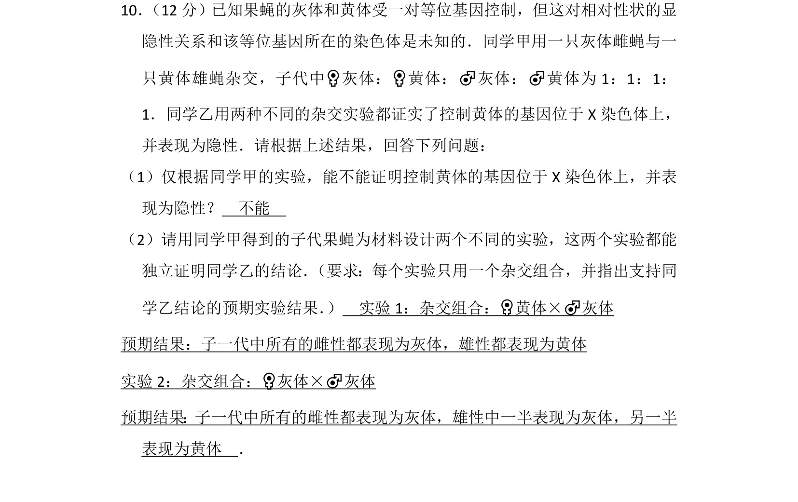
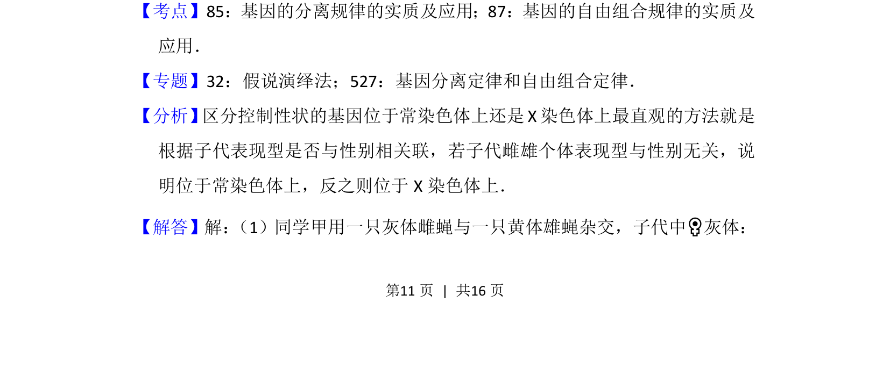
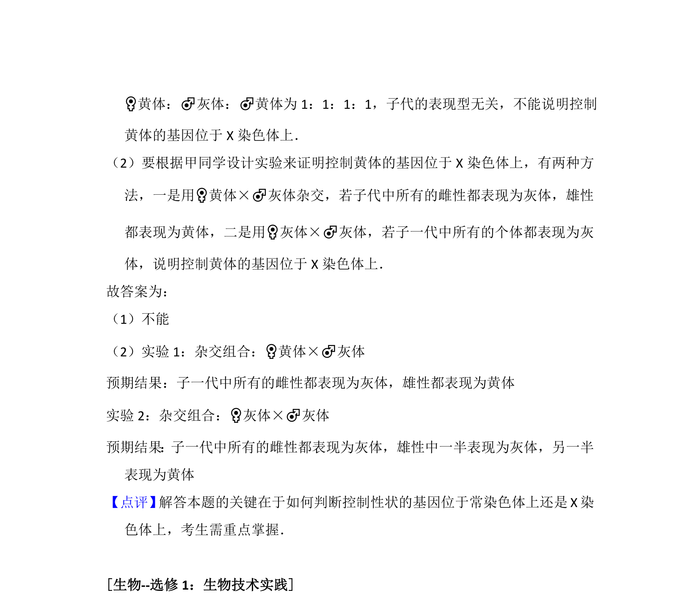

## 题面

## 摘要

考查果蝇灰体与黄体性状的遗传方式判断及伴性遗传实验设计。

## 关联考点

- [[266-分离定律|基因的分离定律]]
- [[276-伴性遗传|伴性遗传]]
- [[遗传实验设计]]

## 答案与解析

> 📄 原 PDF 第 11 页：`素材/真题/湖南/2008-2024·（湖南）生物高考真题/2016年高考生物试卷（新课标Ⅰ）（解析卷）.pdf`

<!-- 题干文本-start -->
## 题干文本
10． （12分）已知果蝇的灰体和黄体受一对等位基因控制，但这对相对性状的显
隐性关系和该等位基因所在的染色体是未知的．同学甲用一只灰体雌蝇与一
只黄体雄蝇杂交，子代中♀灰体：♀黄体：♂灰体：♂黄体为1：1：1：
1．同学乙用两种不同的杂交实验都证实了控制黄体的基因位于X染色体上，
并表现为隐性．请根据上述结果，回答下列问题：
（1）仅根据同学甲的实验，能不能证明控制黄体的基因位于X染色体上，并表
现为隐性？　不能　
（2）请用同学甲得到的子代果蝇为材料设计两个不同的实验，这两个实验都能
独立证明同学乙的结论． （要求：每个实验只用一个杂交组合，并指出支持同
学乙结论的预期实验结果． ）　实验1：杂交组合：♀黄体×♂灰体
预期结果：子一代中所有的雌性都表现为灰体，雄性都表现为黄体
实验2：杂交组合：♀灰体×♂灰体
预期结果：子一代中所有的雌性都表现为灰体，雄性中一半表现为灰体，另一半
表现为黄体　．
<!-- 题干文本-end -->

<!-- 解析文本-start -->
## 解析文本
【考点】85：基因的分离规律的实质及应用；87：基因的自由组合规律的实质及
应用．菁优网版权所有
【专题】32：假说演绎法；527：基因分离定律和自由组合定律．
【分析】 区分控制性状的基因位于常染色体上还是X染色体上最直观的方法就是
根据子代表现型是否与性别相关联，若子代雌雄个体表现型与性别无关，说
明位于常染色体上，反之则位于X染色体上．
【解答】解： （1）同学甲用一只灰体雌蝇与一只黄体雄蝇杂交，子代中♀灰体：
<!-- 解析文本-end -->
