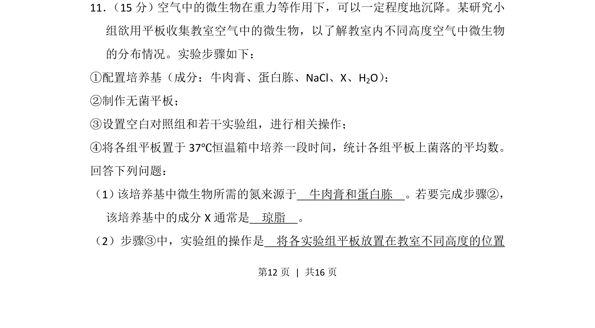
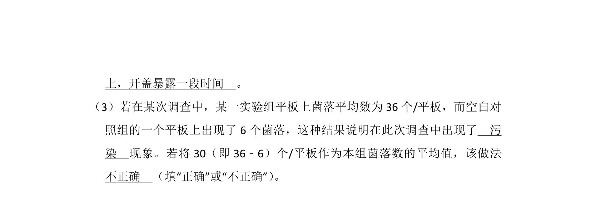
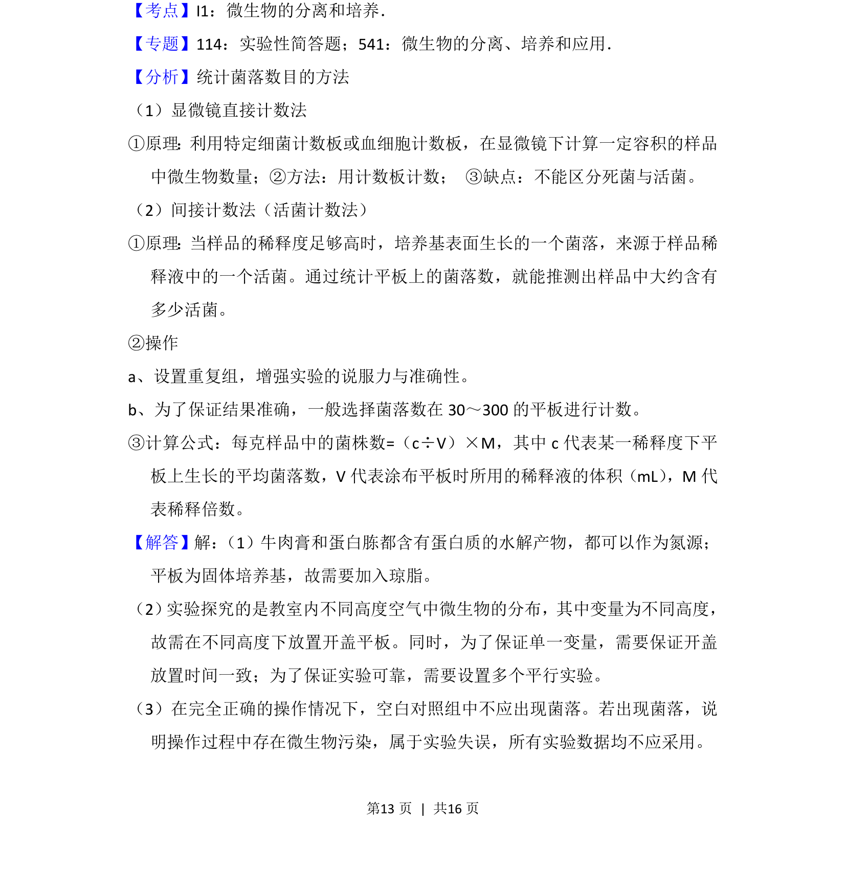
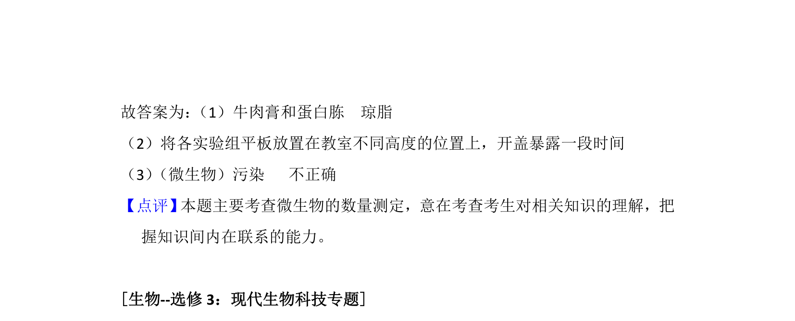

## 题面

## 摘要

本题通过平板收集法实验，考查微生物培养的培养基成分及实验组操作设计。

## 关联考点

- [[428-微生物培养|微生物培养]]
- [[培养基成分]]
- [[482-实验设计|实验设计]]

## 答案与解析

> 📄 原 PDF 第 12 页：`素材/真题/湖南/2008-2024·（湖南）生物高考真题/2016年高考生物试卷（新课标Ⅰ）（解析卷）.pdf`
