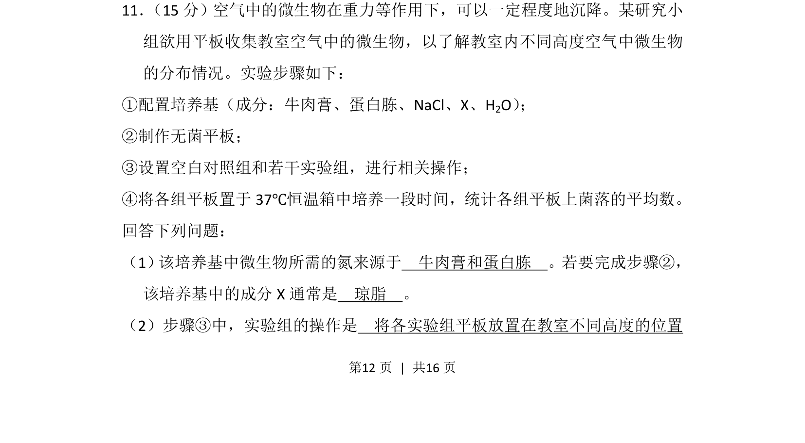
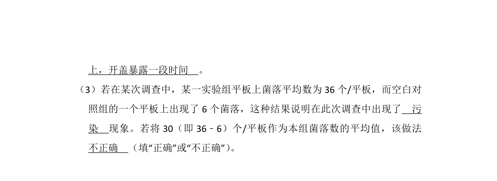
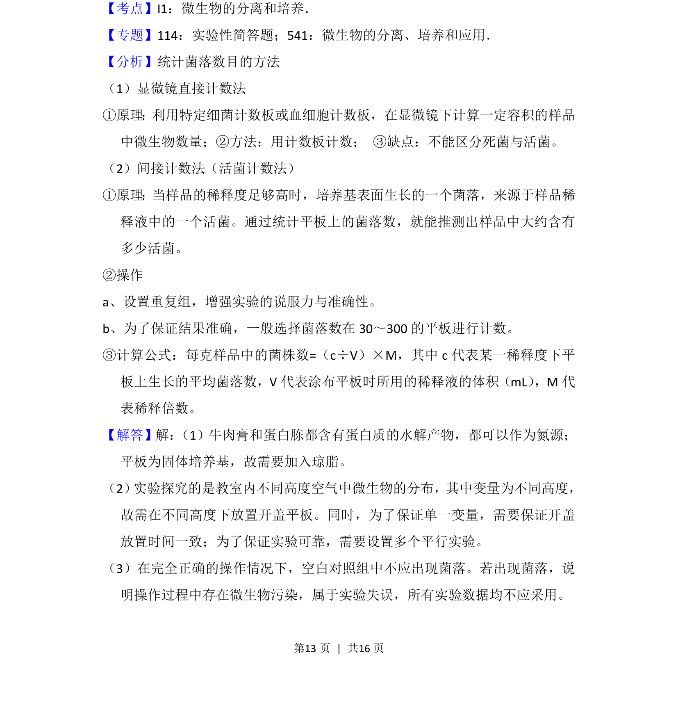
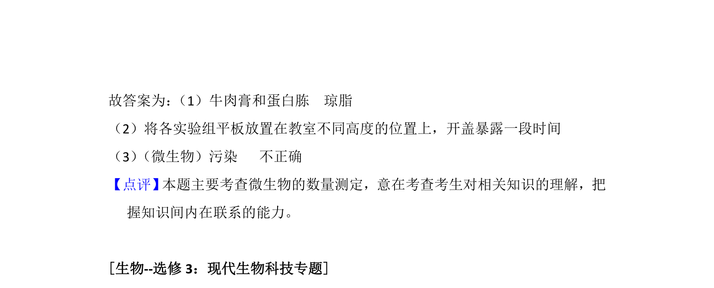

## 题面

## 摘要

本题通过平板收集法实验，考查微生物培养的培养基成分及实验组操作设计。

## 关联考点

- [[428-微生物培养|微生物培养]]
- [[培养基成分]]
- [[482-实验设计|实验设计]]

## 答案与解析

> 📄 原 PDF 第 12 页：`素材/真题/湖南/2008-2024·（湖南）生物高考真题/2016年高考生物试卷（新课标Ⅰ）（解析卷）.pdf`

<!-- 题干文本-start -->
## 题干文本
11． （15分）空气中的微生物在重力等作用下，可以一定程度地沉降。某研究小
组欲用平板收集教室空气中的微生物，以了解教室内不同高度空气中微生物
的分布情况。实验步骤如下：
①配置培养基（成分：牛肉膏、蛋白胨、NaCl、X、H2O） ；
②制作无菌平板；
③设置空白对照组和若干实验组，进行相关操作；
④将各组平板置于37℃恒温箱中培养一段时间，统计各组平板上菌落的平均数。
回答下列问题：
（1） 该培养基中微生物所需的氮来源于　牛肉膏和蛋白胨　。若要完成步骤②，
该培养基中的成分X通常是　琼脂　。
（2）步骤③中，实验组的操作是　将各实验组平板放置在教室不同高度的位置
<!-- 题干文本-end -->

<!-- 解析文本-start -->
## 解析文本

<!-- 解析文本-end -->
