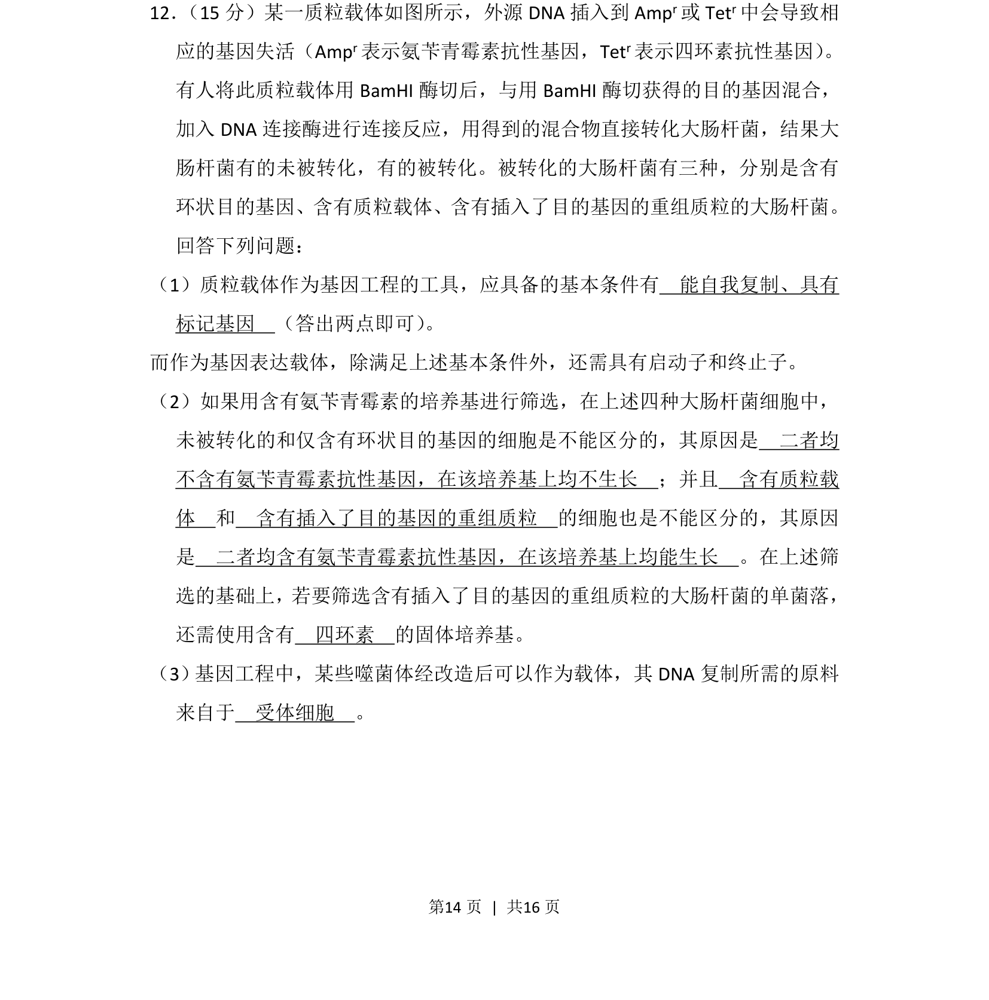
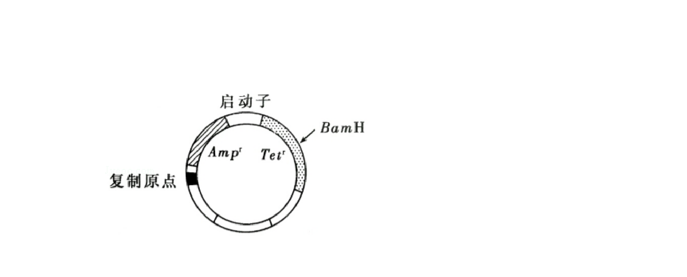
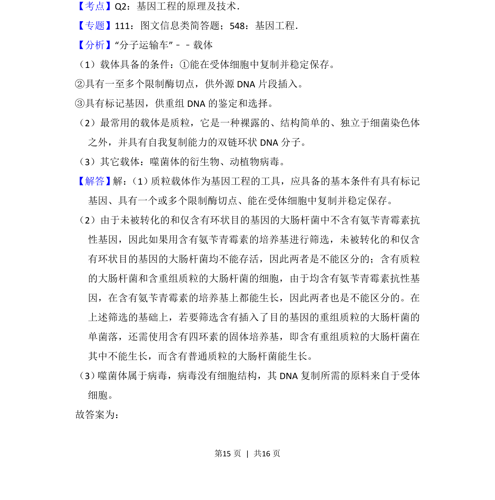
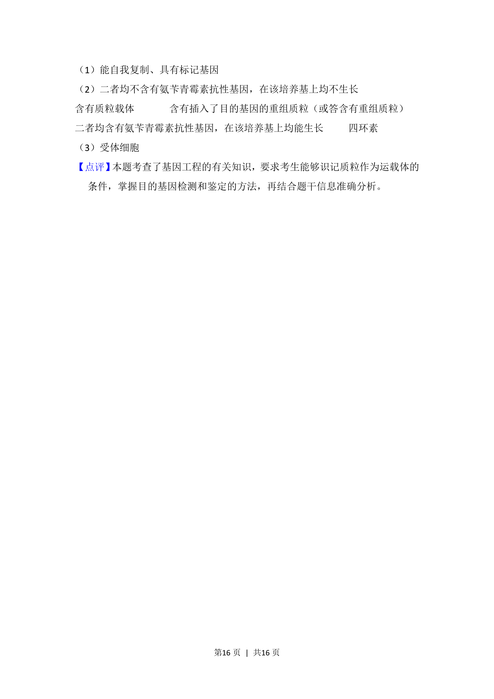

## 题面

## 摘要

考查质粒载体条件、抗性筛选及重组质粒鉴定

## 关联考点

- [[411-基因工程|基因工程]]
- [[710-质粒载体|质粒载体]]
- [[617-标记基因|标记基因]]
- [[抗性筛选]]

## 答案与解析

> 📄 原 PDF 第 14 页：`素材/真题/湖南/2008-2024·（湖南）生物高考真题/2016年高考生物试卷（新课标Ⅰ）（解析卷）.pdf`
