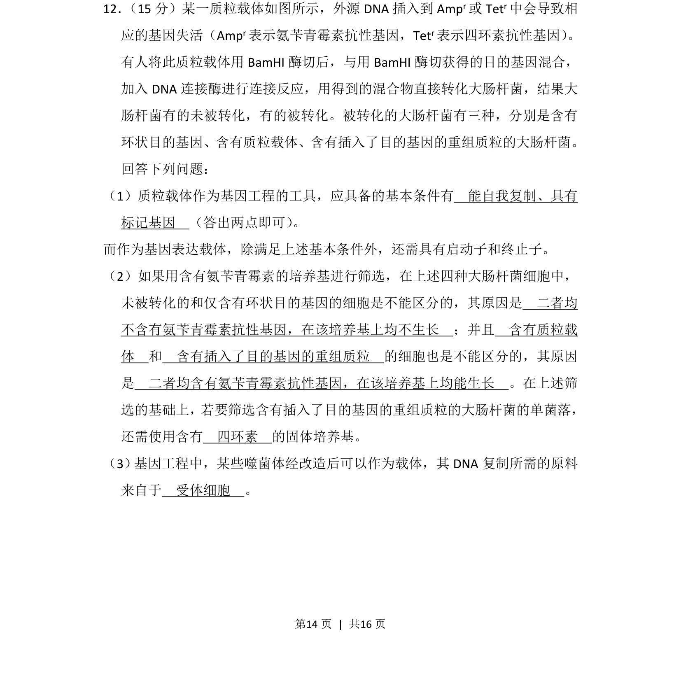
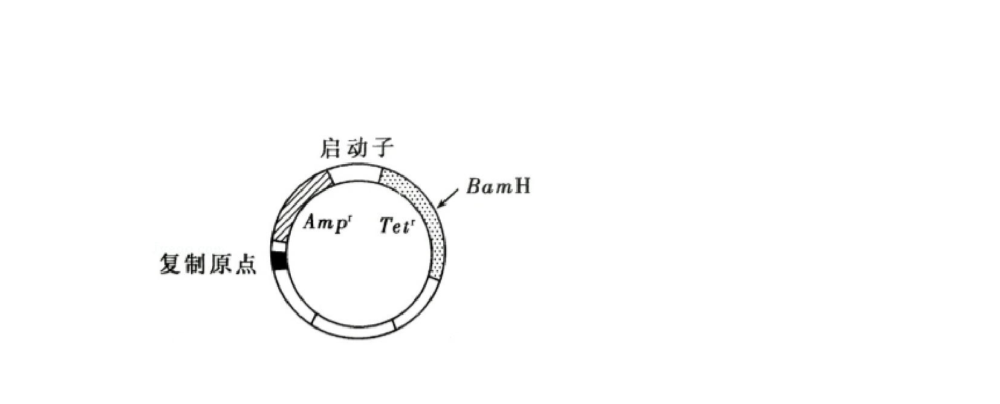
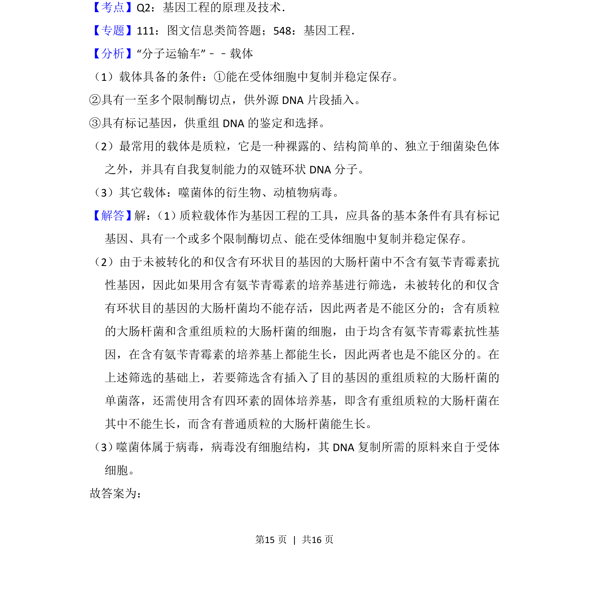
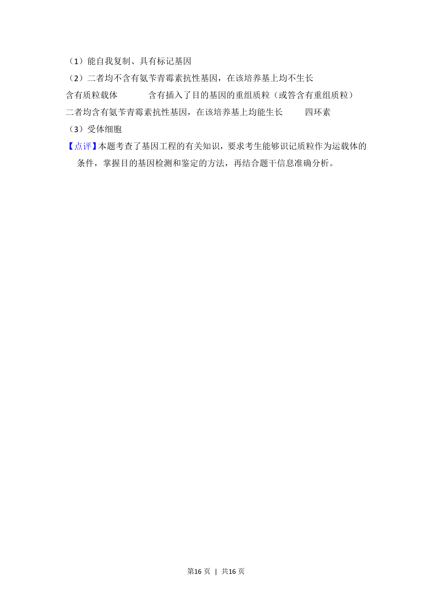

## 题面

## 摘要

考查质粒载体条件、抗性筛选及重组质粒鉴定

## 关联考点

- [[411-基因工程|基因工程]]
- [[710-质粒载体|质粒载体]]
- [[617-标记基因|标记基因]]
- [[抗性筛选]]

## 答案与解析

> 📄 原 PDF 第 14 页：`素材/真题/湖南/2008-2024·（湖南）生物高考真题/2016年高考生物试卷（新课标Ⅰ）（解析卷）.pdf`

<!-- 题干文本-start -->
## 题干文本
12． （15分）某一质粒载体如图所示，外源DNA插入到Ampr或Tet r中会导致相
应的基因失活（Ampr表示氨苄青霉素抗性基因，Tetr表示四环素抗性基因） 。
有人将此质粒载体用BamHI酶切后，与用BamHI酶切获得的目的基因混合，
加入DNA连接酶进行连接反应，用得到的混合物直接转化大肠杆菌，结果大
肠杆菌有的未被转化，有的被转化。被转化的大肠杆菌有三种，分别是含有
环状目的基因、含有质粒载体、含有插入了目的基因的重组质粒的大肠杆菌。
回答下列问题：
（1）质粒载体作为基因工程的工具，应具备的基本条件有　能自我复制、具有
标记基因　（答出两点即可） 。
而作为基因表达载体，除满足上述基本条件外，还需具有启动子和终止子。
（2）如果用含有氨苄青霉素的培养基进行筛选，在上述四种大肠杆菌细胞中，
未被转化的和仅含有环状目的基因的细胞是不能区分的，其原因是　二者均
不含有氨苄青霉素抗性基因，在该培养基上均不生长　；并且　含有质粒载
体　和　含有插入了目的基因的重组质粒　的细胞也是不能区分的，其原因
是　二者均含有氨苄青霉素抗性基因，在该培养基上均能生长　。在上述筛
选的基础上，若要筛选含有插入了目的基因的重组质粒的大肠杆菌的单菌落，
还需使用含有　四环素　的固体培养基。
（3） 基因工程中，某些噬菌体经改造后可以作为载体，其DNA复制所需的原料
来自于　受体细胞　。
<!-- 题干文本-end -->

<!-- 解析文本-start -->
## 解析文本

<!-- 解析文本-end -->
