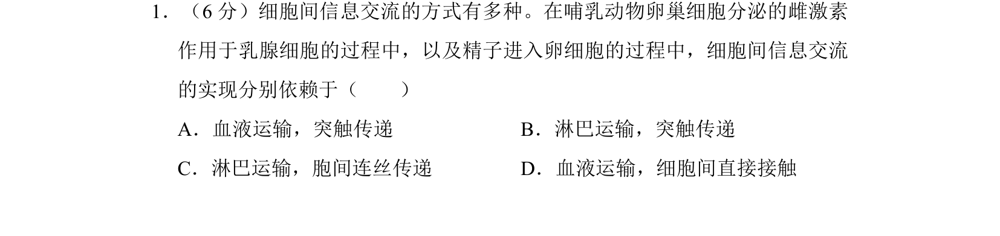

## 题面

## 摘要

激素通过血液运输，精卵通过直接接触传递。

## 关联考点

- [[507-细胞间信息交流|细胞间信息交流]]
- [[血液运输]]
- [[929-直接接触|直接接触]]

## 答案与解析

> 📄 原 PDF 第 1 页：`素材/真题/湖南/2008-2024·（湖南）生物高考真题/2017年高考生物试卷（新课标Ⅰ）（解析卷）.pdf`

<!-- 题干文本-start -->
## 题干文本
1．（6分）细胞间信息交流的方式有多种。在哺乳动物卵巢细胞分泌的雌激素
作用于乳腺细胞的过程中，以及精子进入卵细胞的过程中，细胞间信息交流
的实现分别依赖于（　　）
A．血液运输，突触传递B．淋巴运输，突触传递
C．淋巴运输，胞间连丝传递D．血液运输，细胞间直接接触
<!-- 题干文本-end -->

<!-- 解析文本-start -->
## 解析文本
【考点】24：细胞膜的功能．菁优网版权所有
【分析】细胞间信息交流的方式有三种：
1．以化学信息形式通过血液运输完成，如激素；
<!-- 解析文本-end -->
