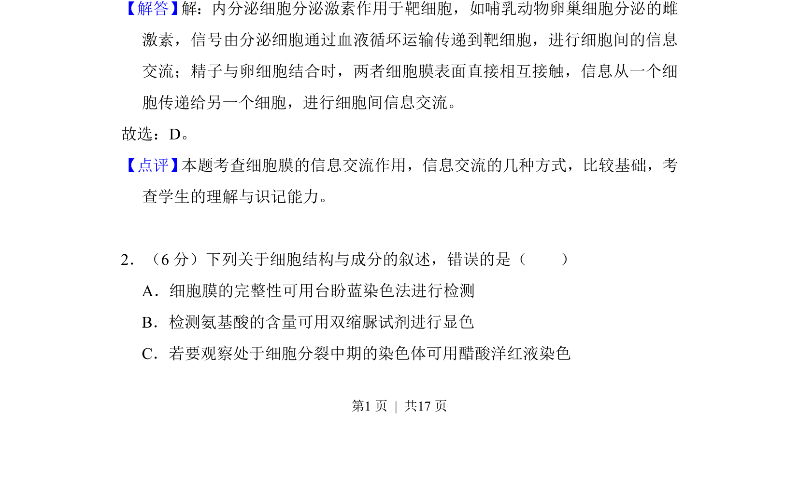
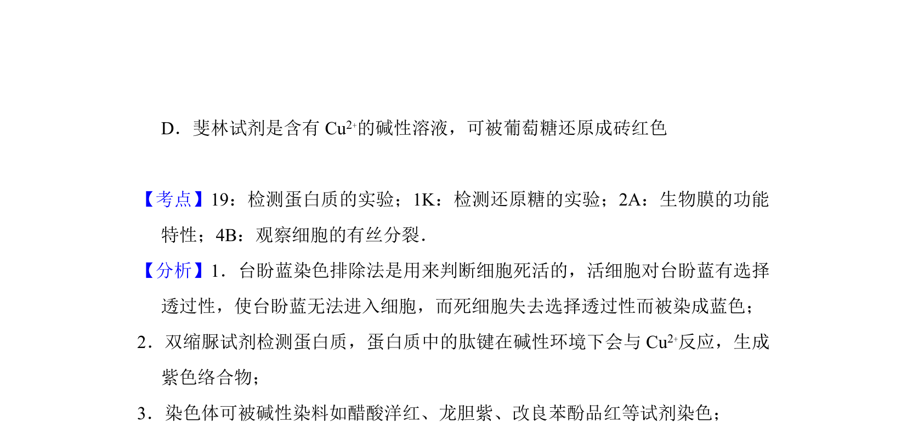

## 题面

## 摘要

细胞通过激素运输和细胞接触等方式进行信息交流

## 关联考点

- [[507-细胞间信息交流|细胞间信息交流]]
- [[331-激素调节|激素调节]]
- [[细胞膜功能]]

## 答案与解析

> 📄 原 PDF 第 1 页：`素材/真题/湖南/2008-2024·（湖南）生物高考真题/2017年高考生物试卷（新课标Ⅰ）（解析卷）.pdf`

<!-- 题干文本-start -->
## 题干文本
3．通过通道如胞间连丝完成，如植物细胞之间的信息传递。
<!-- 题干文本-end -->

<!-- 解析文本-start -->
## 解析文本
【解答】 解：内分泌细胞分泌激素作用于靶细胞，如哺乳动物卵巢细胞分泌的雌
激素，信号由分泌细胞通过血液循环运输传递到靶细胞，进行细胞间的信息
交流；精子与卵细胞结合时，两者细胞膜表面直接相互接触，信息从一个细
胞传递给另一个细胞，进行细胞间信息交流。
故选：D。
【点评】 本题考查细胞膜的信息交流作用，信息交流的几种方式，比较基础，考
查学生的理解与识记能力。
　
2．（6分）下列关于细胞结构与成分的叙述，错误的是（　　）
A．细胞膜的完整性可用台盼蓝染色法进行检测
B．检测氨基酸的含量可用双缩脲试剂进行显色
C．若要观察处于细胞分裂中期的染色体可用醋酸洋红液染色
<!-- 解析文本-end -->
