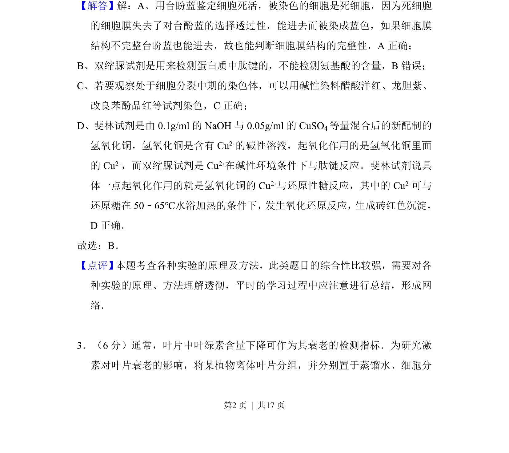
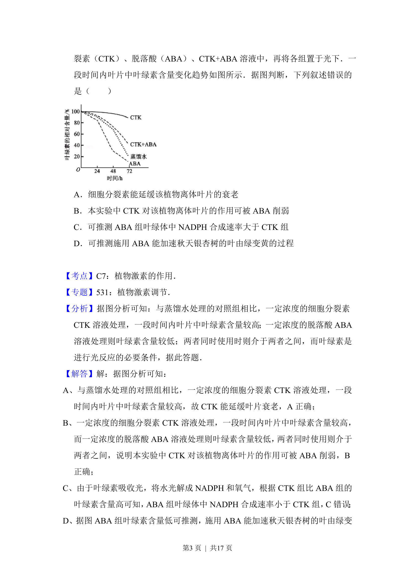
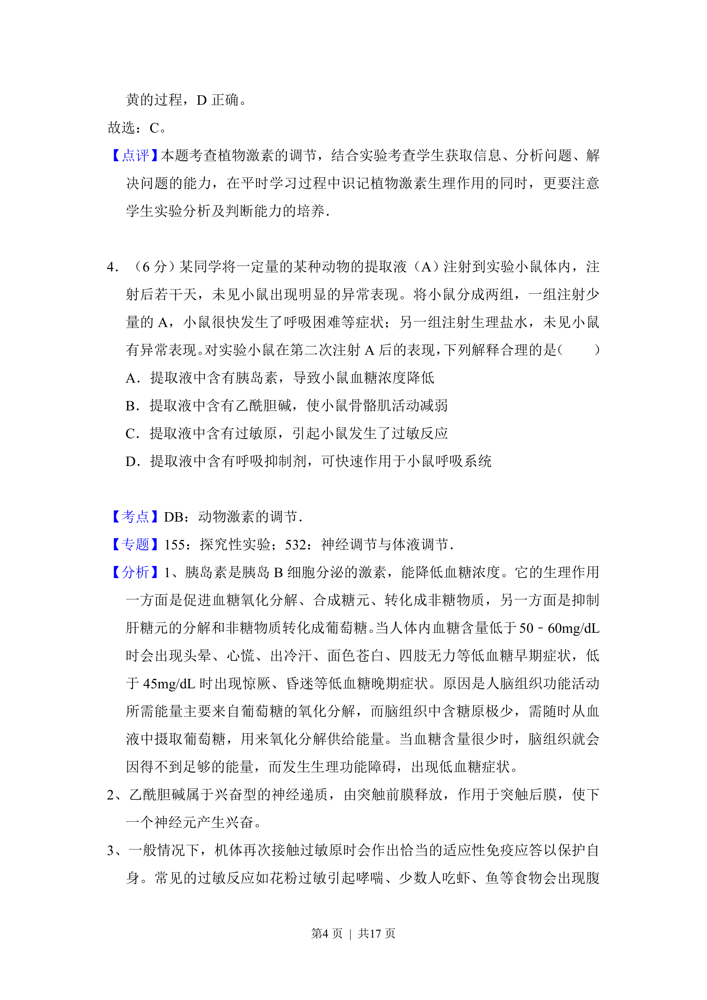
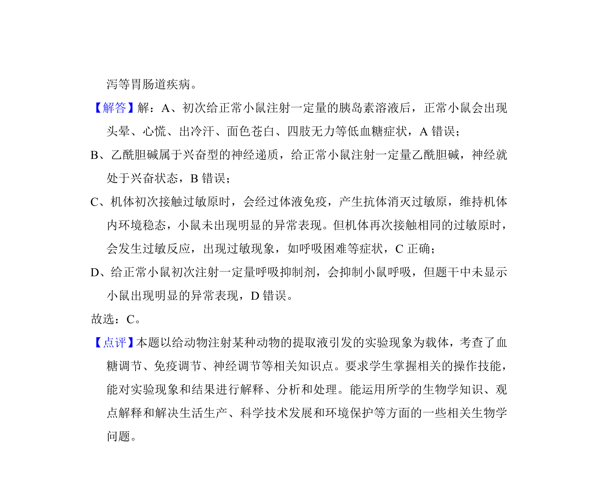

## 题面

## 摘要

考查生物实验中常用试剂的使用原理与鉴别方法，如台盼蓝、双缩脲试剂、斐林试剂等。

## 关联考点

- [[细胞膜选择透过性]]
- [[蛋白质检测]]
- [[773-还原糖检测|还原糖检测]]
- [[染色体染色]]

## 答案与解析

> 📄 原 PDF 第 2 页：`素材/真题/湖南/2008-2024·（湖南）生物高考真题/2017年高考生物试卷（新课标Ⅰ）（解析卷）.pdf`
