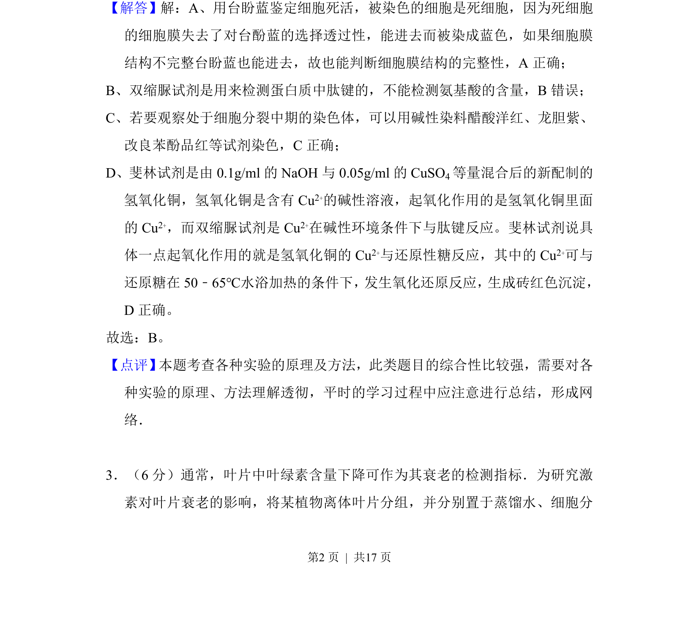
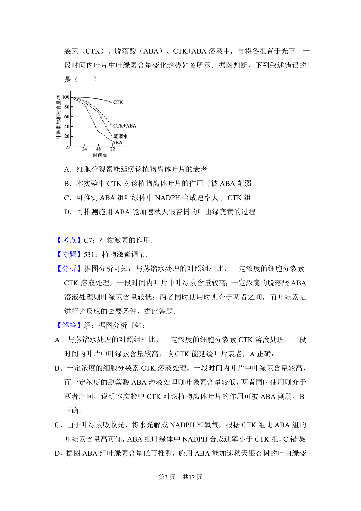
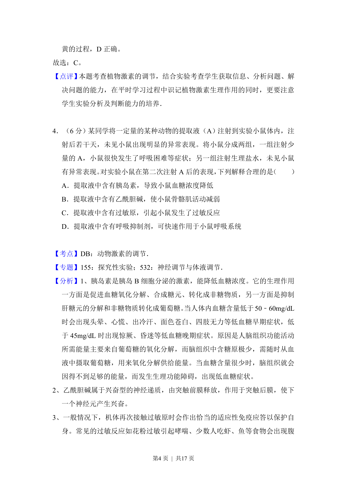
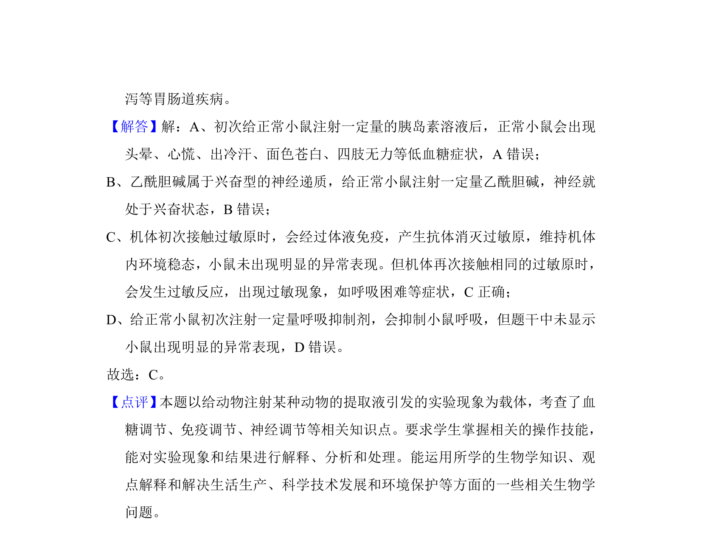

## 题面

## 摘要

考查生物实验中常用试剂的使用原理与鉴别方法，如台盼蓝、双缩脲试剂、斐林试剂等。

## 关联考点

- [[细胞膜选择透过性]]
- [[蛋白质检测]]
- [[773-还原糖检测|还原糖检测]]
- [[染色体染色]]

## 答案与解析

> 📄 原 PDF 第 2 页：`素材/真题/湖南/2008-2024·（湖南）生物高考真题/2017年高考生物试卷（新课标Ⅰ）（解析卷）.pdf`

<!-- 题干文本-start -->
## 题干文本
4．斐林试剂与还原性糖在50﹣65℃水浴加热条件下反应，生成砖红色沉淀．
<!-- 题干文本-end -->

<!-- 解析文本-start -->
## 解析文本
【解答】解：A、用台盼蓝鉴定细胞死活，被染色的细胞是死细胞，因为死细胞
的细胞膜失去了对台酚蓝的选择透过性，能进去而被染成蓝色，如果细胞膜
结构不完整台盼蓝也能进去，故也能判断细胞膜结构的完整性，A正确； 
B、双缩脲试剂是用来检测蛋白质中肽键的，不能检测氨基酸的含量，B错误； 
C、若要观察处于细胞分裂中期的染色体，可以用碱性染料醋酸洋红、龙胆紫、
改良苯酚品红等试剂染色，C正确； 
D、斐林试剂是由0.1g/ml的NaOH与0.05g/ml的CuSO 4等量混合后的新配制的
氢氧化铜，氢氧化铜是含有Cu 2+的碱性溶液，起氧化作用的是氢氧化铜里面
的Cu 2+，而双缩脲试剂是Cu 2+在碱性环境条件下与肽键反应。斐林试剂说具
体一点起氧化作用的就是氢氧化铜的Cu 2+与还原性糖反应，其中的Cu 2+可与
还原糖在50﹣65℃水浴加热的条件下，发生氧化还原反应，生成砖红色沉淀，
D正确。
故选：B。
【点评】 本题考查各种实验的原理及方法，此类题目的综合性比较强，需要对各
种实验的原理、方法理解透彻，平时的学习过程中应注意进行总结，形成网
络．
　
3．（6分）通常，叶片中叶绿素含量下降可作为其衰老的检测指标．为研究激
素对叶片衰老的影响，将某植物离体叶片分组，并分别置于蒸馏水、细胞分
<!-- 解析文本-end -->
