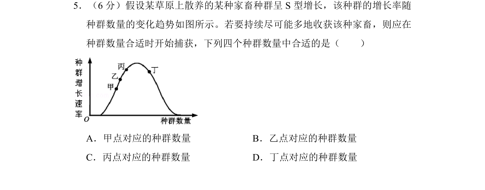
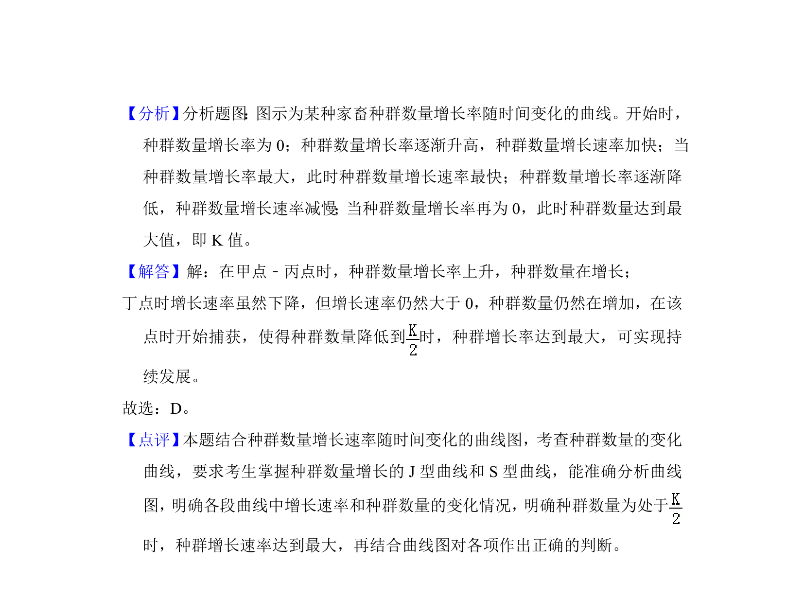

## 题面

## 摘要

该题考查S型种群增长中增长率变化规律及持续最大捕获量对应的种群数量选取。

## 关联考点

- [[种群数量变动]]
- [[926-S型增长|S型增长]]
- [[增长率]]
- [[持续最大捕获量]]

## 答案与解析

> 📄 原 PDF 第 5 页：`素材/真题/湖南/2008-2024·（湖南）生物高考真题/2017年高考生物试卷（新课标Ⅰ）（解析卷）.pdf`

<!-- 题干文本-start -->
## 题干文本
5．（6分）假设某草原上散养的某种家畜种群呈S型增长，该种群的增长率随
种群数量的变化趋势如图所示。若要持续尽可能多地收获该种家畜，则应在
种群数量合适时开始捕获，下列四个种群数量中合适的是（　　）
A．甲点对应的种群数量B．乙点对应的种群数量
C．丙点对应的种群数量D．丁点对应的种群数量
<!-- 题干文本-end -->

<!-- 解析文本-start -->
## 解析文本
【考点】F2：种群的数量变动．菁优网版权所有
【专题】121：坐标曲线图；536：种群和群落．
<!-- 解析文本-end -->
