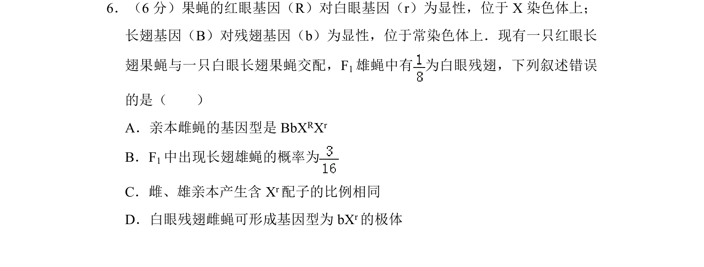
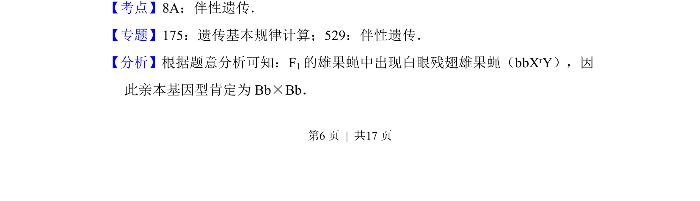
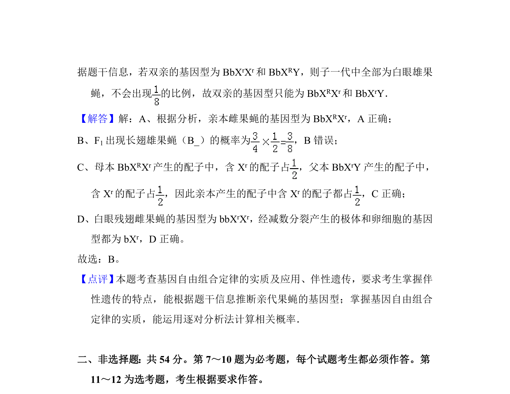

## 题面

## 摘要

果蝇眼色伴X遗传与翅型常染色体遗传的综合推断与计算

## 关联考点

- [[276-伴性遗传|伴性遗传]]
- [[477-基因分离定律|基因分离定律]]
- [[580-基因自由组合定律|基因自由组合定律]]

## 答案与解析

> 📄 原 PDF 第 6 页：`素材/真题/湖南/2008-2024·（湖南）生物高考真题/2017年高考生物试卷（新课标Ⅰ）（解析卷）.pdf`
