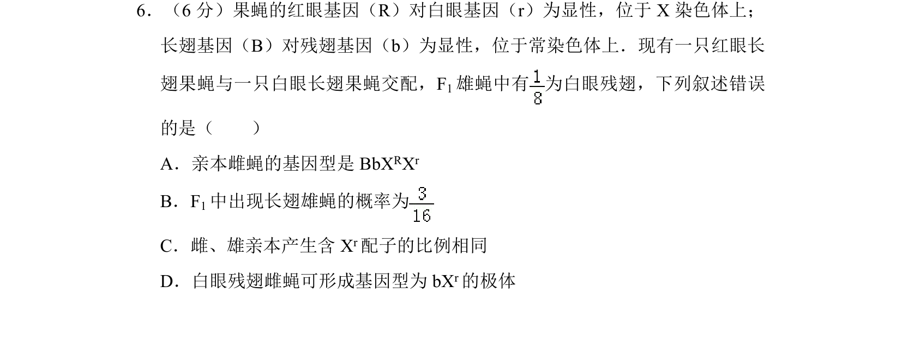
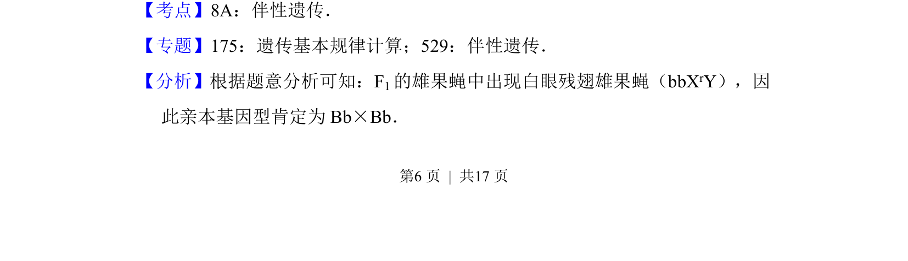
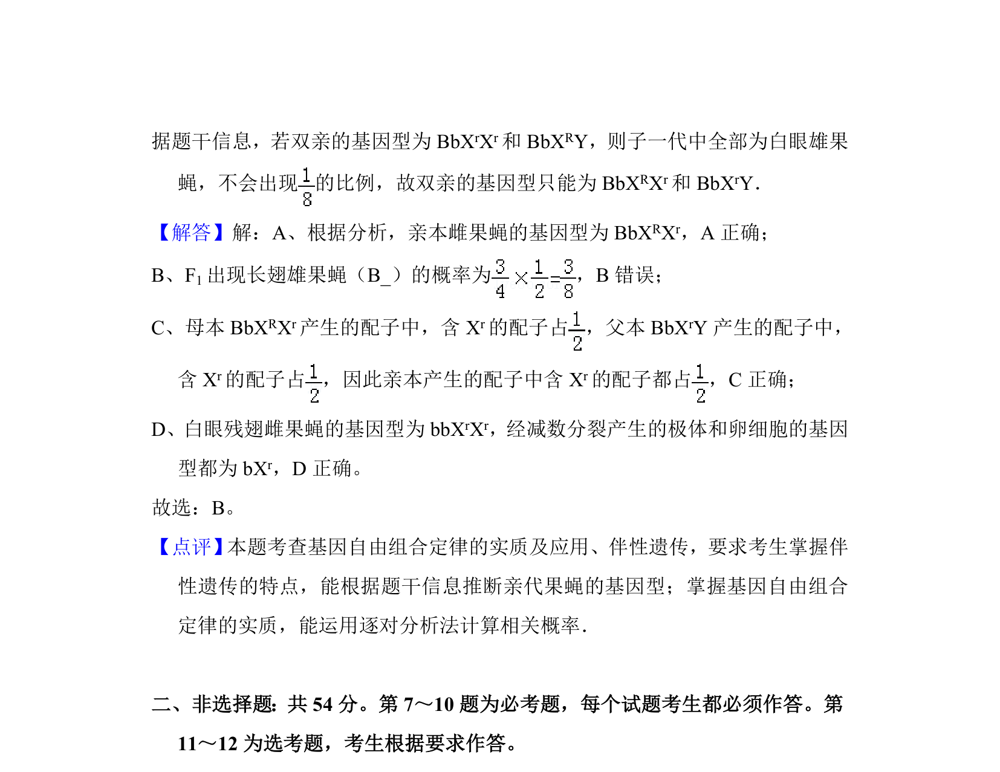

## 题面

## 摘要

果蝇眼色伴X遗传与翅型常染色体遗传的综合推断与计算

## 关联考点

- [[276-伴性遗传|伴性遗传]]
- [[477-基因分离定律|基因分离定律]]
- [[580-基因自由组合定律|基因自由组合定律]]

## 答案与解析

> 📄 原 PDF 第 6 页：`素材/真题/湖南/2008-2024·（湖南）生物高考真题/2017年高考生物试卷（新课标Ⅰ）（解析卷）.pdf`

<!-- 题干文本-start -->
## 题干文本
6．（6分）果蝇的红眼基因（R）对白眼基因（r）为显性，位于X染色体上；
长翅基因（B）对残翅基因（b）为显性，位于常染色体上．现有一只红眼长
翅果蝇与一只白眼长翅果蝇交配，F 1雄蝇中有 为白眼残翅，下列叙述错误
的是（　　）
A．亲本雌蝇的基因型是BbX RXr
B．F1中出现长翅雄蝇的概率为
C．雌、雄亲本产生含X r配子的比例相同
D．白眼残翅雌蝇可形成基因型为bX r的极体
<!-- 题干文本-end -->

<!-- 解析文本-start -->
## 解析文本
【考点】8A：伴性遗传．菁优网版权所有
【专题】175：遗传基本规律计算；529：伴性遗传．
【分析】根据题意分析可知：F1的雄果蝇中出现白眼残翅雄果蝇（bbXrY），因
此亲本基因型肯定为Bb×Bb．
<!-- 解析文本-end -->
