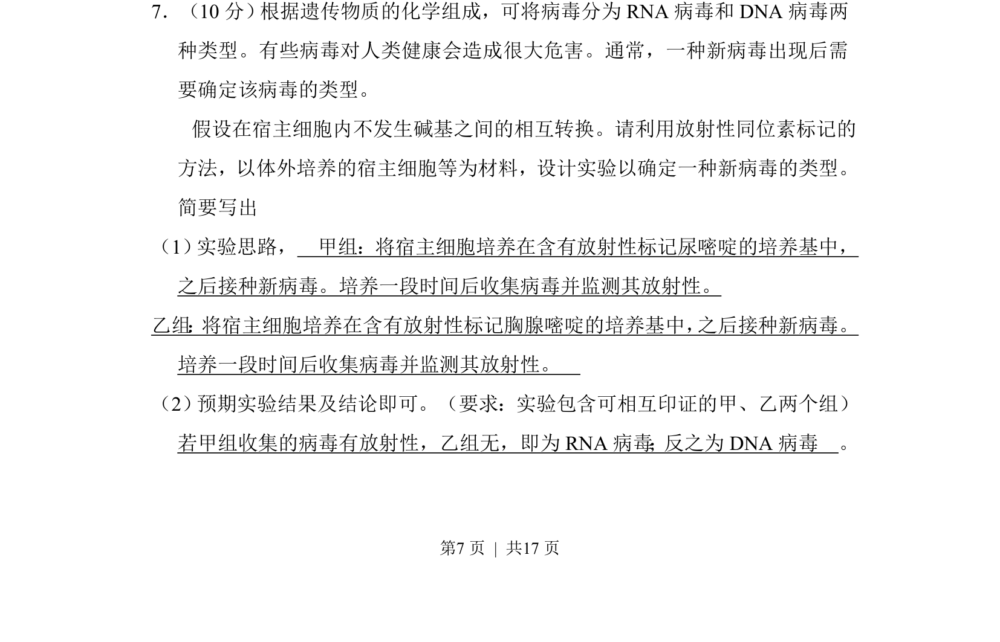
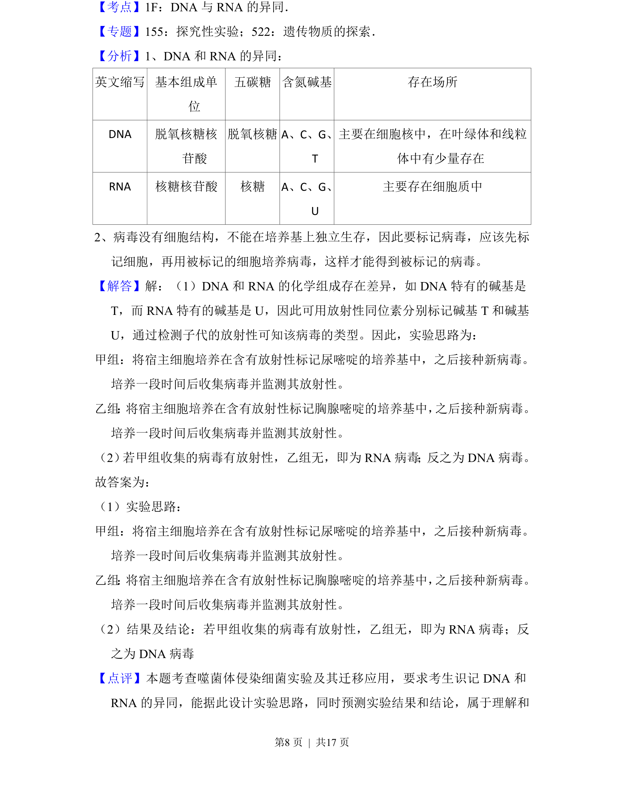

## 题面

## 摘要

设计实验利用放射性同位素标记法区分RNA病毒与DNA病毒

## 关联考点

- [[病毒类型]]
- [[核酸组成]]
- [[913-同位素标记|同位素标记]]
- [[482-实验设计|实验设计]]

## 答案与解析

> 📄 原 PDF 第 7 页：`素材/真题/湖南/2008-2024·（湖南）生物高考真题/2017年高考生物试卷（新课标Ⅰ）（解析卷）.pdf`

<!-- 题干文本-start -->
## 题干文本
7．（10分） 根据遗传物质的化学组成，可将病毒分为RNA病毒和DNA病毒两
种类型。有些病毒对人类健康会造成很大危害。通常，一种新病毒出现后需
要确定该病毒的类型。
    假设在宿主细胞内不发生碱基之间的相互转换。请利用放射性同位素标记的
方法，以体外培养的宿主细胞等为材料，设计实验以确定一种新病毒的类型。
简要写出
（1） 实验思路，　甲组：将宿主细胞培养在含有放射性标记尿嘧啶的培养基中，
之后接种新病毒。培养一段时间后收集病毒并监测其放射性。
乙组 ： 将宿主细胞培养在含有放射性标记胸腺嘧啶的培养基中， 之后接种新病毒。
培养一段时间后收集病毒并监测其放射性。　
（2） 预期实验结果及结论即可。（要求：实验包含可相互印证的甲、乙两个组） 　
若甲组收集的病毒有放射性，乙组无，即为RNA病毒；反之为DNA病毒　。
<!-- 题干文本-end -->

<!-- 解析文本-start -->
## 解析文本

<!-- 解析文本-end -->
