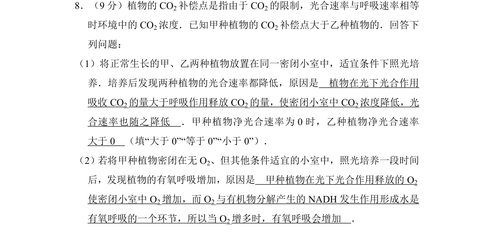
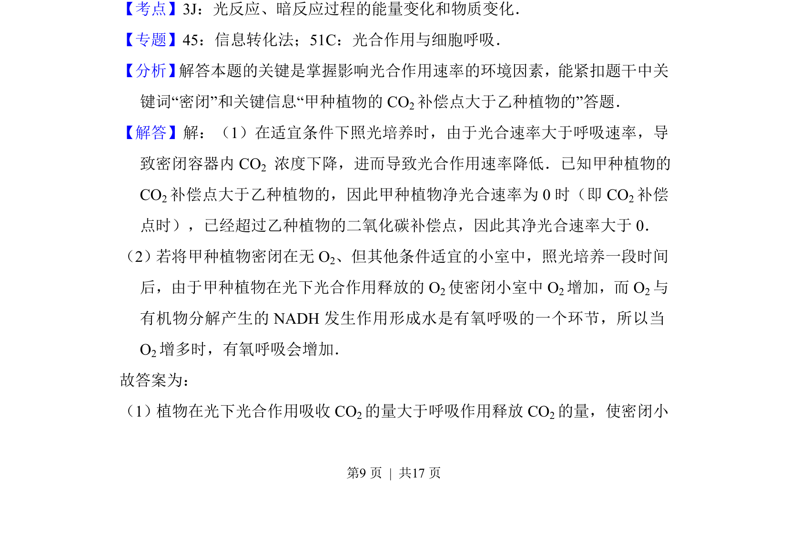
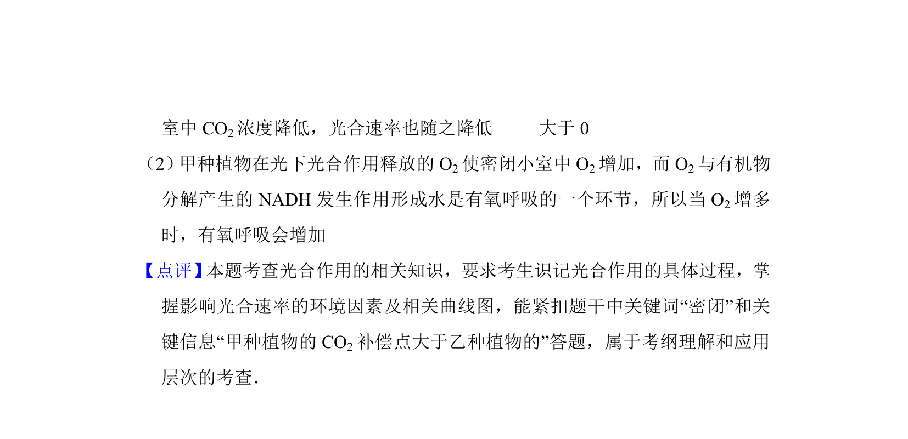

## 题面

## 摘要

植物在密闭小室中光合与呼吸导致CO2浓度变化，比较两种植物CO2补偿点及净光合速率。

## 关联考点

- [[543-光合作用强度|光合速率]]
- [[呼吸速率]]
- [[CO2补偿点]]
- [[552-净光合速率|净光合速率]]

## 答案与解析

> 📄 原 PDF 第 9 页：`素材/真题/湖南/2008-2024·（湖南）生物高考真题/2017年高考生物试卷（新课标Ⅰ）（解析卷）.pdf`
