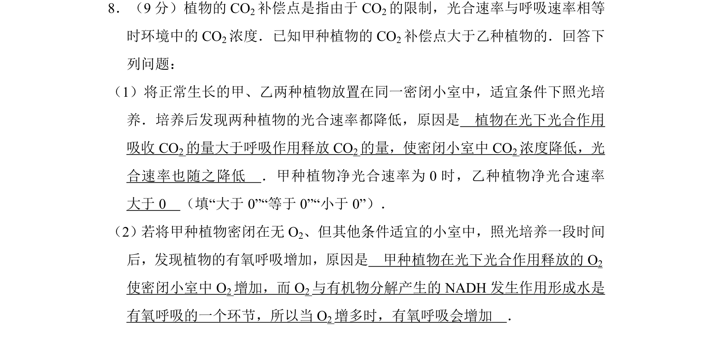
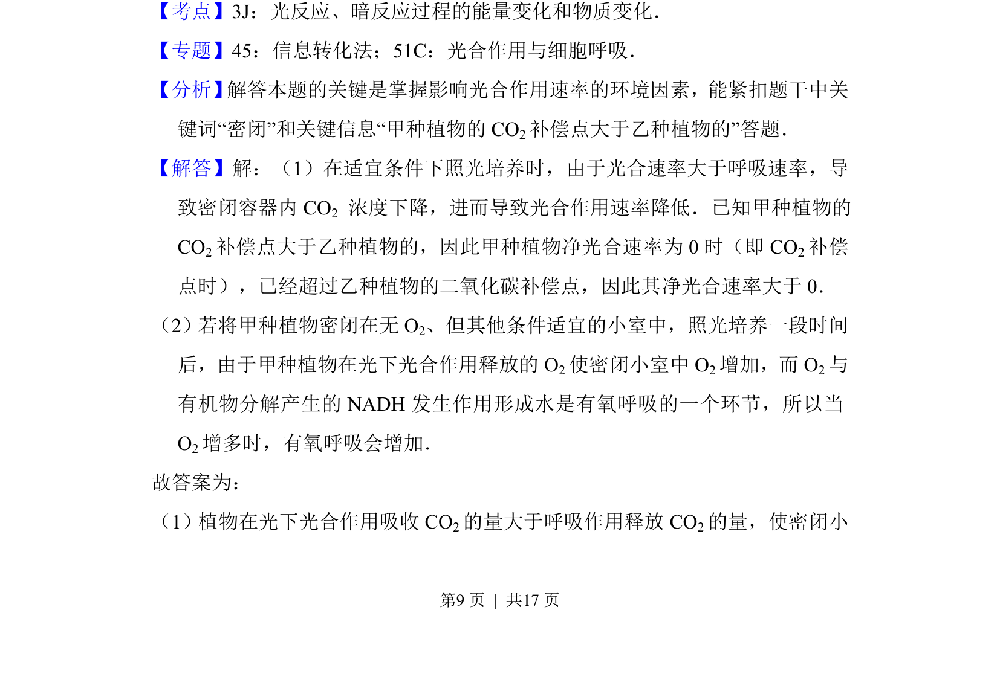
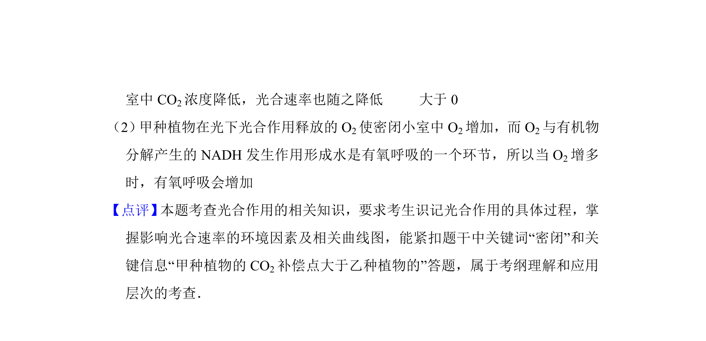

## 题面

## 摘要

植物在密闭小室中光合与呼吸导致CO2浓度变化，比较两种植物CO2补偿点及净光合速率。

## 关联考点

- [[543-光合作用强度|光合速率]]
- [[呼吸速率]]
- [[CO2补偿点]]
- [[552-净光合速率|净光合速率]]

## 答案与解析

> 📄 原 PDF 第 9 页：`素材/真题/湖南/2008-2024·（湖南）生物高考真题/2017年高考生物试卷（新课标Ⅰ）（解析卷）.pdf`

<!-- 题干文本-start -->
## 题干文本
8．（9分）植物的CO 2补偿点是指由于CO 2的限制，光合速率与呼吸速率相等
时环境中的CO 2浓度．已知甲种植物的CO 2补偿点大于乙种植物的．回答下
列问题：
（1）将正常生长的甲、乙两种植物放置在同一密闭小室中，适宜条件下照光培
养．培养后发现两种植物的光合速率都降低，原因是　植物在光下光合作用
吸收CO 2的量大于呼吸作用释放CO 2的量，使密闭小室中CO 2浓度降低，光
合速率也随之降低　．甲种植物净光合速率为0时，乙种植物净光合速率　
大于0　（填“大于0”“等于0”“小于0”）．
（2）若将甲种植物密闭在无O2、但其他条件适宜的小室中，照光培养一段时间
后，发现植物的有氧呼吸增加，原因是　甲种植物在光下光合作用释放的O 2
使密闭小室中O 2增加，而O 2与有机物分解产生的NADH发生作用形成水是
有氧呼吸的一个环节，所以当O 2增多时，有氧呼吸会增加　．
<!-- 题干文本-end -->

<!-- 解析文本-start -->
## 解析文本
【考点】3J：光反应、暗反应过程的能量变化和物质变化．菁优网版权所有
【专题】45：信息转化法；51C：光合作用与细胞呼吸．
【分析】 解答本题的关键是掌握影响光合作用速率的环境因素，能紧扣题干中关
键词“密闭”和关键信息“甲种植物的CO 2补偿点大于乙种植物的”答题．
【解答】解：（1）在适宜条件下照光培养时，由于光合速率大于呼吸速率，导
致密闭容器内CO 2 浓度下降，进而导致光合作用速率降低．已知甲种植物的
CO2补偿点大于乙种植物的，因此甲种植物净光合速率为0时（即CO 2补偿
点时），已经超过乙种植物的二氧化碳补偿点，因此其净光合速率大于0．
（2）若将甲种植物密闭在无O2、但其他条件适宜的小室中，照光培养一段时间
后，由于甲种植物在光下光合作用释放的O 2使密闭小室中O 2增加，而O 2与
有机物分解产生的NADH发生作用形成水是有氧呼吸的一个环节，所以当
O2增多时，有氧呼吸会增加．
故答案为：
（1）植物在光下光合作用吸收CO2的量大于呼吸作用释放CO 2的量，使密闭小
<!-- 解析文本-end -->
