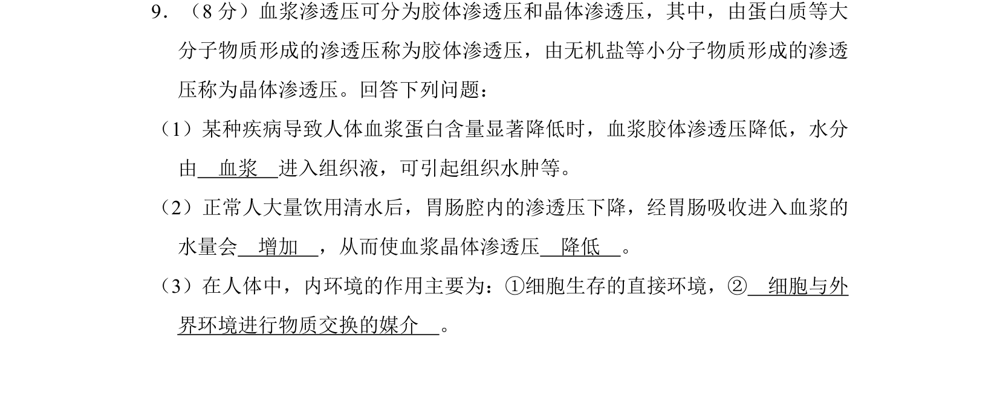
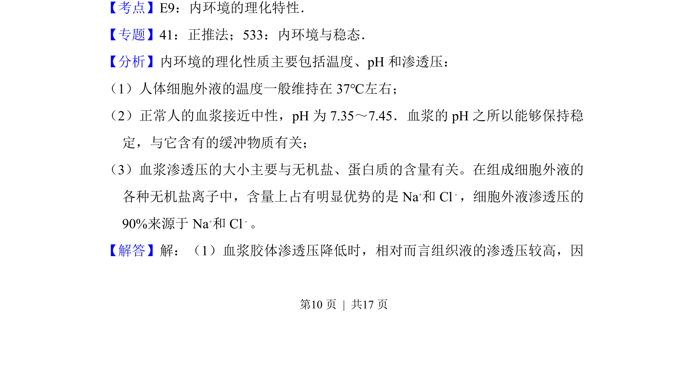
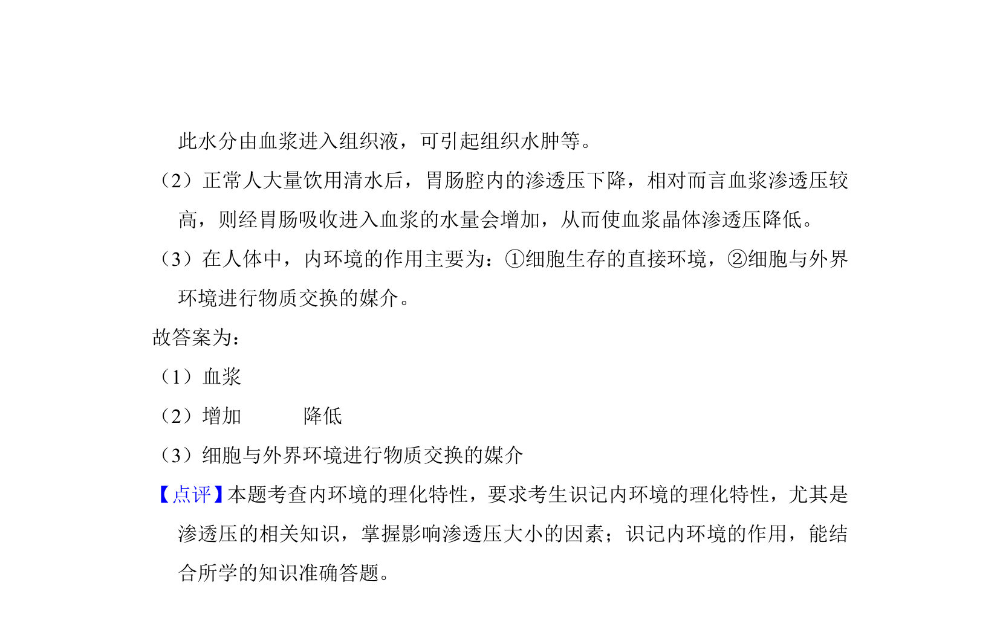

## 题面

## 摘要

考查血浆胶体渗透压与晶体渗透压的区别及内环境作用

## 关联考点

- [[313-内环境|内环境]]
- [[741-血浆渗透压|血浆渗透压]]
- [[组织水肿]]
- [[314-内环境稳态|稳态]]

## 答案与解析

> 📄 原 PDF 第 10 页：`素材/真题/湖南/2008-2024·（湖南）生物高考真题/2017年高考生物试卷（新课标Ⅰ）（解析卷）.pdf`
