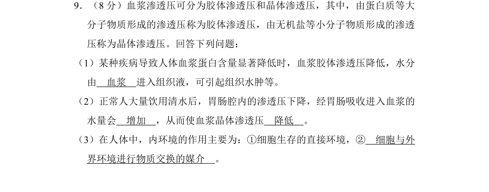
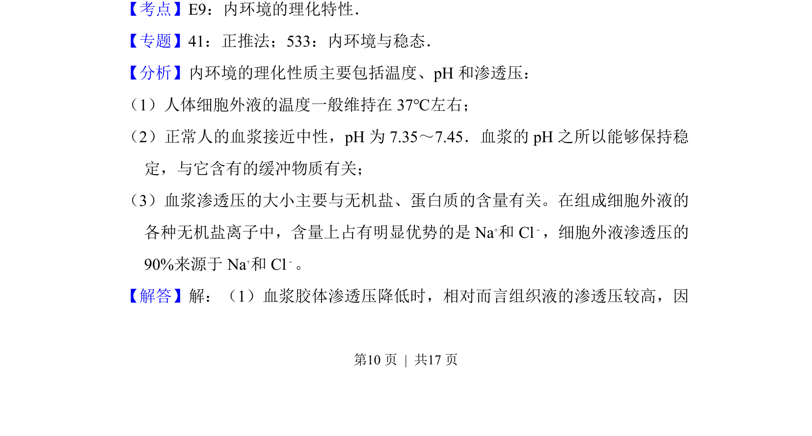
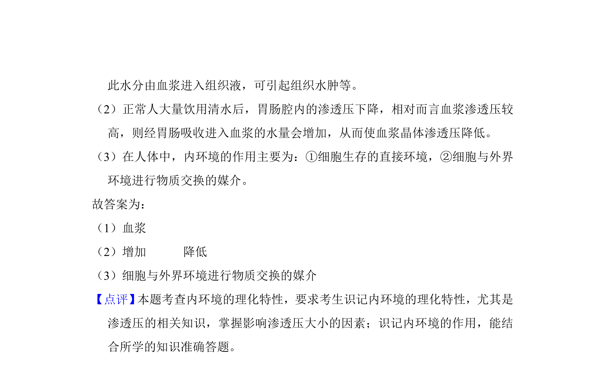

## 题面

## 摘要

考查血浆胶体渗透压与晶体渗透压的区别及内环境作用

## 关联考点

- [[313-内环境|内环境]]
- [[741-血浆渗透压|血浆渗透压]]
- [[组织水肿]]
- [[314-内环境稳态|稳态]]

## 答案与解析

> 📄 原 PDF 第 10 页：`素材/真题/湖南/2008-2024·（湖南）生物高考真题/2017年高考生物试卷（新课标Ⅰ）（解析卷）.pdf`

<!-- 题干文本-start -->
## 题干文本
9．（8分）血浆渗透压可分为胶体渗透压和晶体渗透压，其中，由蛋白质等大
分子物质形成的渗透压称为胶体渗透压，由无机盐等小分子物质形成的渗透
压称为晶体渗透压。回答下列问题：
（1）某种疾病导致人体血浆蛋白含量显著降低时，血浆胶体渗透压降低，水分
由　血浆　进入组织液，可引起组织水肿等。
（2）正常人大量饮用清水后，胃肠腔内的渗透压下降，经胃肠吸收进入血浆的
水量会　增加　，从而使血浆晶体渗透压　降低　。
（3）在人体中，内环境的作用主要为：①细胞生存的直接环境，②　细胞与外
界环境进行物质交换的媒介　。
<!-- 题干文本-end -->

<!-- 解析文本-start -->
## 解析文本
【考点】E9：内环境的理化特性．菁优网版权所有
【专题】41：正推法；533：内环境与稳态．
【分析】内环境的理化性质主要包括温度、pH和渗透压：
（1）人体细胞外液的温度一般维持在37℃左右；
（2）正常人的血浆接近中性，pH为7.35～7.45．血浆的pH之所以能够保持稳
定，与它含有的缓冲物质有关；
（3）血浆渗透压的大小主要与无机盐、蛋白质的含量有关。在组成细胞外液的
各种无机盐离子中，含量上占有明显优势的是Na +和Cl ﹣，细胞外液渗透压的
90%来源于Na +和Cl ﹣。
【解答】解：（1）血浆胶体渗透压降低时，相对而言组织液的渗透压较高，因
<!-- 解析文本-end -->
