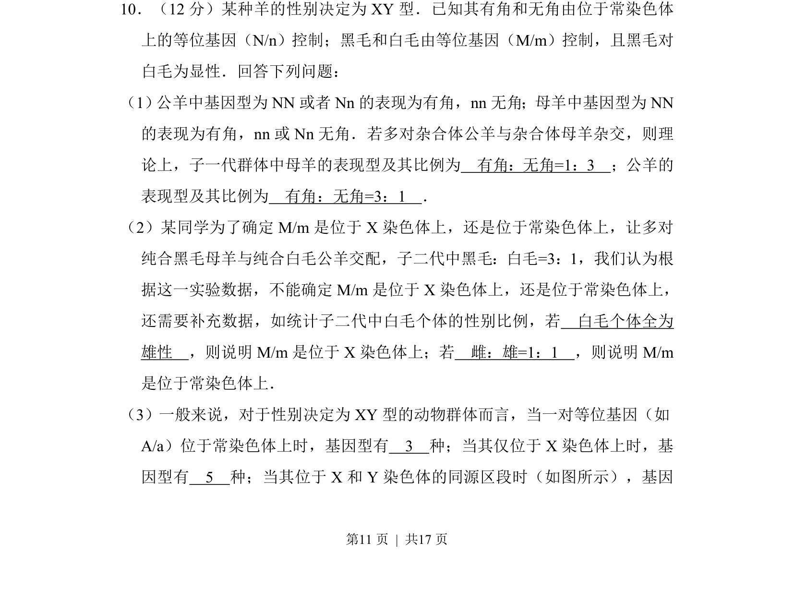
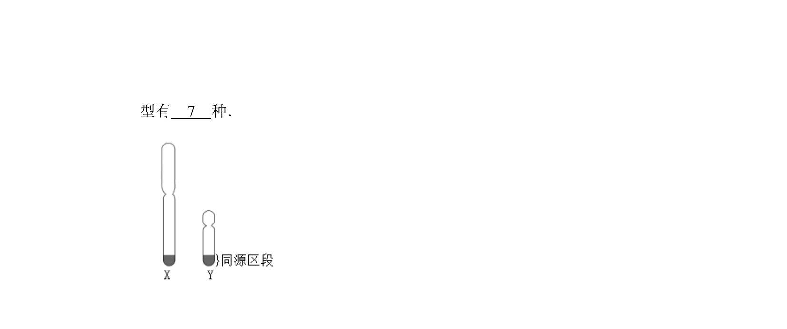
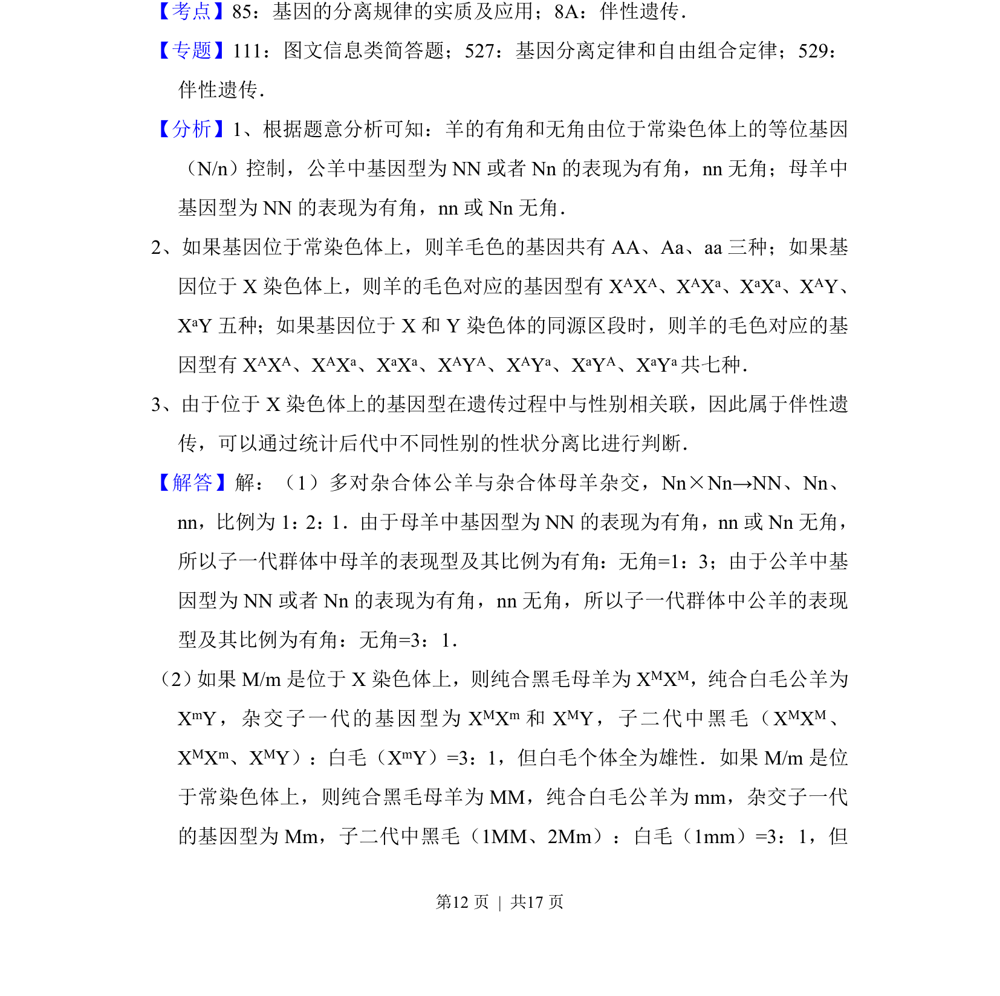
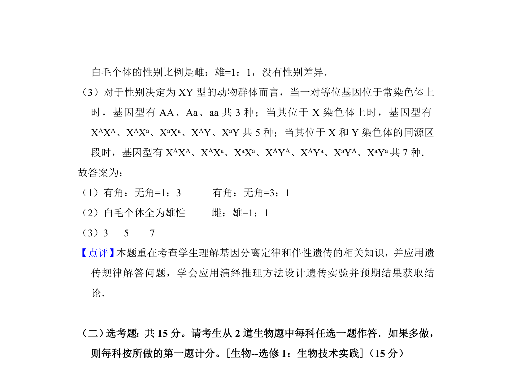

## 题面

## 摘要

该题考查羊的常染色体从性遗传、毛色基因定位及性染色体基因型种类。

## 关联考点

- [[从性遗传]]
- [[276-伴性遗传|伴性遗传]]
- [[478-基因定位|基因定位]]
- [[基因型种类]]

## 答案与解析

> 📄 原 PDF 第 11 页：`素材/真题/湖南/2008-2024·（湖南）生物高考真题/2017年高考生物试卷（新课标Ⅰ）（解析卷）.pdf`
