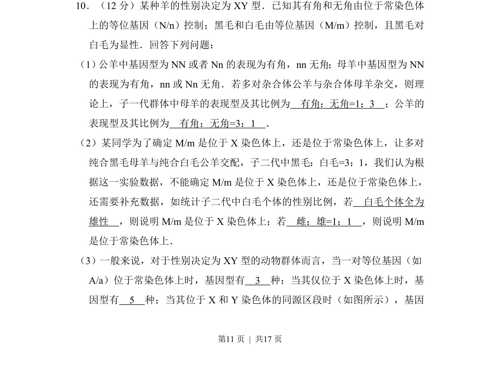
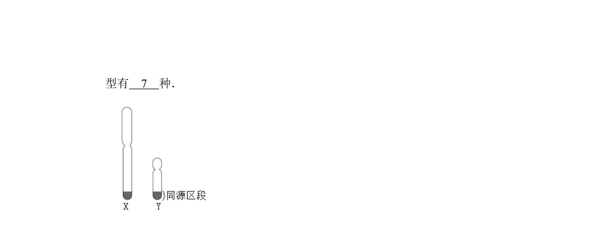
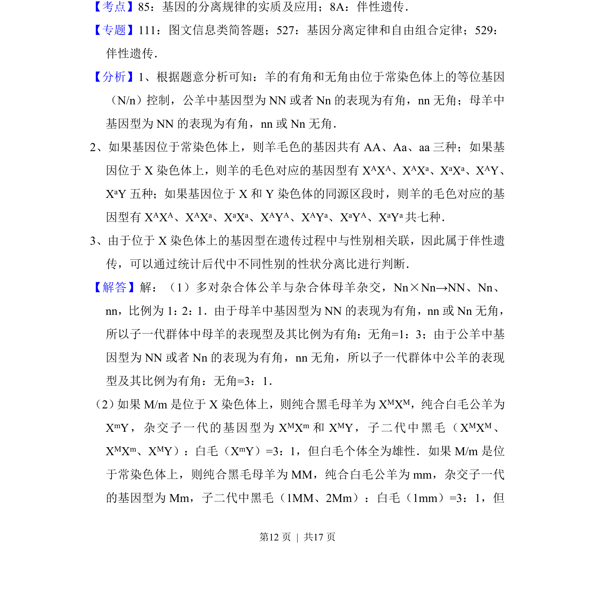
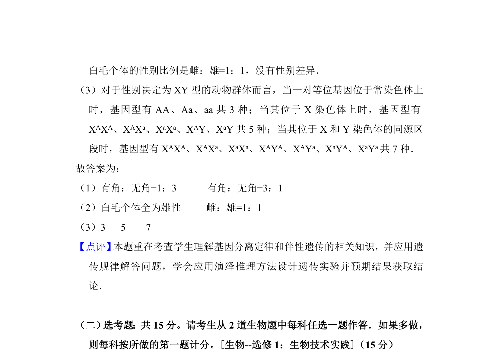

## 题面

## 摘要

该题考查羊的常染色体从性遗传、毛色基因定位及性染色体基因型种类。

## 关联考点

- [[从性遗传]]
- [[276-伴性遗传|伴性遗传]]
- [[478-基因定位|基因定位]]
- [[基因型种类]]

## 答案与解析

> 📄 原 PDF 第 11 页：`素材/真题/湖南/2008-2024·（湖南）生物高考真题/2017年高考生物试卷（新课标Ⅰ）（解析卷）.pdf`

<!-- 题干文本-start -->
## 题干文本
10．（12分）某种羊的性别决定为XY型．已知其有角和无角由位于常染色体
上的等位基因（N/n）控制；黑毛和白毛由等位基因（M/m）控制，且黑毛对
白毛为显性．回答下列问题：
（1） 公羊中基因型为NN或者Nn的表现为有角，nn无角；母羊中基因型为NN
的表现为有角，nn或Nn无角．若多对杂合体公羊与杂合体母羊杂交，则理
论上，子一代群体中母羊的表现型及其比例为　有角：无角=1：3　；公羊的
表现型及其比例为　有角：无角=3：1　．
（2）某同学为了确定M/m是位于X染色体上，还是位于常染色体上，让多对
纯合黑毛母羊与纯合白毛公羊交配，子二代中黑毛：白毛=3：1，我们认为根
据这一实验数据，不能确定M/m是位于X染色体上，还是位于常染色体上，
还需要补充数据，如统计子二代中白毛个体的性别比例，若　白毛个体全为
雄性　，则说明M/m是位于X染色体上；若　雌：雄=1：1　，则说明M/m
是位于常染色体上．
（3）一般来说，对于性别决定为XY型的动物群体而言，当一对等位基因（如
A/a）位于常染色体上时，基因型有　3　种；当其仅位于X染色体上时，基
因型有　5　种；当其位于X和Y染色体的同源区段时（如图所示），基因
<!-- 题干文本-end -->

<!-- 解析文本-start -->
## 解析文本

<!-- 解析文本-end -->
