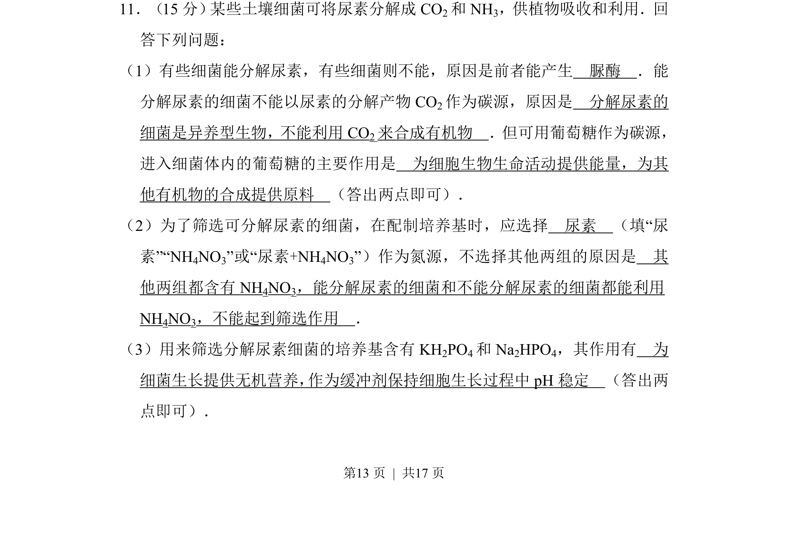
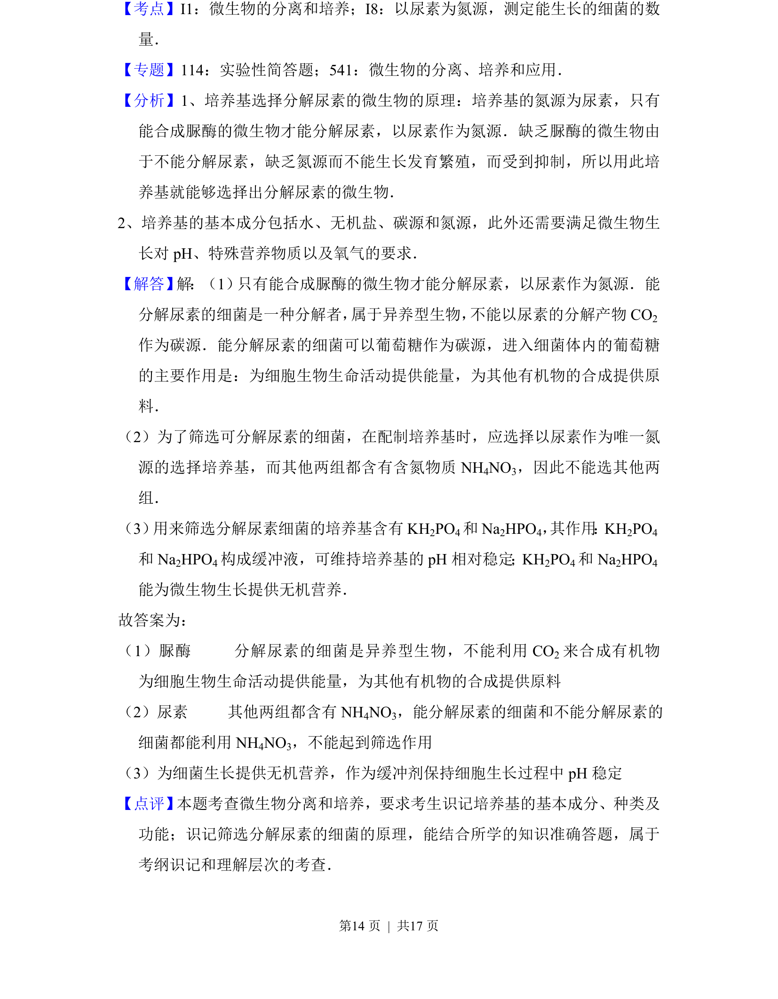

## 题面

## 摘要

该题考查尿素分解菌的代谢特点、筛选培养基设计及无机盐的作用。

## 关联考点

- [[脲酶]]
- [[碳源利用]]
- [[427-培养基|选择培养基]]
- [[无机盐功能]]

## 答案与解析

> 📄 原 PDF 第 13 页：`素材/真题/湖南/2008-2024·（湖南）生物高考真题/2017年高考生物试卷（新课标Ⅰ）（解析卷）.pdf`

<!-- 题干文本-start -->
## 题干文本
11．（15分） 某些土壤细菌可将尿素分解成CO2和NH 3，供植物吸收和利用．回
答下列问题：
（1）有些细菌能分解尿素，有些细菌则不能，原因是前者能产生　脲酶　．能
分解尿素的细菌不能以尿素的分解产物CO 2作为碳源，原因是　分解尿素的
细菌是异养型生物，不能利用CO 2来合成有机物　．但可用葡萄糖作为碳源，
进入细菌体内的葡萄糖的主要作用是　为细胞生物生命活动提供能量，为其
他有机物的合成提供原料　（答出两点即可）．
（2）为了筛选可分解尿素的细菌，在配制培养基时，应选择　尿素　（填“尿
素”“NH4NO3”或“尿素+NH 4NO3”）作为氮源，不选择其他两组的原因是　其
他两组都含有NH 4NO3，能分解尿素的细菌和不能分解尿素的细菌都能利用
NH4NO3，不能起到筛选作用　．
（3）用来筛选分解尿素细菌的培养基含有KH 2PO4和Na 2HPO4，其作用有　为
细菌生长提供无机营养， 作为缓冲剂保持细胞生长过程中pH稳定　（答出两
点即可）．
<!-- 题干文本-end -->

<!-- 解析文本-start -->
## 解析文本

<!-- 解析文本-end -->
