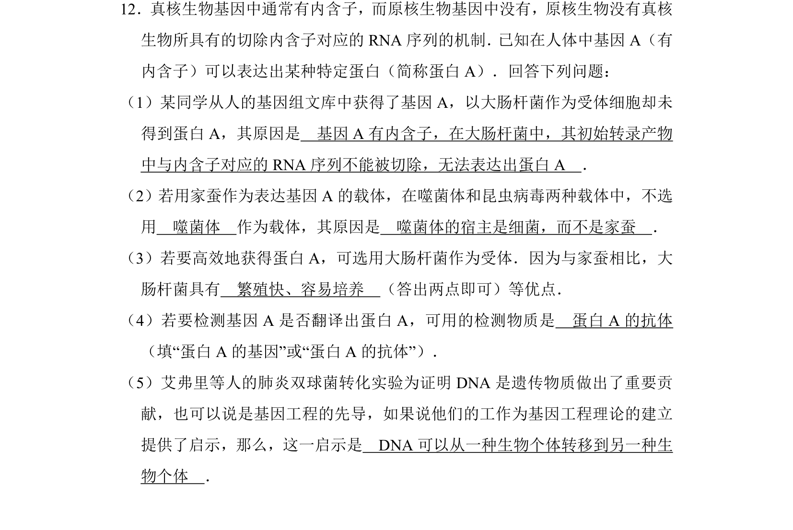
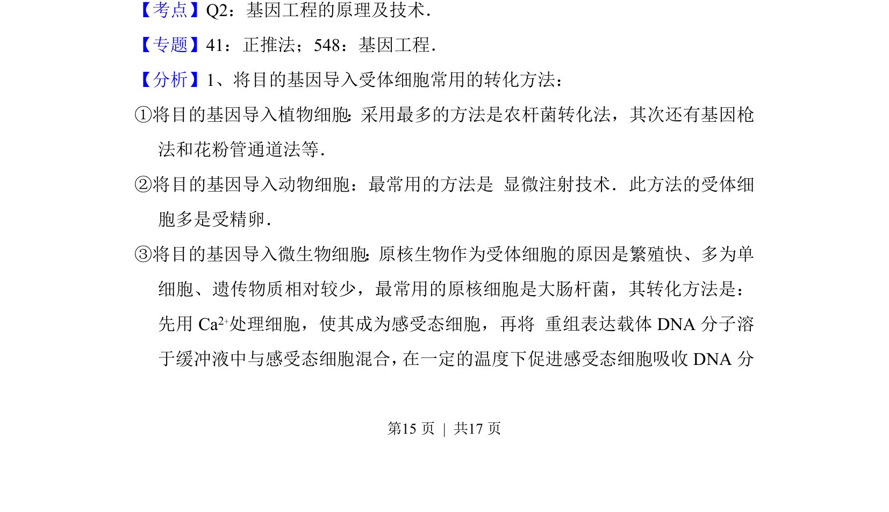
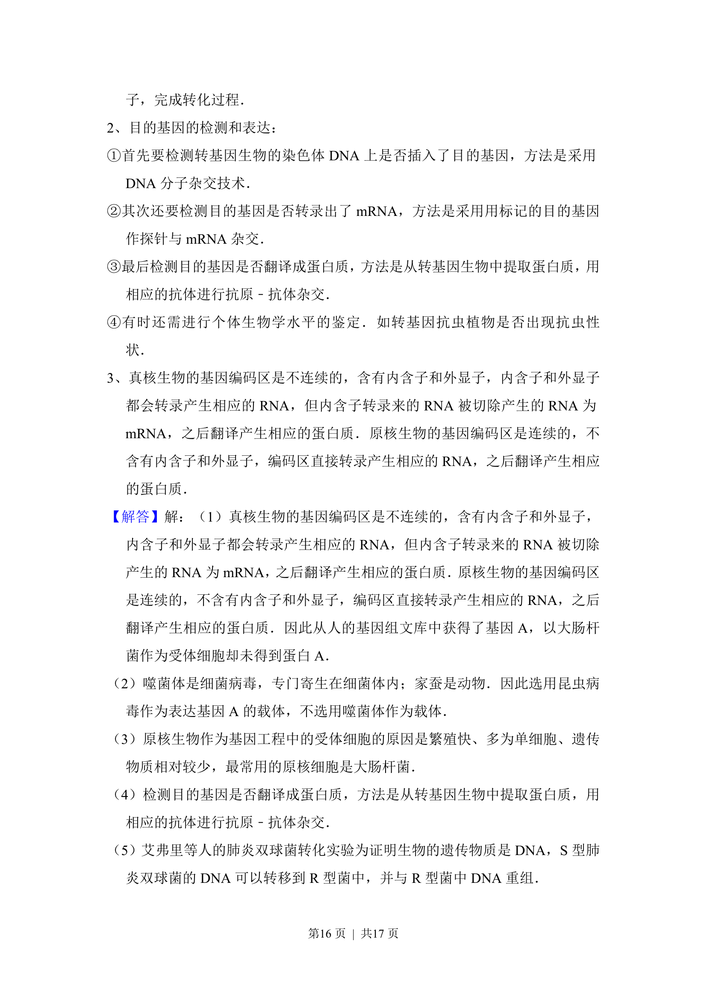
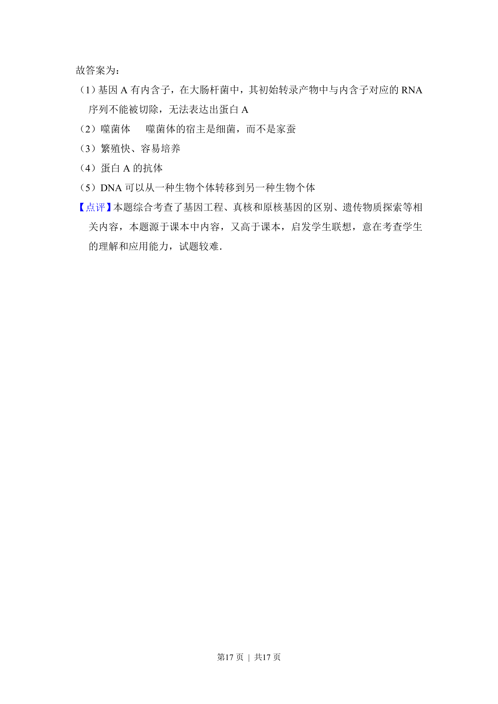

## 题面

## 摘要

该题考查真核与原核基因表达差异、基因工程载体选择与受体细胞特性及翻译产物检测等应用知识。

## 关联考点

- [[内含子]]
- [[479-基因表达|基因表达]]
- [[420-载体|基因工程载体]]
- [[翻译检测]]

## 答案与解析

> 📄 原 PDF 第 15 页：`素材/真题/湖南/2008-2024·（湖南）生物高考真题/2017年高考生物试卷（新课标Ⅰ）（解析卷）.pdf`
