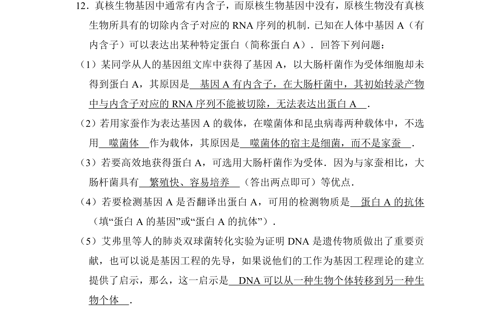
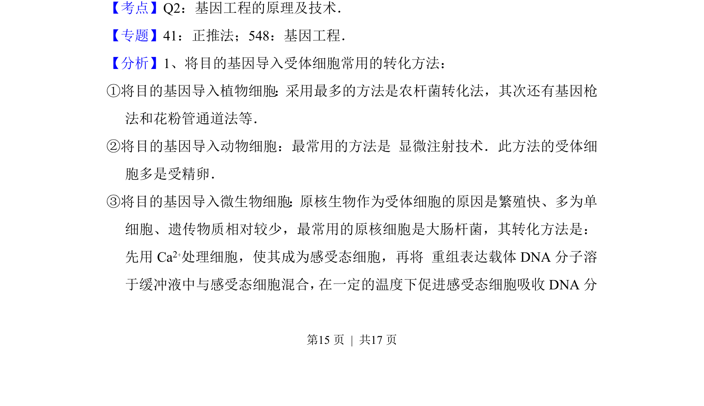
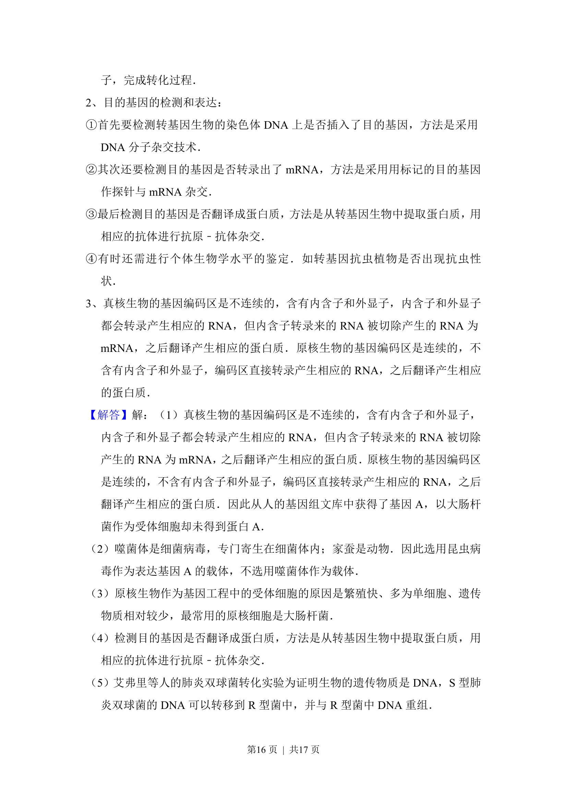
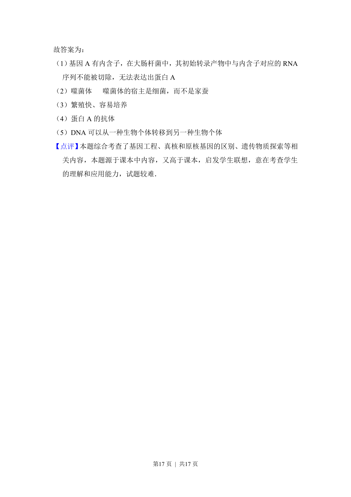

## 题面

## 摘要

该题考查真核与原核基因表达差异、基因工程载体选择与受体细胞特性及翻译产物检测等应用知识。

## 关联考点

- [[内含子]]
- [[843-基因的表达|基因表达]]
- [[420-载体|基因工程载体]]
- [[翻译检测]]

## 答案与解析

> 📄 原 PDF 第 15 页：`素材/真题/湖南/2008-2024·（湖南）生物高考真题/2017年高考生物试卷（新课标Ⅰ）（解析卷）.pdf`

<!-- 题干文本-start -->
## 题干文本
12．真核生物基因中通常有内含子，而原核生物基因中没有，原核生物没有真核
生物所具有的切除内含子对应的RNA序列的机制． 已知在人体中基因A（有
内含子）可以表达出某种特定蛋白（简称蛋白A）．回答下列问题：
（1）某同学从人的基因组文库中获得了基因A，以大肠杆菌作为受体细胞却未
得到蛋白A，其原因是　基因A有内含子，在大肠杆菌中，其初始转录产物
中与内含子对应的RNA序列不能被切除，无法表达出蛋白A　．
（2）若用家蚕作为表达基因A的载体，在噬菌体和昆虫病毒两种载体中，不选
用　噬菌体　作为载体，其原因是　噬菌体的宿主是细菌，而不是家蚕　．
（3）若要高效地获得蛋白A，可选用大肠杆菌作为受体．因为与家蚕相比，大
肠杆菌具有　繁殖快、容易培养　（答出两点即可）等优点．
（4）若要检测基因A是否翻译出蛋白A，可用的检测物质是　蛋白A的抗体　
（填“蛋白A的基因”或“蛋白A的抗体”）．
（5）艾弗里等人的肺炎双球菌转化实验为证明DNA是遗传物质做出了重要贡
献，也可以说是基因工程的先导，如果说他们的工作为基因工程理论的建立
提供了启示，那么，这一启示是　DNA可以从一种生物个体转移到另一种生
物个体　．
<!-- 题干文本-end -->

<!-- 解析文本-start -->
## 解析文本
【考点】Q2：基因工程的原理及技术．菁优网版权所有
【专题】41：正推法；548：基因工程．
【分析】1、将目的基因导入受体细胞常用的转化方法：
①将目的基因导入植物细胞：采用最多的方法是农杆菌转化法，其次还有基因枪
法和花粉管通道法等．
②将目的基因导入动物细胞：最常用的方法是 显微注射技术．此方法的受体细
胞多是受精卵．
③将目的基因导入微生物细胞：原核生物作为受体细胞的原因是繁殖快、多为单
细胞、遗传物质相对较少，最常用的原核细胞是大肠杆菌，其转化方法是：
先用Ca 2+处理细胞，使其成为感受态细胞，再将 重组表达载体DNA分子溶
于缓冲液中与感受态细胞混合， 在一定的温度下促进感受态细胞吸收DNA分
<!-- 解析文本-end -->
