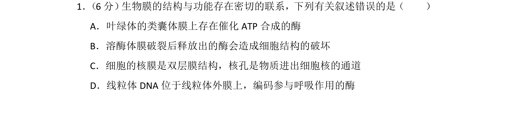
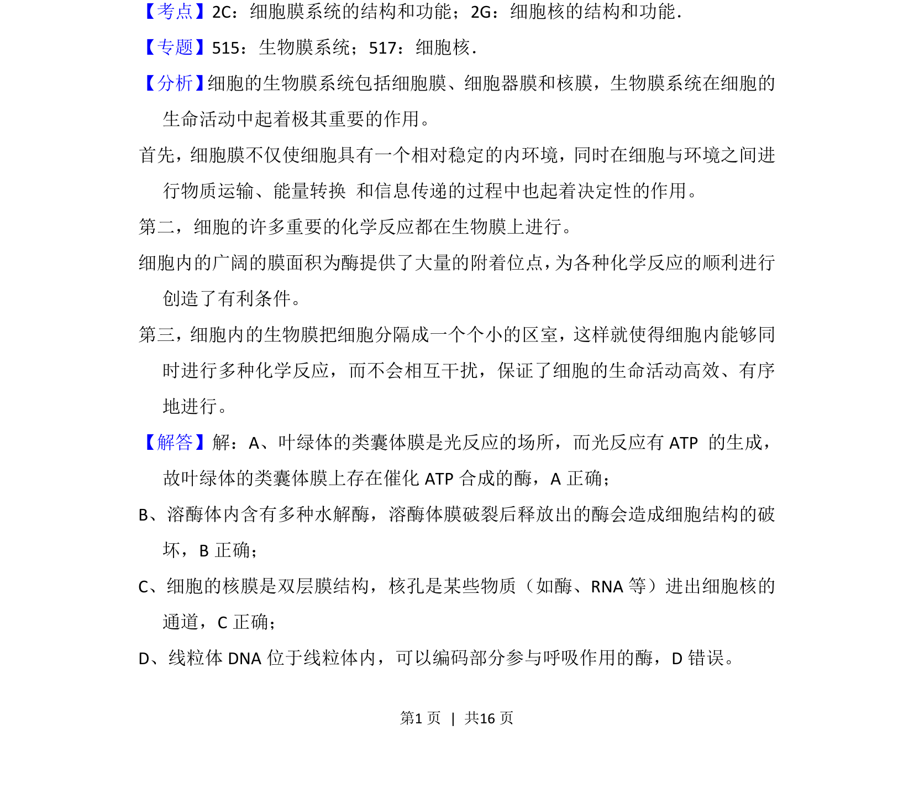
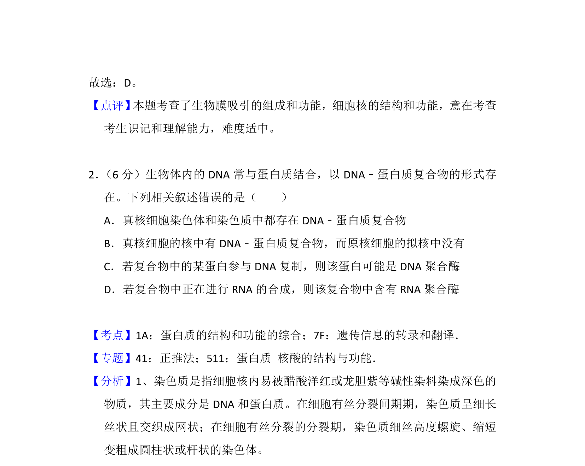

## 题面

## 摘要

考查生物膜系统结构与功能，涉及叶绿体、溶酶体、核膜、线粒体DNA定位等辨析。

## 关联考点

- [[227-生物膜系统|生物膜系统]]
- [[细胞核结构]]
- [[线粒体DNA]]
- [[溶酶体功能]]

## 答案与解析

> 📄 原 PDF 第 1 页：`素材/真题/湖南/2008-2024·（湖南）生物高考真题/2018年高考生物试卷（新课标Ⅰ）（解析卷）.pdf`
