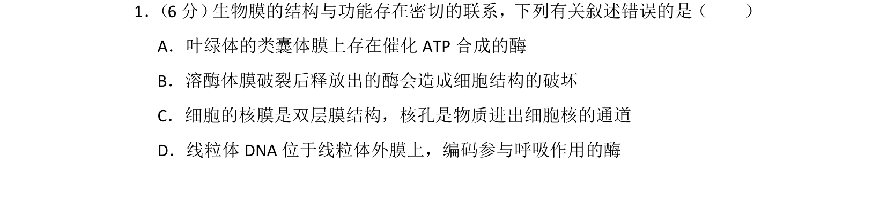
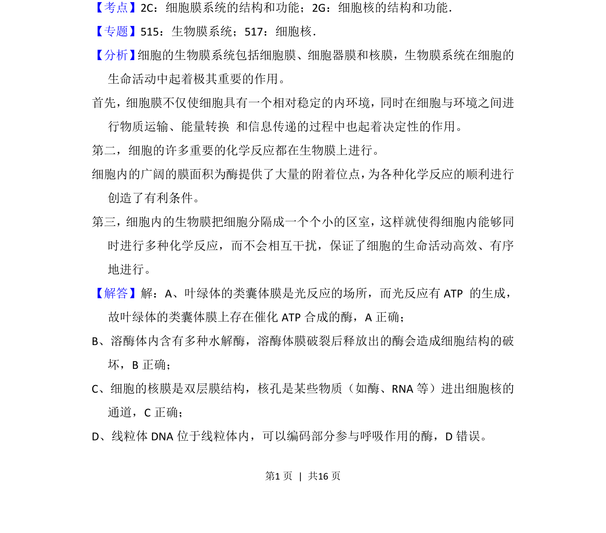
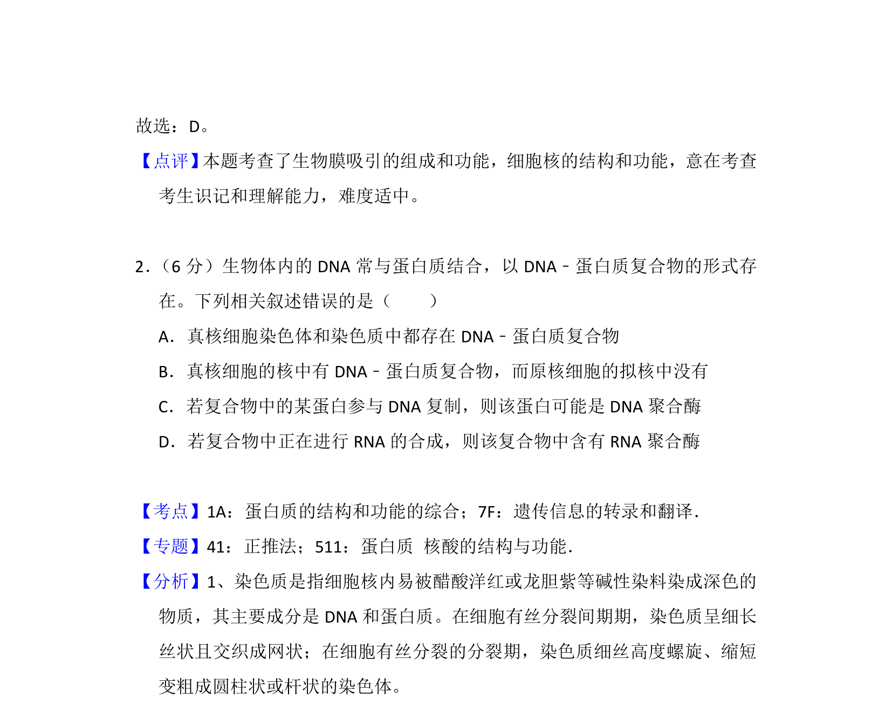

## 题面

## 摘要

考查生物膜系统结构与功能，涉及叶绿体、溶酶体、核膜、线粒体DNA定位等辨析。

## 关联考点

- [[227-生物膜系统|生物膜系统]]
- [[细胞核结构]]
- [[919-线粒体DNA|线粒体DNA]]
- [[溶酶体功能]]

## 答案与解析

> 📄 原 PDF 第 1 页：`素材/真题/湖南/2008-2024·（湖南）生物高考真题/2018年高考生物试卷（新课标Ⅰ）（解析卷）.pdf`

<!-- 题干文本-start -->
## 题干文本
1． （6分） 生物膜的结构与功能存在密切的联系，下列有关叙述错误的是（　　）
A．叶绿体的类囊体膜上存在催化ATP合成的酶
B．溶酶体膜破裂后释放出的酶会造成细胞结构的破坏
C．细胞的核膜是双层膜结构，核孔是物质进出细胞核的通道
D．线粒体DNA位于线粒体外膜上，编码参与呼吸作用的酶
<!-- 题干文本-end -->

<!-- 解析文本-start -->
## 解析文本
【考点】2C：细胞膜系统的结构和功能；2G：细胞核的结构和功能．菁优网版权所有
【专题】515：生物膜系统；517：细胞核．
【分析】 细胞的生物膜系统包括细胞膜、细胞器膜和核膜，生物膜系统在细胞的
生命活动中起着极其重要的作用。
首先，细胞膜不仅使细胞具有一个相对稳定的内环境，同时在细胞与环境之间进
行物质运输、能量转换 和信息传递的过程中也起着决定性的作用。
第二，细胞的许多重要的化学反应都在生物膜上进行。
细胞内的广阔的膜面积为酶提供了大量的附着位点， 为各种化学反应的顺利进行
创造了有利条件。
第三，细胞内的生物膜把细胞分隔成一个个小的区室，这样就使得细胞内能够同
时进行多种化学反应，而不会相互干扰，保证了细胞的生命活动高效、有序
地进行。
【解答】解：A、叶绿体的类囊体膜是光反应的场所，而光反应有ATP 的生成，
故叶绿体的类囊体膜上存在催化ATP合成的酶，A正确；
B、溶酶体内含有多种水解酶，溶酶体膜破裂后释放出的酶会造成细胞结构的破
坏，B正确；
C、细胞的核膜是双层膜结构，核孔是某些物质（如酶、RNA等）进出细胞核的
通道，C正确；
D、线粒体DNA位于线粒体内，可以编码部分参与呼吸作用的酶，D错误。
<!-- 解析文本-end -->
