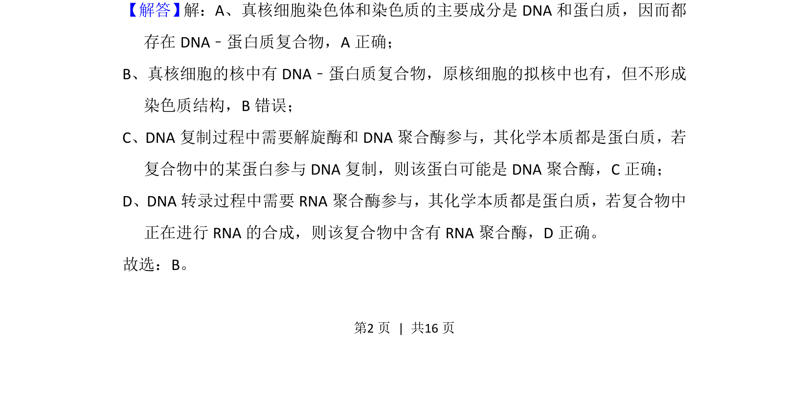
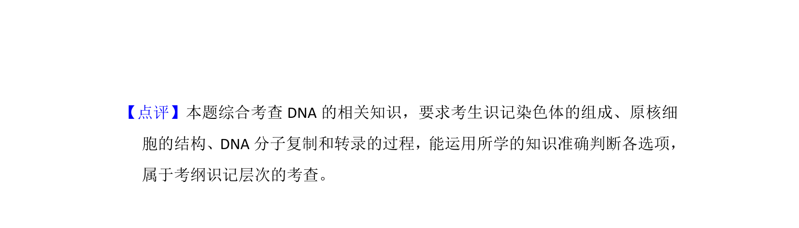

## 题面

## 摘要

考查DNA与蛋白质复合物的存在形式及功能，涉及染色体结构、DNA复制和转录。

## 关联考点

- [[染色体结构]]
- [[285-DNA复制|DNA复制]]
- [[298-转录|转录]]
- [[真核与原核细胞]]

## 答案与解析

> 📄 原 PDF 第 2 页：`素材/真题/湖南/2008-2024·（湖南）生物高考真题/2018年高考生物试卷（新课标Ⅰ）（解析卷）.pdf`
