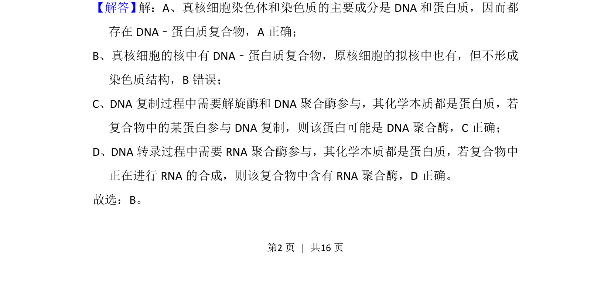
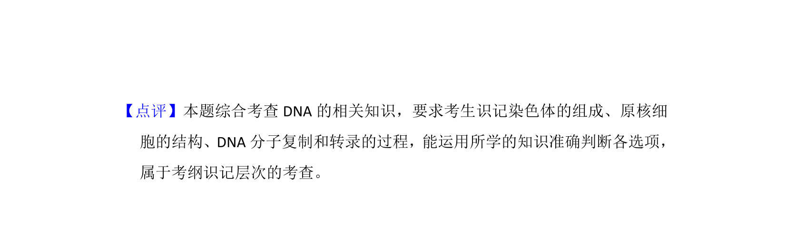

## 题面

## 摘要

考查DNA与蛋白质复合物的存在形式及功能，涉及染色体结构、DNA复制和转录。

## 关联考点

- [[染色体结构]]
- [[285-DNA复制|DNA复制]]
- [[298-转录|转录]]
- [[真核与原核细胞]]

## 答案与解析

> 📄 原 PDF 第 2 页：`素材/真题/湖南/2008-2024·（湖南）生物高考真题/2018年高考生物试卷（新课标Ⅰ）（解析卷）.pdf`

<!-- 题干文本-start -->
## 题干文本
2． （6分）生物体内的DNA常与蛋白质结合，以DNA﹣蛋白质复合物的形式存
在。下列相关叙述错误的是（　　）
A．真核细胞染色体和染色质中都存在DNA﹣蛋白质复合物
B．真核细胞的核中有DNA﹣蛋白质复合物，而原核细胞的拟核中没有
C．若复合物中的某蛋白参与DNA复制，则该蛋白可能是DNA聚合酶
D．若复合物中正在进行RNA的合成，则该复合物中含有RNA聚合酶
<!-- 题干文本-end -->

<!-- 解析文本-start -->
## 解析文本
【考点】1A：蛋白质的结构和功能的综合；7F：遗传信息的转录和翻译．菁优网版权所有
【专题】41：正推法；511：蛋白质 核酸的结构与功能．
【分析】1、染色质是指细胞核内易被醋酸洋红或龙胆紫等碱性染料染成深色的
物质，其主要成分是DNA和蛋白质。在细胞有丝分裂间期期，染色质呈细长
丝状且交织成网状；在细胞有丝分裂的分裂期，染色质细丝高度螺旋、缩短
变粗成圆柱状或杆状的染色体。
2、真核细胞具有核膜包被的细胞核，细胞核中有呈极细的丝状物状态的染色质 ；
原核细胞没有核膜包被的细胞核，其DNA裸露，不和蛋白质结合，没有染色
体或染色质结构。
【解答】 解：A、真核细胞染色体和染色质的主要成分是DNA和蛋白质，因而都
存在DNA﹣蛋白质复合物，A正确；
B、真核细胞的核中有DNA﹣蛋白质复合物，原核细胞的拟核中也有，但不形成
染色质结构，B错误；
C、DNA复制过程中需要解旋酶和DNA聚合酶参与，其化学本质都是蛋白质，若
复合物中的某蛋白参与DNA复制，则该蛋白可能是DNA聚合酶，C正确；
D、DNA转录过程中需要RNA聚合酶参与，其化学本质都是蛋白质，若复合物中
正在进行RNA的合成，则该复合物中含有RNA聚合酶，D正确。
故选：B。
<!-- 解析文本-end -->
