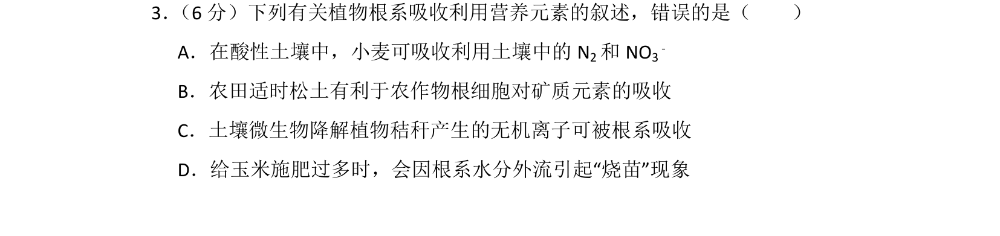
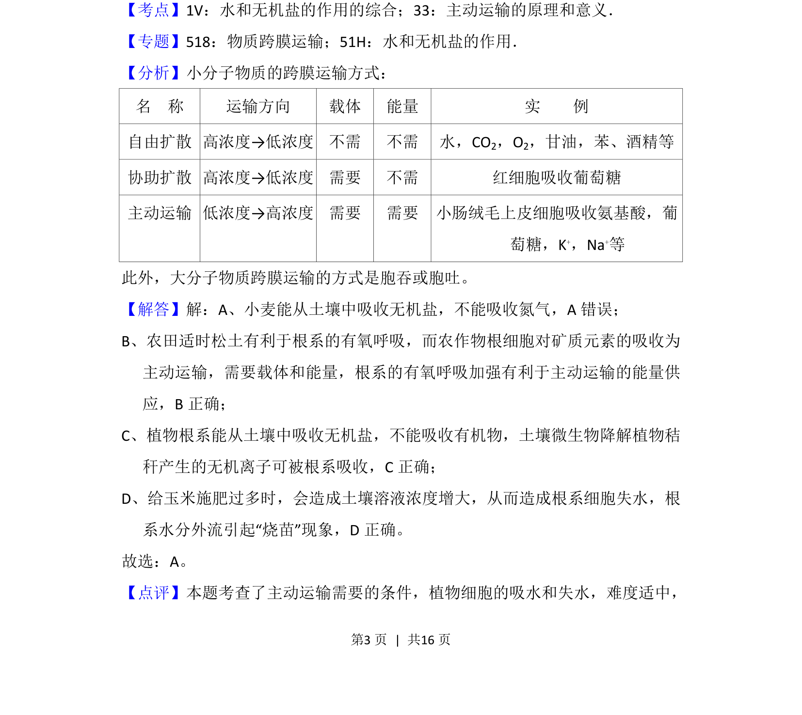

## 题面

## 摘要

该题考查植物根系对营养元素的吸收机制，涉及主动运输条件及细胞失水现象。

## 关联考点

- [[256-主动运输|主动运输]]
- [[无机盐吸收]]
- [[细胞失水]]
- [[烧苗]]

## 答案与解析

> 📄 原 PDF 第 3 页：`素材/真题/湖南/2008-2024·（湖南）生物高考真题/2018年高考生物试卷（新课标Ⅰ）（解析卷）.pdf`

<!-- 题干文本-start -->
## 题干文本
3． （6分）下列有关植物根系吸收利用营养元素的叙述，错误的是（　　）
A．在酸性土壤中，小麦可吸收利用土壤中的N 2和NO 3
﹣
B．农田适时松土有利于农作物根细胞对矿质元素的吸收
C．土壤微生物降解植物秸秆产生的无机离子可被根系吸收
D．给玉米施肥过多时，会因根系水分外流引起“烧苗”现象
<!-- 题干文本-end -->

<!-- 解析文本-start -->
## 解析文本
【考点】1V：水和无机盐的作用的综合；33：主动运输的原理和意义．菁优网版权所有
【专题】518：物质跨膜运输；51H：水和无机盐的作用．
【分析】小分子物质的跨膜运输方式：
名　称 运输方向 载体 能量 实　　例
自由扩散 高浓度→低浓度 不需 不需 水，CO2，O2，甘油，苯、酒精等
协助扩散 高浓度→低浓度 需要 不需 红细胞吸收葡萄糖
主动运输 低浓度→高浓度 需要 需要 小肠绒毛上皮细胞吸收氨基酸，葡
萄糖，K+，Na+等
此外，大分子物质跨膜运输的方式是胞吞或胞吐。
【解答】解：A、小麦能从土壤中吸收无机盐，不能吸收氮气，A错误；
B、农田适时松土有利于根系的有氧呼吸，而农作物根细胞对矿质元素的吸收为
主动运输，需要载体和能量，根系的有氧呼吸加强有利于主动运输的能量供
应，B正确；
C、植物根系能从土壤中吸收无机盐，不能吸收有机物，土壤微生物降解植物秸
秆产生的无机离子可被根系吸收，C正确；
D、给玉米施肥过多时，会造成土壤溶液浓度增大，从而造成根系细胞失水，根
系水分外流引起“烧苗”现象，D正确。
故选：A。
【点评】本题考查了主动运输需要的条件，植物细胞的吸水和失水，难度适中，
<!-- 解析文本-end -->
