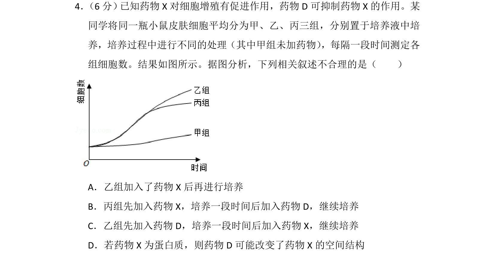
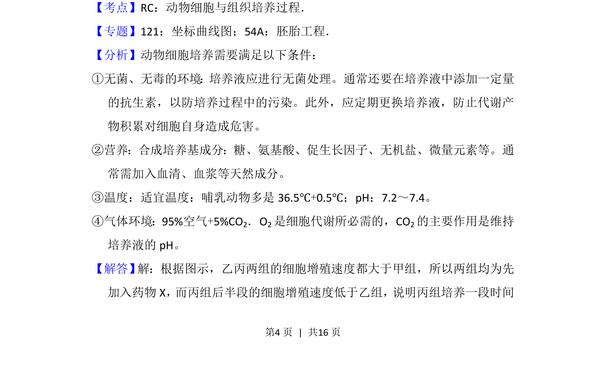
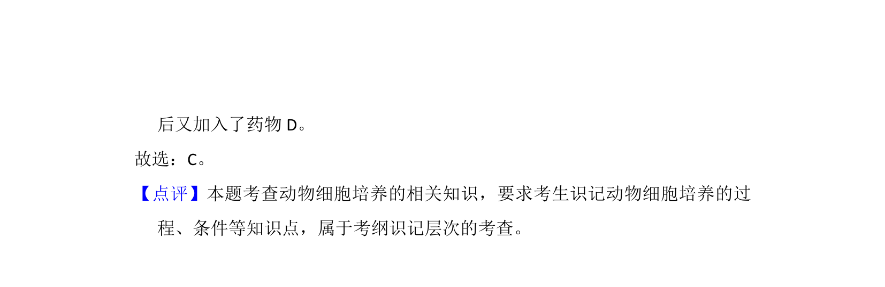

## 题面

## 摘要

探究药物X和D对小鼠皮肤细胞增殖影响的曲线分析，判断不同处理顺序的合理性

## 关联考点

- [[449-动物细胞培养|动物细胞培养]]
- [[584-增殖|细胞增殖]]
- [[药物作用]]
- [[666-实验分析|实验分析]]

## 答案与解析

> 📄 原 PDF 第 4 页：`素材/真题/湖南/2008-2024·（湖南）生物高考真题/2018年高考生物试卷（新课标Ⅰ）（解析卷）.pdf`
