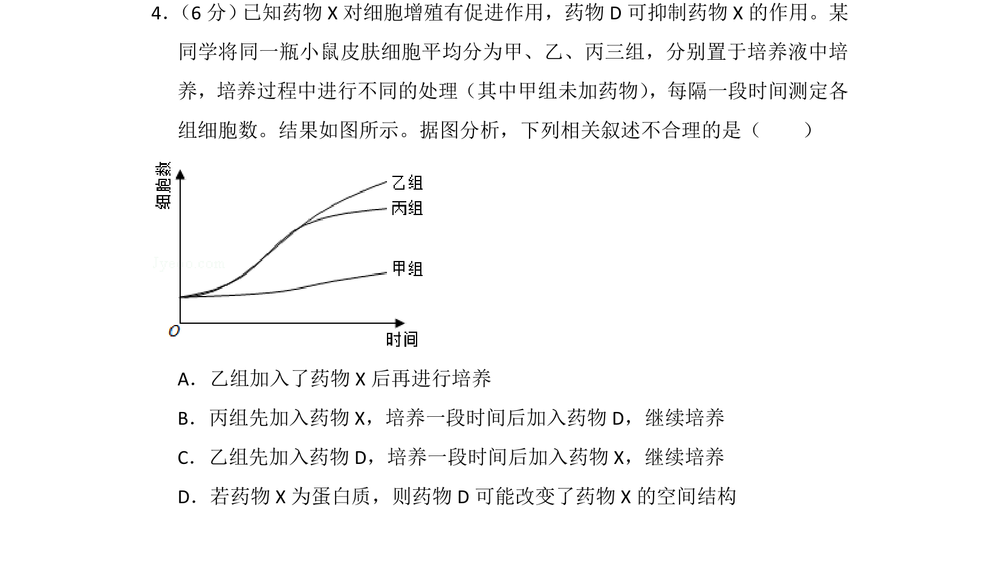
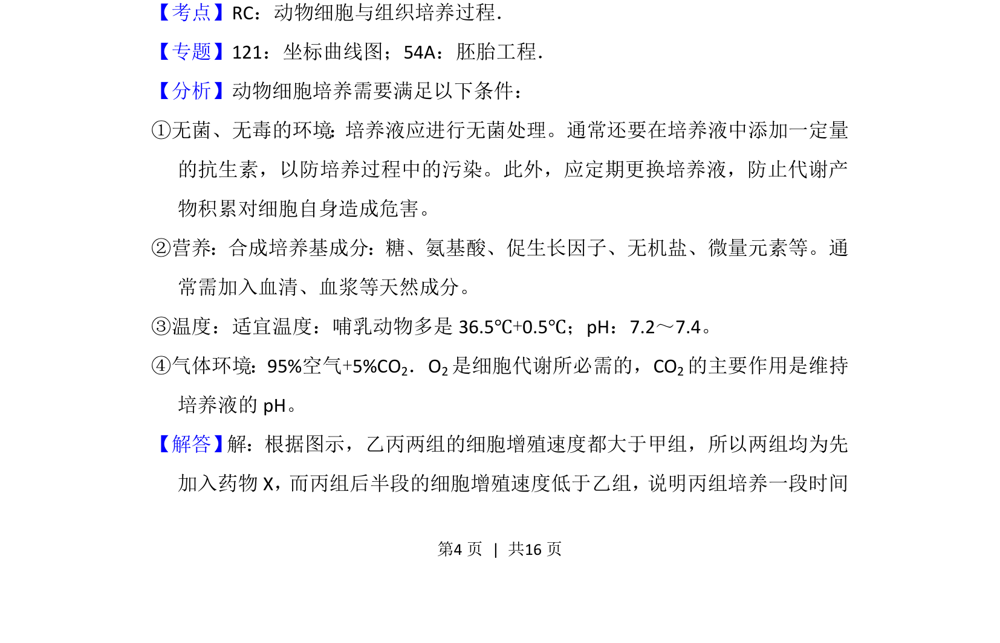
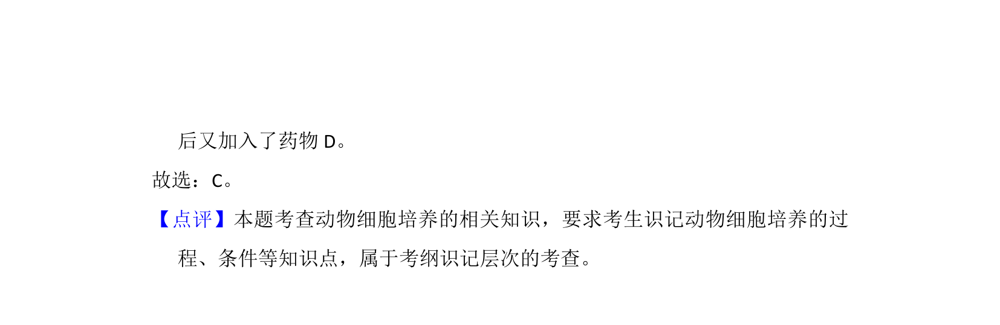

## 题面

## 摘要

探究药物X和D对小鼠皮肤细胞增殖影响的曲线分析，判断不同处理顺序的合理性

## 关联考点

- [[449-动物细胞培养|动物细胞培养]]
- [[584-增殖|细胞增殖]]
- [[药物作用]]
- [[666-实验分析|实验分析]]

## 答案与解析

> 📄 原 PDF 第 4 页：`素材/真题/湖南/2008-2024·（湖南）生物高考真题/2018年高考生物试卷（新课标Ⅰ）（解析卷）.pdf`

<!-- 题干文本-start -->
## 题干文本
4． （6分） 已知药物X对细胞增殖有促进作用，药物D可抑制药物X的作用。某
同学将同一瓶小鼠皮肤细胞平均分为甲、乙、丙三组，分别置于培养液中培
养，培养过程中进行不同的处理（其中甲组未加药物） ，每隔一段时间测定各
组细胞数。结果如图所示。据图分析，下列相关叙述不合理的是（　　）
A．乙组加入了药物X后再进行培养
B．丙组先加入药物X，培养一段时间后加入药物D，继续培养
C．乙组先加入药物D，培养一段时间后加入药物X，继续培养
D．若药物X为蛋白质，则药物D可能改变了药物X的空间结构
<!-- 题干文本-end -->

<!-- 解析文本-start -->
## 解析文本
【考点】RC：动物细胞与组织培养过程．菁优网版权所有
【专题】121：坐标曲线图；54A：胚胎工程．
【分析】动物细胞培养需要满足以下条件：
①无菌、无毒的环境：培养液应进行无菌处理。通常还要在培养液中添加一定量
的抗生素，以防培养过程中的污染。此外，应定期更换培养液，防止代谢产
物积累对细胞自身造成危害。
②营养：合成培养基成分：糖、氨基酸、促生长因子、无机盐、微量元素等。通
常需加入血清、血浆等天然成分。
③温度：适宜温度：哺乳动物多是36.5℃+0.5℃；pH：7.2～7.4。
④气体环境：95%空气+5%CO2．O2是细胞代谢所必需的，CO2的主要作用是维持
培养液的pH。
【解答】 解：根据图示，乙丙两组的细胞增殖速度都大于甲组，所以两组均为先
加入药物X，而丙组后半段的细胞增殖速度低于乙组，说明丙组培养一段时间
<!-- 解析文本-end -->
