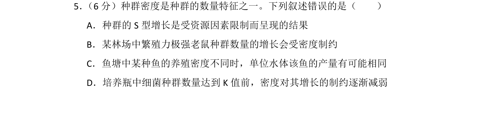
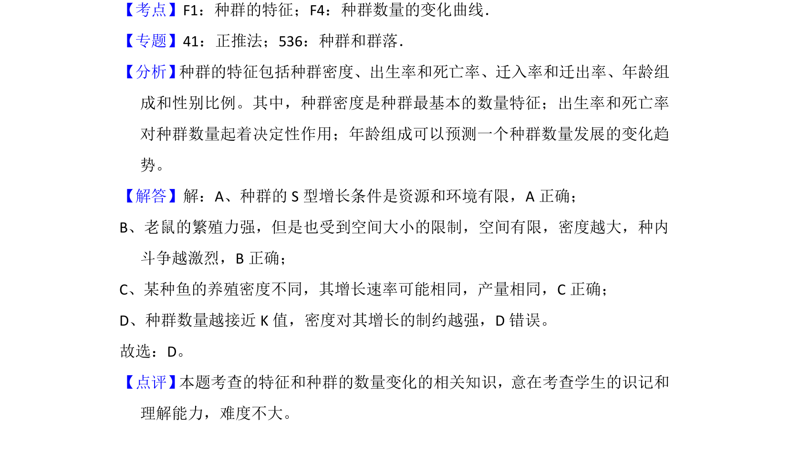

## 题面

## 摘要

本题考查种群密度及种群数量增长曲线的特征，辨析S型增长及密度制约因素等叙述。

## 关联考点

- [[370-种群密度|种群密度]]
- [[926-S型增长|S型增长]]
- [[密度制约]]

## 答案与解析

> 📄 原 PDF 第 5 页：`素材/真题/湖南/2008-2024·（湖南）生物高考真题/2018年高考生物试卷（新课标Ⅰ）（解析卷）.pdf`

<!-- 题干文本-start -->
## 题干文本
5． （6分）种群密度是种群的数量特征之一。下列叙述错误的是（　　）
A．种群的S型增长是受资源因素限制而呈现的结果
B．某林场中繁殖力极强老鼠种群数量的增长会受密度制约
C．鱼塘中某种鱼的养殖密度不同时，单位水体该鱼的产量有可能相同
D．培养瓶中细菌种群数量达到K值前，密度对其增长的制约逐渐减弱
<!-- 题干文本-end -->

<!-- 解析文本-start -->
## 解析文本
【考点】F1：种群的特征；F4：种群数量的变化曲线．菁优网版权所有
【专题】41：正推法；536：种群和群落．
【分析】 种群的特征包括种群密度、出生率和死亡率、迁入率和迁出率、年龄组
成和性别比例。其中，种群密度是种群最基本的数量特征；出生率和死亡率
对种群数量起着决定性作用；年龄组成可以预测一个种群数量发展的变化趋
势。
【解答】解：A、种群的S型增长条件是资源和环境有限，A正确；
B、老鼠的繁殖力强，但是也受到空间大小的限制，空间有限，密度越大，种内
斗争越激烈，B正确；
C、某种鱼的养殖密度不同，其增长速率可能相同，产量相同，C正确；
D、种群数量越接近K值，密度对其增长的制约越强，D错误。
故选：D。
【点评】 本题考查的特征和种群的数量变化的相关知识，意在考查学生的识记和
理解能力，难度不大。
<!-- 解析文本-end -->
