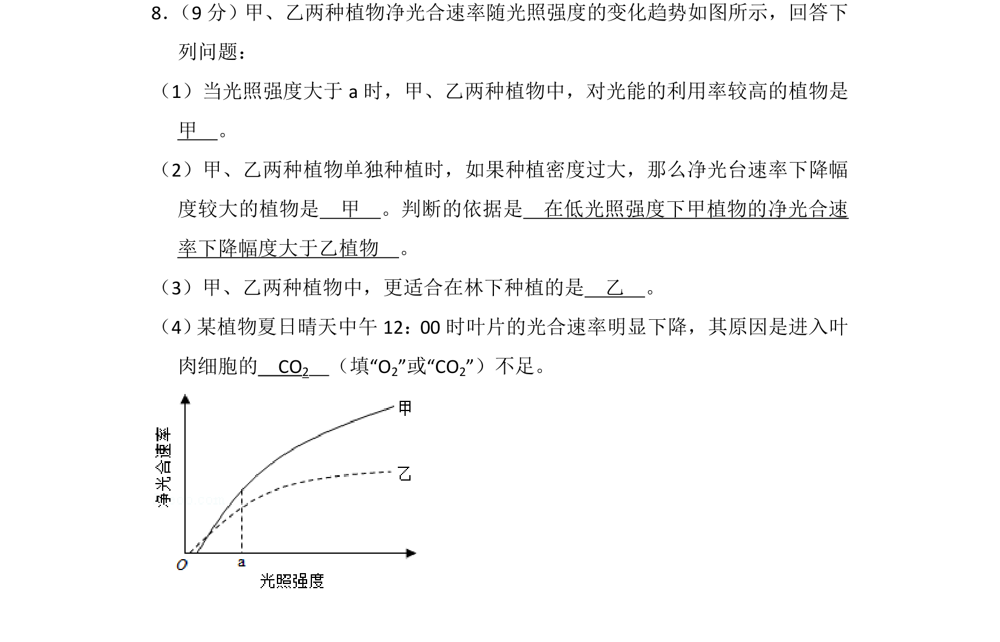
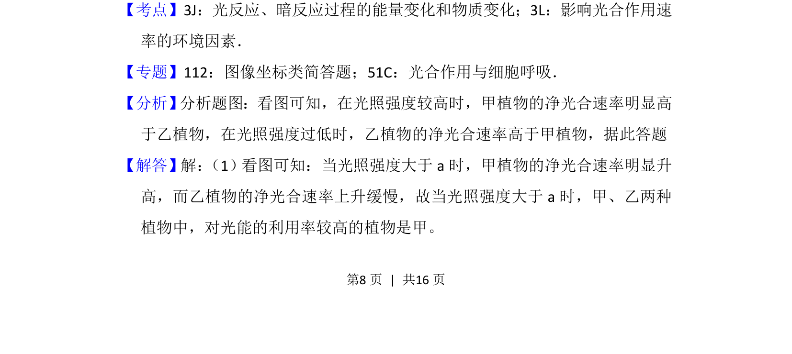
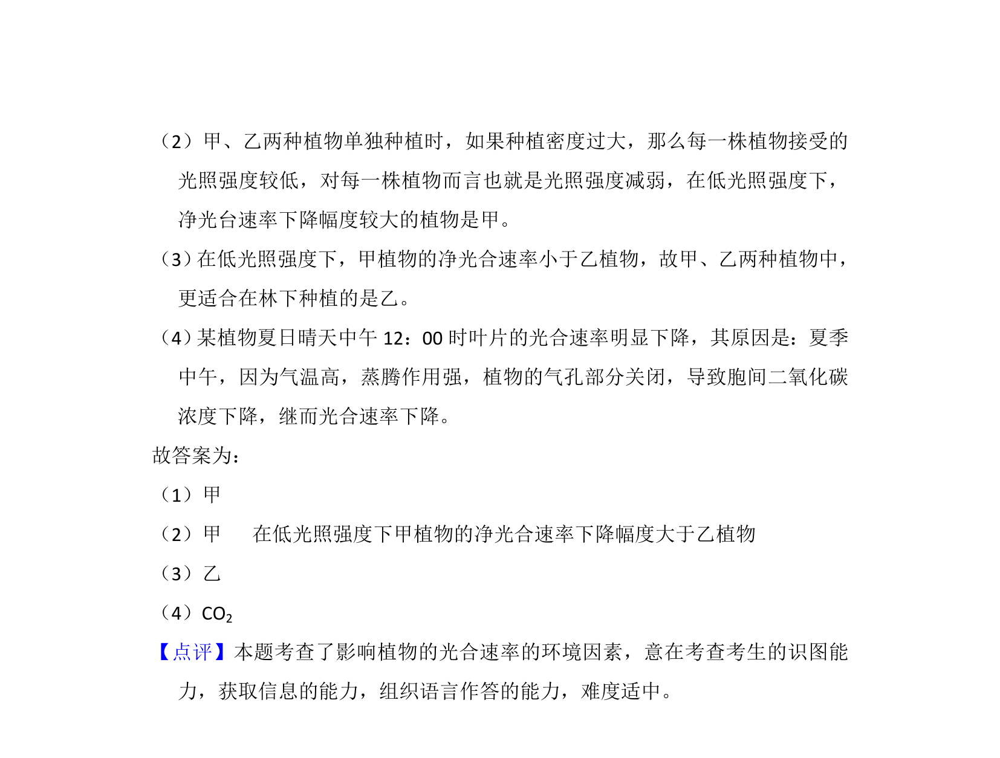

## 题面

## 摘要

甲、乙两种植物净光合速率随光照强度变化的曲线分析，包括光能利用率、种植密度影响、林下种植选择及光合午休原因。

## 关联考点

- [[光反应和暗反应过程的能量变化和物质变化]]
- [[影响光合作用速率的环境因素]]

## 答案与解析

> 📄 原 PDF 第 8 页：`素材/真题/湖南/2008-2024·（湖南）生物高考真题/2018年高考生物试卷（新课标Ⅰ）（解析卷）.pdf`
