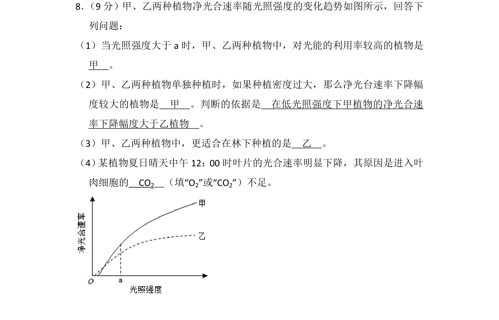
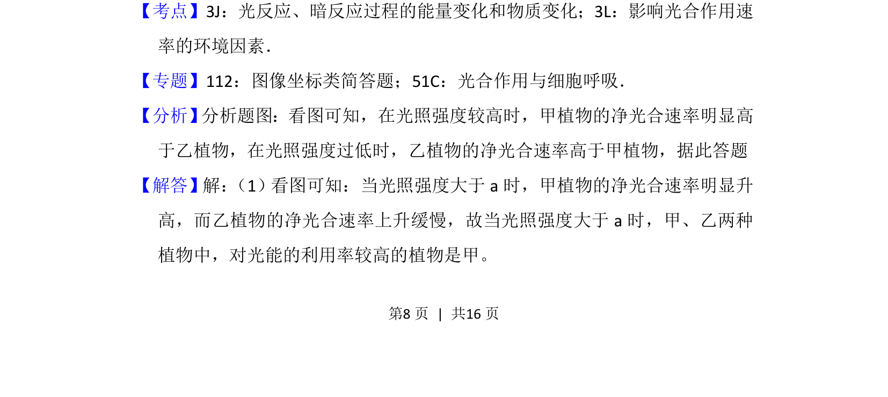
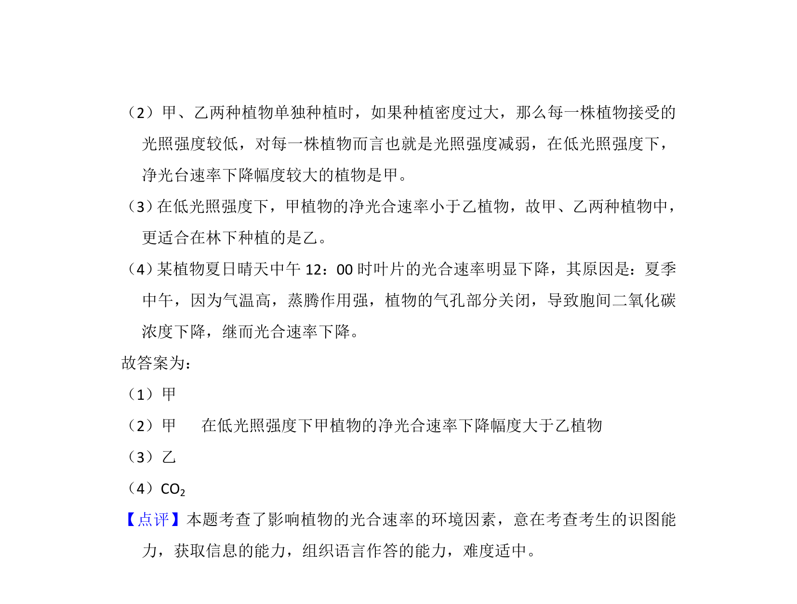

## 题面

## 摘要

甲、乙两种植物净光合速率随光照强度变化的曲线分析，包括光能利用率、种植密度影响、林下种植选择及光合午休原因。

## 关联考点

- [[光反应和暗反应过程的能量变化和物质变化]]
- [[影响光合作用速率的环境因素]]

## 答案与解析

> 📄 原 PDF 第 8 页：`素材/真题/湖南/2008-2024·（湖南）生物高考真题/2018年高考生物试卷（新课标Ⅰ）（解析卷）.pdf`

<!-- 题干文本-start -->
## 题干文本
8． （9分）甲、乙两种植物净光合速率随光照强度的变化趋势如图所示，回答下
列问题：
（1）当光照强度大于a时，甲、乙两种植物中，对光能的利用率较高的植物是　
甲　。
（2）甲、乙两种植物单独种植时，如果种植密度过大，那么净光台速率下降幅
度较大的植物是　甲　。判断的依据是　在低光照强度下甲植物的净光合速
率下降幅度大于乙植物　。
（3）甲、乙两种植物中，更适合在林下种植的是　乙　。
（4） 某植物夏日晴天中午12：00时叶片的光合速率明显下降，其原因是进入叶
肉细胞的　CO2　（填“O2”或“CO2”）不足。
<!-- 题干文本-end -->

<!-- 解析文本-start -->
## 解析文本
【考点】3J：光反应、暗反应过程的能量变化和物质变化；3L：影响光合作用速
率的环境因素．菁优网版权所有
【专题】112：图像坐标类简答题；51C：光合作用与细胞呼吸．
【分析】 分析题图：看图可知，在光照强度较高时，甲植物的净光合速率明显高
于乙植物，在光照强度过低时，乙植物的净光合速率高于甲植物，据此答题
【解答】解： （1）看图可知：当光照强度大于a时，甲植物的净光合速率明显升
高，而乙植物的净光合速率上升缓慢，故当光照强度大于a时，甲、乙两种
植物中，对光能的利用率较高的植物是甲。
<!-- 解析文本-end -->
