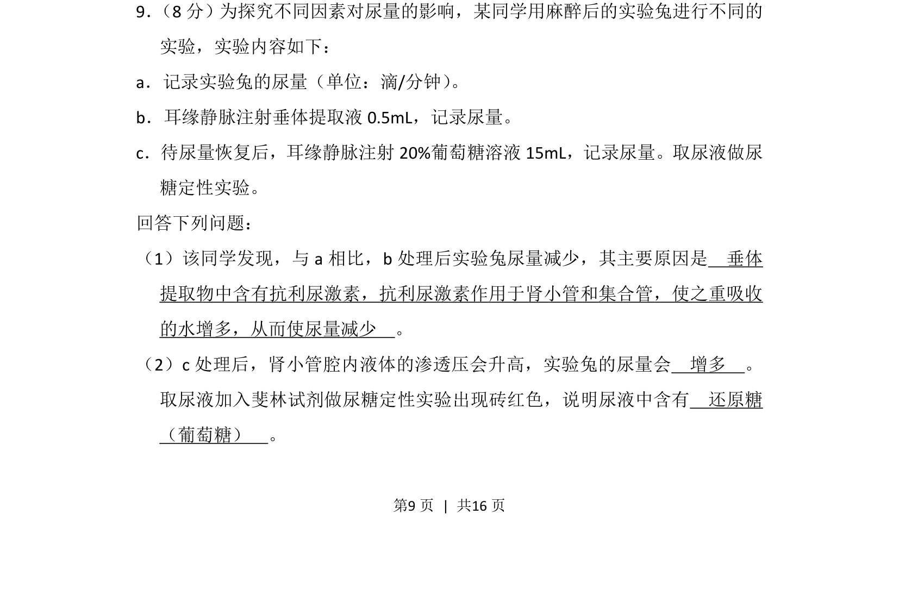
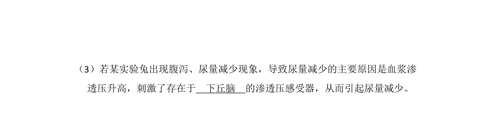
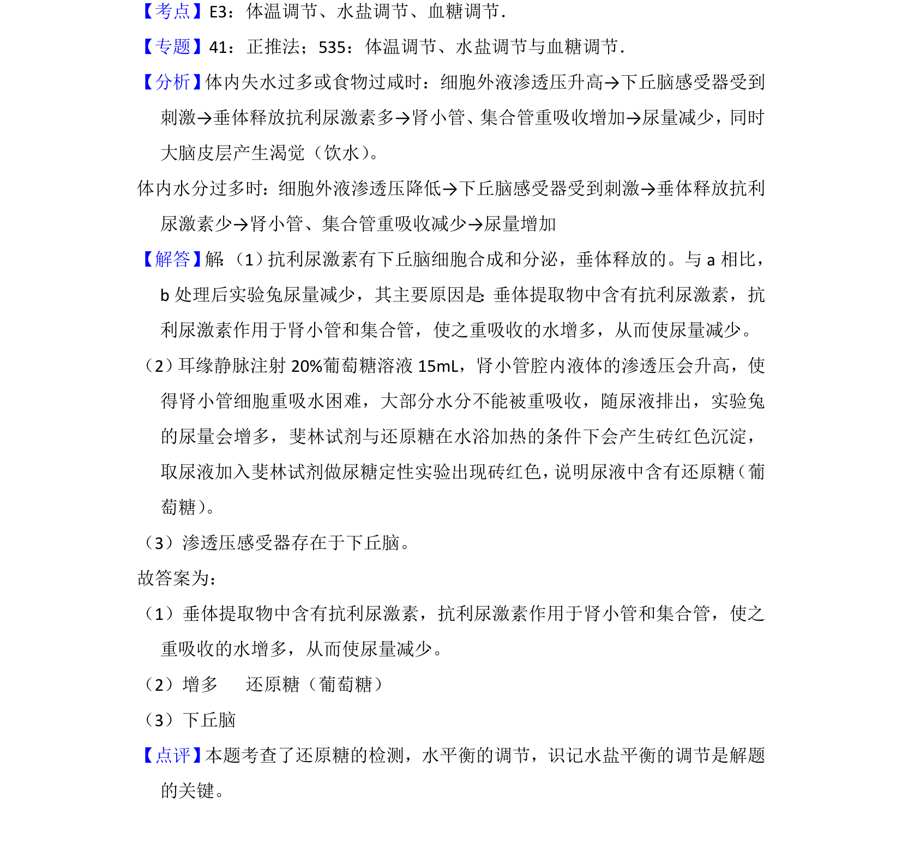

## 题面

## 摘要

探究垂体提取液和葡萄糖溶液对实验兔尿量的影响及尿糖检测。

## 关联考点

- [[094-激素|抗利尿激素]]
- [[921-肾小管重吸收|肾小管重吸收]]
- [[497-渗透压|渗透压]]
- [[773-还原糖检测|还原糖检测]]

## 答案与解析

> 📄 原 PDF 第 9 页：`素材/真题/湖南/2008-2024·（湖南）生物高考真题/2018年高考生物试卷（新课标Ⅰ）（解析卷）.pdf`
