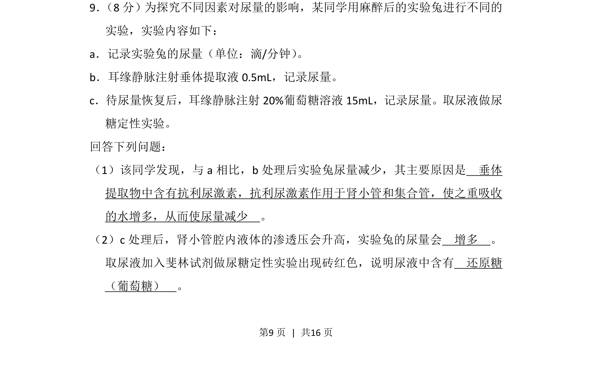
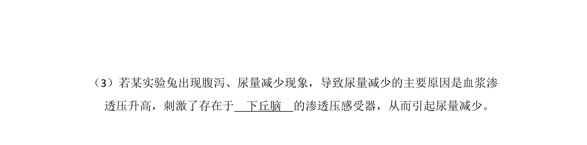
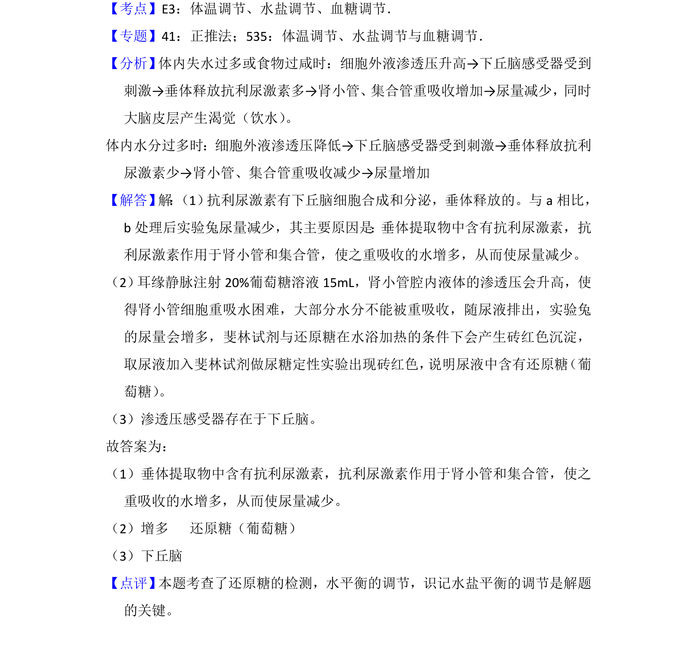

## 题面

## 摘要

探究垂体提取液和葡萄糖溶液对实验兔尿量的影响及尿糖检测。

## 关联考点

- [[094-激素|抗利尿激素]]
- [[921-肾小管重吸收|肾小管重吸收]]
- [[497-渗透压|渗透压]]
- [[773-还原糖检测|还原糖检测]]

## 答案与解析

> 📄 原 PDF 第 9 页：`素材/真题/湖南/2008-2024·（湖南）生物高考真题/2018年高考生物试卷（新课标Ⅰ）（解析卷）.pdf`

<!-- 题干文本-start -->
## 题干文本
9． （8分）为探究不同因素对尿量的影响，某同学用麻醉后的实验兔进行不同的
实验，实验内容如下：
a．记录实验兔的尿量（单位：滴/分钟） 。
b．耳缘静脉注射垂体提取液0.5mL，记录尿量。
c．待尿量恢复后，耳缘静脉注射20%葡萄糖溶液15mL，记录尿量。取尿液做尿
糖定性实验。
回答下列问题：
（1）该同学发现，与a相比，b处理后实验兔尿量减少，其主要原因是　垂体
提取物中含有抗利尿激素，抗利尿激素作用于肾小管和集合管，使之重吸收
的水增多，从而使尿量减少　。
（2）c处理后，肾小管腔内液体的渗透压会升高，实验兔的尿量会　增多　。
取尿液加入斐林试剂做尿糖定性实验出现砖红色，说明尿液中含有　还原糖
（葡萄糖）　。
<!-- 题干文本-end -->

<!-- 解析文本-start -->
## 解析文本

<!-- 解析文本-end -->
